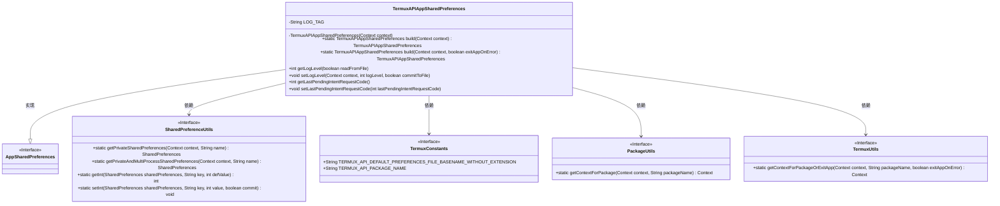
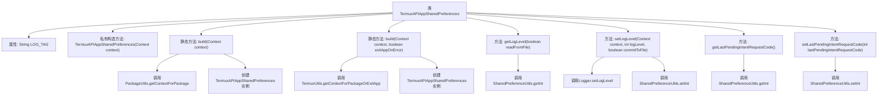

# 基础信息

|      |      |
|------|------|
| 名称 | TermuxAPIAppSharedPreferences |
| 编码语言 | .java |
| 代码路径 | termux-app/termux-shared/src/main/java/com/termux/shared/termux/settings/preferences/TermuxAPIAppSharedPreferences.java |
| 包名 | com.termux.shared.termux.settings.preferences |
| 依赖项 | ['android.content.Context', 'androidx.annotation.NonNull', 'androidx.annotation.Nullable', 'com.termux.shared.logger.Logger', 'com.termux.shared.android.PackageUtils', 'com.termux.shared.settings.preferences.AppSharedPreferences', 'com.termux.shared.settings.preferences.SharedPreferenceUtils', 'com.termux.shared.termux.TermuxUtils', 'com.termux.shared.termux.settings.preferences.TermuxPreferenceConstants.TERMUX_API_APP', 'com.termux.shared.termux.TermuxConstants'] |
| 概述说明 | TermuxAPI应用共享偏好类，提供日志级别和请求码管理功能。 |

# 说明

TermuxAPIAppSharedPreferences是AppSharedPreferences的子类，用于管理Termux API应用的共享偏好设置。它通过私有构造方法初始化上下文和两种类型的共享偏好文件（普通和多进程）。提供两个build方法获取实例，支持可选错误退出功能。包含日志级别管理方法（支持文件读取和写入）及最后待处理意图请求码的存取功能。所有操作均通过SharedPreferenceUtils工具类实现。

# 类列表 Class Summary

| 名称   | 类型  | 说明 |
|-------|------|-------------|
| TermuxAPIAppSharedPreferences | class | TermuxAPI应用共享偏好类，提供日志等级和请求码管理。 |

## 类 TermuxAPIAppSharedPreferences

|      |      |
|------|------|
| 访问范围 | public |
| 类型 | class |
| 名称 | TermuxAPIAppSharedPreferences |
| 说明 | TermuxAPI应用共享偏好类，提供日志等级和请求码管理。 |

### UML类图

这段代码展示了一个Android应用中的共享偏好设置管理类`TermuxAPIAppSharedPreferences`，它继承自`AppSharedPreferences`接口。该类通过两种静态工厂方法`build()`创建实例，并提供了日志级别和PendingIntent请求码的读写功能。它依赖于多个工具类（`SharedPreferenceUtils`、`TermuxConstants`等）来获取上下文和操作共享偏好设置文件，体现了Android中典型的偏好设置管理实现模式。

### 内部方法调用关系图

该流程图展示了TermuxAPIAppSharedPreferences类的结构和主要方法调用关系。类继承自AppSharedPreferences，包含两个静态构建方法(build)和多个实例方法。核心功能包括：通过不同方式构建实例(getContextForPackage)、管理日志级别(get/setLogLevel)和处理PendingIntent请求码(get/setLastPendingIntentRequestCode)。所有数据操作都通过SharedPreferenceUtils工具类完成，体现了对Android共享偏好设置的封装。

### 字段列表 Field List

| 名称  | 类型  | 说明 |
|-------|-------|------|
| LOG_TAG = "TermuxAPIAppSharedPreferences" | String | TermuxAPIApp共享首选项日志标签 |

### 方法列表 Method List

| 名称  | 类型  | 说明 |
|-------|-------|------|
| build | TermuxAPIAppSharedPreferences | 构建TermuxAPIAppSharedPreferences实例，依赖Termux上下文，失败可退出应用。 |
| getLogLevel | int | 获取日志级别，根据参数选择从文件或共享偏好读取。 |
| build | TermuxAPIAppSharedPreferences | 构建TermuxAPIAppSharedPreferences，依赖TermuxAPI包上下文，失败返回null。 |
| setLogLevel | void | 设置日志级别并保存到文件。 |
| getLastPendingIntentRequestCode | int | 获取最后待处理意图请求码，默认值来自共享偏好设置。 |
| setLastPendingIntentRequestCode | void | 设置最后待处理意图请求代码。 |

