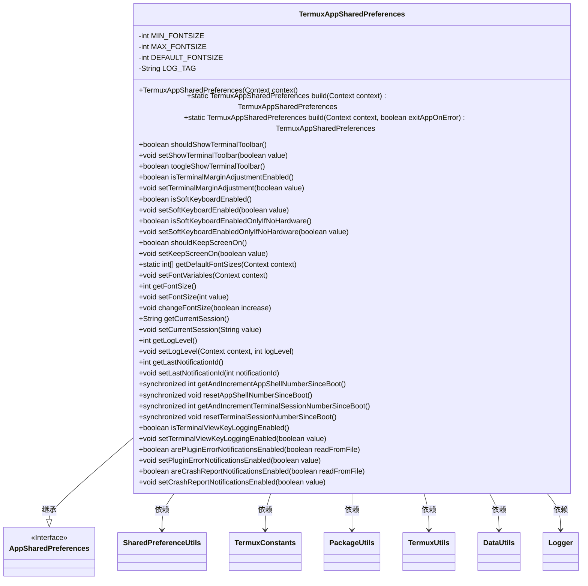
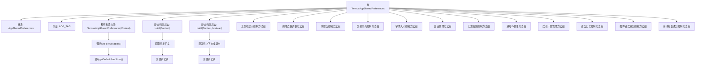

# 基础信息

|      |      |
|------|------|
| 名称 | TermuxAppSharedPreferences |
| 编码语言 | .java |
| 代码路径 | termux-app/termux-shared/src/main/java/com/termux/shared/termux/settings/preferences/TermuxAppSharedPreferences.java |
| 包名 | com.termux.shared.termux.settings.preferences |
| 依赖项 | ['android.content.Context', 'android.util.TypedValue', 'androidx.annotation.NonNull', 'androidx.annotation.Nullable', 'com.termux.shared.android.PackageUtils', 'com.termux.shared.settings.preferences.AppSharedPreferences', 'com.termux.shared.settings.preferences.SharedPreferenceUtils', 'com.termux.shared.termux.TermuxConstants', 'com.termux.shared.logger.Logger', 'com.termux.shared.data.DataUtils', 'com.termux.shared.termux.TermuxUtils', 'com.termux.shared.termux.settings.preferences.TermuxPreferenceConstants.TERMUX_APP'] |
| 概述说明 | Termux应用共享偏好设置类，管理字体、工具栏、键盘等配置。 |

# 说明

TermuxAppSharedPreferences类继承自AppSharedPreferences，用于管理Termux应用的共享偏好设置。它包含字体大小、终端工具栏显示、软键盘启用、屏幕常亮、会话管理、日志级别、通知ID等配置项的获取和设置方法。类通过私有构造方法初始化，提供静态build方法创建实例。支持多进程共享偏好设置，包含错误报告和崩溃通知的开关控制。字体大小设置具有最小、默认和最大值限制，并提供增减方法。会话和终端编号支持自增和重置功能。

# 类列表 Class Summary

| 名称   | 类型  | 说明 |
|-------|------|-------------|
| TermuxAppSharedPreferences | class | Termux应用共享偏好设置类，管理字体大小、工具栏显示、键盘设置等配置项。 |

## 类 TermuxAppSharedPreferences

|      |      |
|------|------|
| 访问范围 | public |
| 类型 | class |
| 名称 | TermuxAppSharedPreferences |
| 说明 | Termux应用共享偏好设置类，管理字体大小、工具栏显示、键盘设置等配置项。 |

### UML类图

该类图展示了TermuxAppSharedPreferences类继承自AppSharedPreferences接口，并管理Termux应用的多种偏好设置，包括字体大小、终端工具栏显示、键盘设置等。通过SharedPreferenceUtils工具类操作共享偏好，与多个工具类（如PackageUtils、Logger等）存在依赖关系，实现了对应用配置的全面管理。

### 内部方法调用关系图

该流程图展示了TermuxAppSharedPreferences类的完整结构，该类继承自AppSharedPreferences，主要功能是管理Termux应用的各类偏好设置。核心包含12个功能模块：从基础的构造方法和两种静态构建方法，到具体的工具栏显示控制、终端边距调整、软键盘控制、屏幕常亮、字体大小控制等业务功能。特别值得注意的是字体初始化流程和两种不同的构建方式，其中build(Context, boolean)版本支持失败时退出应用的特性。所有偏好设置最终都通过SharedPreferenceUtils工具类实现持久化存储。

### 字段列表 Field List

| 名称  | 类型  | 说明 |
|-------|-------|------|
| MIN_FONTSIZE | int | 私有整型变量，最小字体大小。 |
| DEFAULT_FONTSIZE | int | 私有整型默认字体大小变量 |
| LOG_TAG = "TermuxAppSharedPreferences" | String | 私有静态常量LOG_TAG值为TermuxAppSharedPreferences |
| MAX_FONTSIZE | int | 私有整型常量MAX_FONTSIZE |

### 方法列表 Method List

| 名称  | 类型  | 说明 |
|-------|-------|------|
| getLogLevel | int | 获取日志级别，默认值来自Logger.DEFAULT_LOG_LEVEL。 |
| getCurrentSession | String | 获取当前会话的字符串值。 |
| resetTerminalSessionNumberSinceBoot | void | 同步方法重置终端会话数为默认值。 |
| isTerminalMarginAdjustmentEnabled | boolean | 检查终端边距调整功能是否启用。 |
| setFontVariables | void | 设置字体变量：默认、最小和最大字号。 |
| setLogLevel | void | 设置日志级别并保存到共享偏好设置。 |
| setSoftKeyboardEnabled | void | 设置软键盘启用状态的方法，通过SharedPreference存储布尔值。 |
| setKeepScreenOn | void | 设置屏幕常亮状态，保存到共享偏好。 |
| setTerminalMarginAdjustment | void | 设置终端边距调整的布尔值，默认false。 |
| changeFontSize | void | 调整字体大小方法，根据参数增减值并限制范围。 |
| shouldShowTerminalToolbar | boolean | 检查是否显示终端工具栏，返回布尔值。 |
| setSoftKeyboardEnabledOnlyIfNoHardware | void | 设置无硬件键盘时启用软键盘 |
| build | TermuxAppSharedPreferences | 构建Termux应用共享偏好设置，依赖上下文和错误处理参数。 |
| getAndIncrementAppShellNumberSinceBoot | int | 同步方法获取并递增自启动后的应用Shell数，溢出时保持最大值。 |
| setCurrentSession | void | 设置当前会话值到共享偏好存储。 |
| setLastNotificationId | void | 设置最后通知ID，存入共享偏好。 |
| toogleShowTerminalToolbar | boolean | 切换终端工具栏显示状态并返回新值。 |
| getAndIncrementTerminalSessionNumberSinceBoot | int | 同步方法获取并递增启动后的终端会话编号，溢出时保持最大值。 |
| shouldKeepScreenOn | boolean | 检查屏幕常亮设置并返回布尔值。 |
| isTerminalViewKeyLoggingEnabled | boolean | 检查终端视图按键记录是否启用。 |
| build | TermuxAppSharedPreferences | 静态方法根据上下文构建Termux应用共享偏好，若包上下文无效则返回空。 |
| getFontSize | int | 获取字体大小，范围限制在最小和最大值之间。 |
| isSoftKeyboardEnabledOnlyIfNoHardware | boolean | 检查无硬件键盘时是否启用软键盘 |
| setTerminalViewKeyLoggingEnabled | void | 设置终端视图按键记录开关状态。 |
| setShowTerminalToolbar | void | 设置终端工具栏显示状态的方法，通过共享偏好存储布尔值。 |
| resetAppShellNumberSinceBoot | void | 同步方法重置启动后应用shell计数为默认值。 |
| setFontSize | void | 设置字体大小并存储到共享偏好设置。 |
| getDefaultFontSizes | int[] | 获取默认字体大小数组：最小4dip，默认12dip（偶数值），最大256。 |
| arePluginErrorNotificationsEnabled | boolean | 检查插件错误通知是否启用，根据参数从文件或内存读取设置。 |
| getLastNotificationId | int | 获取最后通知ID的整数值。 |
| isSoftKeyboardEnabled | boolean | 检查软键盘是否启用。 |
| setPluginErrorNotificationsEnabled | void | 设置插件错误通知启用状态 |
| areCrashReportNotificationsEnabled | boolean | 检查崩溃报告通知是否启用，根据参数决定读取方式。 |
| setCrashReportNotificationsEnabled | void | 设置崩溃报告通知开关状态。 |

