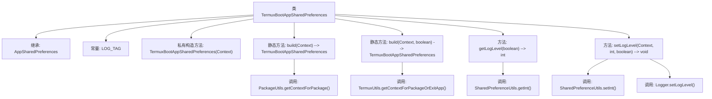

# 基础信息

|      |      |
|------|------|
| 名称 | TermuxBootAppSharedPreferences |
| 编码语言 | .java |
| 代码路径 | termux-app/termux-shared/src/main/java/com/termux/shared/termux/settings/preferences/TermuxBootAppSharedPreferences.java |
| 包名 | com.termux.shared.termux.settings.preferences |
| 依赖项 | ['android.content.Context', 'androidx.annotation.NonNull', 'androidx.annotation.Nullable', 'com.termux.shared.logger.Logger', 'com.termux.shared.android.PackageUtils', 'com.termux.shared.settings.preferences.AppSharedPreferences', 'com.termux.shared.settings.preferences.SharedPreferenceUtils', 'com.termux.shared.termux.TermuxUtils', 'com.termux.shared.termux.settings.preferences.TermuxPreferenceConstants.TERMUX_BOOT_APP', 'com.termux.shared.termux.TermuxConstants'] |
| 概述说明 | TermuxBootAppSharedPreferences类用于管理Termux启动应用的共享偏好设置，提供日志级别操作。 |

# 说明

TermuxBootAppSharedPreferences类继承自AppSharedPreferences，用于管理Termux Boot应用的共享偏好设置。它通过私有构造函数初始化，提供两种构建方法：build方法尝试获取包上下文，失败返回null；另一build方法支持失败时退出应用。类提供日志级别管理功能，支持从文件读取或直接设置日志级别，并能将更改提交到文件。所有操作均基于TermuxConstants中定义的常量进行。

# 类列表 Class Summary

| 名称   | 类型  | 说明 |
|-------|------|-------------|
| TermuxBootAppSharedPreferences | class | TermuxBootAppSharedPreferences类用于管理Termux启动应用的共享偏好设置，提供日志级别获取和设置功能。 |

## 类 TermuxBootAppSharedPreferences

|      |      |
|------|------|
| 访问范围 | public |
| 类型 | class |
| 名称 | TermuxBootAppSharedPreferences |
| 说明 | TermuxBootAppSharedPreferences类用于管理Termux启动应用的共享偏好设置，提供日志级别获取和设置功能。 |

### UML类图

```mermaid
classDiagram
    class TermuxBootAppSharedPreferences {
        -String LOG_TAG
        -TermuxBootAppSharedPreferences(Context context)
        +TermuxBootAppSharedPreferences build(Context context)
        +TermuxBootAppSharedPreferences build(Context context, boolean exitAppOnError)
        +int getLogLevel(boolean readFromFile)
        +void setLogLevel(Context context, int logLevel, boolean commitToFile)
    }

    class AppSharedPreferences {
        <<Abstract>>
    }

    class Context {
        <<Interface>>
    }

    class TermuxConstants {
        <<Interface>>
        +String TERMUX_BOOT_PACKAGE_NAME
        +String TERMUX_BOOT_DEFAULT_PREFERENCES_FILE_BASENAME_WITHOUT_EXTENSION
    }

    class SharedPreferenceUtils {
        <<Utility>>
        +SharedPreferences getPrivateSharedPreferences(Context context, String name)
        +SharedPreferences getPrivateAndMultiProcessSharedPreferences(Context context, String name)
        +int getInt(SharedPreferences sharedPreferences, String key, int def)
        +void setInt(SharedPreferences sharedPreferences, String key, int value, boolean commit)
    }

    class PackageUtils {
        <<Utility>>
        +Context getContextForPackage(Context context, String packageName)
    }

    class TermuxUtils {
        <<Utility>>
        +Context getContextForPackageOrExitApp(Context context, String packageName, boolean exitAppOnError)
    }

    class Logger {
        <<Utility>>
        +int DEFAULT_LOG_LEVEL
        +int setLogLevel(Context context, int logLevel)
    }

    TermuxBootAppSharedPreferences --|> AppSharedPreferences
    TermuxBootAppSharedPreferences --> Context : 依赖
    TermuxBootAppSharedPreferences --> TermuxConstants : 依赖
    TermuxBootAppSharedPreferences --> SharedPreferenceUtils : 依赖
    TermuxBootAppSharedPreferences --> PackageUtils : 依赖
    TermuxBootAppSharedPreferences --> TermuxUtils : 依赖
    TermuxBootAppSharedPreferences --> Logger : 依赖
```

这段代码定义了一个`TermuxBootAppSharedPreferences`类，用于管理Termux Boot应用的共享偏好设置。该类继承自`AppSharedPreferences`，提供了两种构建方法（带和不带错误处理选项），以及日志级别获取和设置功能。它依赖于多个工具类（`SharedPreferenceUtils`、`PackageUtils`、`TermuxUtils`）和常量接口`TermuxConstants`，通过上下文对象访问应用资源。主要功能包括从不同来源（文件或内存）读取日志级别，以及将日志级别设置持久化到共享偏好中。

### 内部方法调用关系图

这段代码流程图展示了TermuxBootAppSharedPreferences类的结构，该类继承自AppSharedPreferences，包含两个静态构建方法和两个实例方法。主要功能是通过不同方式获取应用上下文并管理日志级别设置，涉及PackageUtils、TermuxUtils、SharedPreferenceUtils和Logger等多个工具类的交互。构造方法私有化，强制通过build方法创建实例，体现了工厂模式的设计思想。

### 字段列表 Field List

| 名称  | 类型  | 说明 |
|-------|-------|------|
| LOG_TAG = "TermuxBootAppSharedPreferences" | String | 私有静态常量LOG_TAG值为TermuxBootAppSharedPreferences |

### 方法列表 Method List

| 名称  | 类型  | 说明 |
|-------|-------|------|
| setLogLevel | void | 设置日志级别并保存到文件 |
| getLogLevel | int | 根据参数从不同存储获取日志级别，默认返回预设值。 |
| build | TermuxBootAppSharedPreferences | 构建TermuxBootAppSharedPreferences实例，依赖包上下文，失败可退出应用。 |
| build | TermuxBootAppSharedPreferences | 构建TermuxBootAppSharedPreferences，若获取包上下文失败则返回null。 |

