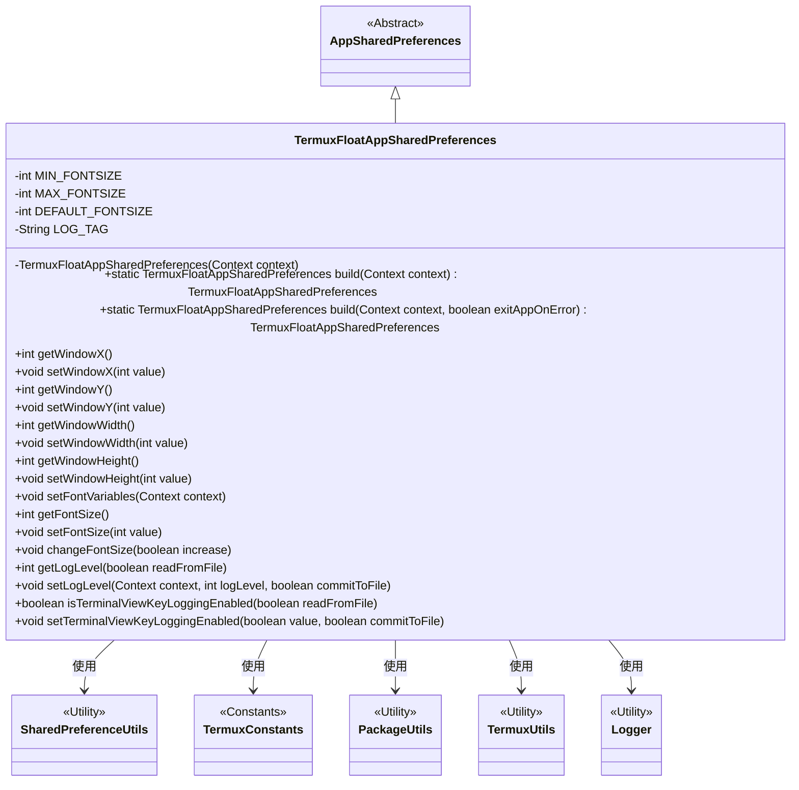
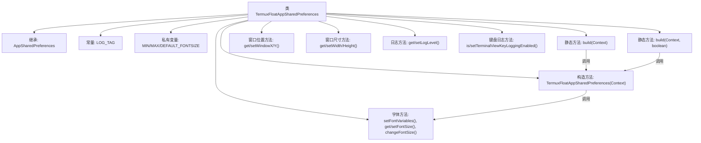

# 基础信息

|      |      |
|------|------|
| 名称 | TermuxFloatAppSharedPreferences |
| 编码语言 | .java |
| 代码路径 | termux-app/termux-shared/src/main/java/com/termux/shared/termux/settings/preferences/TermuxFloatAppSharedPreferences.java |
| 包名 | com.termux.shared.termux.settings.preferences |
| 依赖项 | ['android.content.Context', 'androidx.annotation.NonNull', 'androidx.annotation.Nullable', 'com.termux.shared.data.DataUtils', 'com.termux.shared.logger.Logger', 'com.termux.shared.android.PackageUtils', 'com.termux.shared.settings.preferences.AppSharedPreferences', 'com.termux.shared.settings.preferences.SharedPreferenceUtils', 'com.termux.shared.termux.TermuxUtils', 'com.termux.shared.termux.settings.preferences.TermuxPreferenceConstants.TERMUX_FLOAT_APP', 'com.termux.shared.termux.TermuxConstants'] |
| 概述说明 | Termux浮动窗口应用共享偏好设置类，管理窗口位置、大小、字体和日志等级等配置。 |

# 说明

TermuxFloatAppSharedPreferences类继承自AppSharedPreferences，用于管理Termux浮动窗口应用的共享偏好设置。它包含窗口位置（X/Y坐标）、大小（宽度/高度）、字体大小（默认值、最小/最大值）、日志级别和终端按键记录等配置项的获取与设置方法。通过私有构造方法和静态build方法初始化，支持多进程共享偏好设置，并提供字体大小调整功能。所有设置项均通过SharedPreferenceUtils工具类进行持久化操作。

# 类列表 Class Summary

| 名称   | 类型  | 说明 |
|-------|------|-------------|
| TermuxFloatAppSharedPreferences | class | Termux浮动窗口应用共享偏好设置类，管理窗口位置、大小、字体和日志级别等配置。 |

## 类 TermuxFloatAppSharedPreferences

|      |      |
|------|------|
| 访问范围 | public |
| 类型 | class |
| 名称 | TermuxFloatAppSharedPreferences |
| 说明 | Termux浮动窗口应用共享偏好设置类，管理窗口位置、大小、字体和日志级别等配置。 |

### UML类图

这段类图展示了TermuxFloatAppSharedPreferences类继承自AppSharedPreferences，并管理浮动终端窗口的偏好设置。该类通过SharedPreferenceUtils工具类操作共享首选项，包含窗口位置/尺寸控制、字体大小调整、日志级别设置等功能。通过build()方法获取实例，依赖多个工具类（PackageUtils/TermuxUtils）和常量类（TermuxConstants），实现了对浮动终端配置的集中管理，支持多进程共享和安全性控制。

### 内部方法调用关系图

该流程图展示了TermuxFloatAppSharedPreferences类的完整结构。该类继承自AppSharedPreferences，主要功能包括管理浮动终端窗口的位置/尺寸参数、字体大小设置、日志级别控制和键盘日志开关。核心是通过两个build()方法创建实例，构造方法会初始化字体变量，各类getter/setter方法通过SharedPreferenceUtils操作持久化数据。特别注意字体大小有最小/最大值限制，且日志功能支持多进程读取模式。

### 字段列表 Field List

| 名称  | 类型  | 说明 |
|-------|-------|------|
| MIN_FONTSIZE | int | 私有整型变量，最小字体大小。 |
| MAX_FONTSIZE | int | 私有整型常量MAX_FONTSIZE |
| LOG_TAG = "TermuxFloatAppSharedPreferences" | String | 私有静态终态字符串LOG_TAG值为TermuxFloatAppSharedPreferences |
| DEFAULT_FONTSIZE | int | 私有整型默认字体大小 |

### 方法列表 Method List

| 名称  | 类型  | 说明 |
|-------|-------|------|
| setLogLevel | void | 设置日志级别并保存到文件。 |
| setFontSize | void | 设置字体大小并存储到共享偏好设置中。 |
| setWindowY | void | 设置窗口Y坐标值并存储到共享偏好。 |
| setFontVariables | void | 设置字体大小变量：默认、最小、最大值从共享偏好中获取。 |
| getLogLevel | int | 根据参数从不同共享存储获取日志级别，默认返回Logger默认值。 |
| getWindowWidth | int | 获取窗口宽度，默认500。 |
| build | TermuxFloatAppSharedPreferences | 构建TermuxFloatAppSharedPreferences实例，依赖TermuxFloat包上下文，失败可退出应用。 |
| changeFontSize | void | 调整字体大小方法：根据增减参数以2为步长修改，限制在最小最大值间。 |
| getWindowHeight | int | 获取窗口高度，默认500。 |
| getFontSize | int | 获取字体大小，范围限制在最小和最大值之间。 |
| setWindowX | void | 设置窗口X坐标值并存储到共享偏好中。 |
| setWindowHeight | void | 设置窗口高度，保存到SharedPreferences。 |
| getWindowY | int | 获取窗口Y坐标，默认200。 |
| setWindowWidth | void | 设置窗口宽度并保存到共享偏好设置。 |
| build | TermuxFloatAppSharedPreferences | 创建TermuxFloatAppSharedPreferences实例，若包上下文为空则返回null。 |
| getWindowX | int | 获取窗口X坐标，默认值200。 |
| isTerminalViewKeyLoggingEnabled | boolean | 检查终端视图键记录是否启用，根据参数选择从文件或内存读取配置。 |
| setTerminalViewKeyLoggingEnabled | void | 设置终端视图按键记录开关，可选保存到文件。 |

