# 基础信息

|      |      |
|------|------|
| 名称 | TermuxPreferenceConstants |
| 编码语言 | .java |
| 代码路径 | termux-app/termux-shared/src/main/java/com/termux/shared/termux/settings/preferences/TermuxPreferenceConstants.java |
| 包名 | com.termux.shared.termux.settings.preferences |
| 依赖项 | ['com.termux.shared.shell.command.ExecutionCommand'] |
| 概述说明 | Termux应用及插件配置常量，包括终端、键盘、日志、窗口等设置项。 |

# 说明

TermuxPreferenceConstants类定义了Termux应用及其插件（API、Boot、Float、Styling、Tasker、Widget）的配置键和默认值。主要包含终端视图边距调整、工具栏显示、软键盘控制、屏幕常亮、字体大小、会话管理、日志级别、通知ID、错误报告等设置。各插件分别定义了窗口坐标、日志级别、待处理意图请求码等特定配置项。所有键均以字符串常量形式声明，并配有布尔或整型的默认值。

# 类列表 Class Summary

| 名称   | 类型  | 说明 |
|-------|------|-------------|
| TermuxPreferenceConstants | class | Termux应用及插件配置常量，包括终端调整、工具栏、键盘、日志等设置。 |

## 类 TermuxPreferenceConstants

|      |      |
|------|------|
| 访问范围 | public final |
| 类型 | class |
| 名称 | TermuxPreferenceConstants |
| 说明 | Termux应用及插件配置常量，包括终端调整、工具栏、键盘、日志等设置。 |

### UML类图

```mermaid
classDiagram
    class TermuxPreferenceConstants {
        <<final>>
    }

    class TERMUX_APP {
        <<static final>>
        +String KEY_TERMINAL_MARGIN_ADJUSTMENT
        +boolean DEFAULT_TERMINAL_MARGIN_ADJUSTMENT
        +String KEY_SHOW_TERMINAL_TOOLBAR
        +boolean DEFAULT_VALUE_SHOW_TERMINAL_TOOLBAR
        +String KEY_SOFT_KEYBOARD_ENABLED
        +boolean DEFAULT_VALUE_KEY_SOFT_KEYBOARD_ENABLED
        +String KEY_SOFT_KEYBOARD_ENABLED_ONLY_IF_NO_HARDWARE
        +boolean DEFAULT_VALUE_KEY_SOFT_KEYBOARD_ENABLED_ONLY_IF_NO_HARDWARE
        +String KEY_KEEP_SCREEN_ON
        +boolean DEFAULT_VALUE_KEEP_SCREEN_ON
        +String KEY_FONTSIZE
        +String KEY_CURRENT_SESSION
        +String KEY_LOG_LEVEL
        +String KEY_LAST_NOTIFICATION_ID
        +int DEFAULT_VALUE_KEY_LAST_NOTIFICATION_ID
        +String KEY_APP_SHELL_NUMBER_SINCE_BOOT
        +int DEFAULT_VALUE_APP_SHELL_NUMBER_SINCE_BOOT
        +String KEY_TERMINAL_SESSION_NUMBER_SINCE_BOOT
        +int DEFAULT_VALUE_TERMINAL_SESSION_NUMBER_SINCE_BOOT
        +String KEY_TERMINAL_VIEW_KEY_LOGGING_ENABLED
        +boolean DEFAULT_VALUE_TERMINAL_VIEW_KEY_LOGGING_ENABLED
        +String KEY_PLUGIN_ERROR_NOTIFICATIONS_ENABLED
        +boolean DEFAULT_VALUE_PLUGIN_ERROR_NOTIFICATIONS_ENABLED
        +String KEY_CRASH_REPORT_NOTIFICATIONS_ENABLED
        +boolean DEFAULT_VALUE_CRASH_REPORT_NOTIFICATIONS_ENABLED
    }

    class TERMUX_API_APP {
        <<static final>>
        +String KEY_LOG_LEVEL
        +String KEY_LAST_PENDING_INTENT_REQUEST_CODE
        +int DEFAULT_VALUE_KEY_LAST_PENDING_INTENT_REQUEST_CODE
    }

    class TERMUX_BOOT_APP {
        <<static final>>
        +String KEY_LOG_LEVEL
    }

    class TERMUX_FLOAT_APP {
        <<static final>>
        +String KEY_WINDOW_X
        +String KEY_WINDOW_Y
        +String KEY_WINDOW_WIDTH
        +String KEY_WINDOW_HEIGHT
        +String KEY_FONTSIZE
        +String KEY_LOG_LEVEL
        +String KEY_TERMINAL_VIEW_KEY_LOGGING_ENABLED
        +boolean DEFAULT_VALUE_TERMINAL_VIEW_KEY_LOGGING_ENABLED
    }

    class TERMUX_STYLING_APP {
        <<static final>>
        +String KEY_LOG_LEVEL
    }

    class TERMUX_TASKER_APP {
        <<static final>>
        +String KEY_LOG_LEVEL
        +String KEY_LAST_PENDING_INTENT_REQUEST_CODE
        +int DEFAULT_VALUE_KEY_LAST_PENDING_INTENT_REQUEST_CODE
    }

    class TERMUX_WIDGET_APP {
        <<static final>>
        +String KEY_LOG_LEVEL
        +String KEY_TOKEN
    }

    TermuxPreferenceConstants --> TERMUX_APP : 包含
    TermuxPreferenceConstants --> TERMUX_API_APP : 包含
    TermuxPreferenceConstants --> TERMUX_BOOT_APP : 包含
    TermuxPreferenceConstants --> TERMUX_FLOAT_APP : 包含
    TermuxPreferenceConstants --> TERMUX_STYLING_APP : 包含
    TermuxPreferenceConstants --> TERMUX_TASKER_APP : 包含
    TermuxPreferenceConstants --> TERMUX_WIDGET_APP : 包含
```

这段代码定义了一个名为TermuxPreferenceConstants的final类，其中包含多个静态final内部类，每个内部类代表Termux不同模块的配置常量。这些常量包括终端边距调整、工具栏显示、软键盘控制、日志级别等配置项的键名和默认值。类图展示了主类与各模块配置类之间的包含关系，所有内部类均为静态final且不可继承，体现了配置常量的不可变性和模块化设计。

### 内部方法调用关系图

```mermaid
graph TD
    A["final class TermuxPreferenceConstants"]
    B["static final class TERMUX_APP"]
    C["static final class TERMUX_API_APP"]
    D["static final class TERMUX_BOOT_APP"]
    E["static final class TERMUX_FLOAT_APP"]
    F["static final class TERMUX_STYLING_APP"]
    G["static final class TERMUX_TASKER_APP"]
    H["static final class TERMUX_WIDGET_APP"]

    A --> B
    A --> C
    A --> D
    A --> E
    A --> F
    A --> G
    A --> H

    B --> B1["KEY_TERMINAL_MARGIN_ADJUSTMENT"]
    B --> B2["DEFAULT_TERMINAL_MARGIN_ADJUSTMENT"]
    B --> B3["KEY_SHOW_TERMINAL_TOOLBAR"]
    B --> B4["DEFAULT_VALUE_SHOW_TERMINAL_TOOLBAR"]
    B --> B5["KEY_SOFT_KEYBOARD_ENABLED"]
    B --> B6["DEFAULT_VALUE_KEY_SOFT_KEYBOARD_ENABLED"]
    B --> B7["KEY_SOFT_KEYBOARD_ENABLED_ONLY_IF_NO_HARDWARE"]
    B --> B8["DEFAULT_VALUE_KEY_SOFT_KEYBOARD_ENABLED_ONLY_IF_NO_HARDWARE"]
    B --> B9["KEY_KEEP_SCREEN_ON"]
    B --> B10["DEFAULT_VALUE_KEEP_SCREEN_ON"]
    B --> B11["KEY_FONTSIZE"]
    B --> B12["KEY_CURRENT_SESSION"]
    B --> B13["KEY_LOG_LEVEL"]
    B --> B14["KEY_LAST_NOTIFICATION_ID"]
    B --> B15["DEFAULT_VALUE_KEY_LAST_NOTIFICATION_ID"]
    B --> B16["KEY_APP_SHELL_NUMBER_SINCE_BOOT"]
    B --> B17["DEFAULT_VALUE_APP_SHELL_NUMBER_SINCE_BOOT"]
    B --> B18["KEY_TERMINAL_SESSION_NUMBER_SINCE_BOOT"]
    B --> B19["DEFAULT_VALUE_TERMINAL_SESSION_NUMBER_SINCE_BOOT"]
    B --> B20["KEY_TERMINAL_VIEW_KEY_LOGGING_ENABLED"]
    B --> B21["DEFAULT_VALUE_TERMINAL_VIEW_KEY_LOGGING_ENABLED"]
    B --> B22["KEY_PLUGIN_ERROR_NOTIFICATIONS_ENABLED"]
    B --> B23["DEFAULT_VALUE_PLUGIN_ERROR_NOTIFICATIONS_ENABLED"]
    B --> B24["KEY_CRASH_REPORT_NOTIFICATIONS_ENABLED"]
    B --> B25["DEFAULT_VALUE_CRASH_REPORT_NOTIFICATIONS_ENABLED"]

    C --> C1["KEY_LOG_LEVEL"]
    C --> C2["KEY_LAST_PENDING_INTENT_REQUEST_CODE"]
    C --> C3["DEFAULT_VALUE_KEY_LAST_PENDING_INTENT_REQUEST_CODE"]

    D --> D1["KEY_LOG_LEVEL"]

    E --> E1["KEY_WINDOW_X"]
    E --> E2["KEY_WINDOW_Y"]
    E --> E3["KEY_WINDOW_WIDTH"]
    E --> E4["KEY_WINDOW_HEIGHT"]
    E --> E5["KEY_FONTSIZE"]
    E --> E6["KEY_LOG_LEVEL"]
    E --> E7["KEY_TERMINAL_VIEW_KEY_LOGGING_ENABLED"]
    E --> E8["DEFAULT_VALUE_TERMINAL_VIEW_KEY_LOGGING_ENABLED"]

    F --> F1["KEY_LOG_LEVEL"]

    G --> G1["KEY_LOG_LEVEL"]
    G --> G2["KEY_LAST_PENDING_INTENT_REQUEST_CODE"]
    G --> G3["DEFAULT_VALUE_KEY_LAST_PENDING_INTENT_REQUEST_CODE"]

    H --> H1["KEY_LOG_LEVEL"]
    H --> H2["KEY_TOKEN"]
```

这段代码定义了一个名为TermuxPreferenceConstants的final类，其中包含多个静态final内部类，每个内部类代表Termux应用的不同模块（如TERMUX_APP、TERMUX_API_APP等），并定义了各种配置键和默认值。这些键用于存储和检索应用的偏好设置，如终端边距调整、工具栏显示、软键盘启用状态、字体大小等。每个内部类都针对特定模块提供了相关的配置键和默认值，便于管理和维护应用的设置。

### 字段列表 Field List

| 名称  | 类型  | 说明 |
|-------|-------|------|

### 方法列表 Method List

| 名称  | 类型  | 说明 |
|-------|-------|------|

