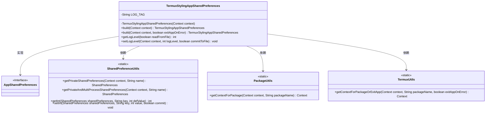
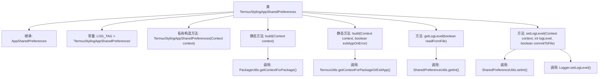

# 基础信息

|      |      |
|------|------|
| 名称 | TermuxStylingAppSharedPreferences |
| 编码语言 | .java |
| 代码路径 | termux-app/termux-shared/src/main/java/com/termux/shared/termux/settings/preferences/TermuxStylingAppSharedPreferences.java |
| 包名 | com.termux.shared.termux.settings.preferences |
| 依赖项 | ['android.content.Context', 'androidx.annotation.NonNull', 'androidx.annotation.Nullable', 'com.termux.shared.logger.Logger', 'com.termux.shared.android.PackageUtils', 'com.termux.shared.settings.preferences.AppSharedPreferences', 'com.termux.shared.settings.preferences.SharedPreferenceUtils', 'com.termux.shared.termux.TermuxUtils', 'com.termux.shared.termux.settings.preferences.TermuxPreferenceConstants.TERMUX_STYLING_APP', 'com.termux.shared.termux.TermuxConstants'] |
| 概述说明 | Termux样式应用共享偏好类，提供日志级别读写功能。 |

# 说明

TermuxStylingAppSharedPreferences类继承自AppSharedPreferences，用于管理Termux应用的样式配置。它通过私有构造方法初始化共享偏好设置，提供两种build方法获取实例：一种在获取包上下文失败时返回null，另一种可设置失败时退出应用。类中包含获取和设置日志级别的方法，支持从文件读取或直接操作偏好设置。所有操作均通过SharedPreferenceUtils工具类处理，确保多进程安全访问。

# 类列表 Class Summary

| 名称   | 类型  | 说明 |
|-------|------|-------------|
| TermuxStylingAppSharedPreferences | class | Termux样式应用共享偏好类，提供日志级别读写功能。 |

## 类 TermuxStylingAppSharedPreferences

|      |      |
|------|------|
| 访问范围 | public |
| 类型 | class |
| 名称 | TermuxStylingAppSharedPreferences |
| 说明 | Termux样式应用共享偏好类，提供日志级别读写功能。 |

### UML类图

该代码实现了一个Termux样式应用的共享偏好设置管理类，继承自基础偏好设置接口。核心功能包括：通过两种方式构建实例（普通模式和错误退出模式）、获取/设置日志级别。类通过静态工具类SharedPreferenceUtils操作SharedPreferences存储，并依赖PackageUtils和TermuxUtils处理包上下文获取逻辑。特别注意多进程共享偏好设置的支持，以及日志级别操作的原子性控制（commitToFile参数）。

### 内部方法调用关系图

该流程图展示了TermuxStylingAppSharedPreferences类的继承关系和主要方法调用链。该类继承自AppSharedPreferences，包含两个静态构建方法(build)和两个日志级别操作方法(getLogLevel/setLogLevel)。构建方法通过PackageUtils或TermuxUtils获取包上下文，日志操作方法则依赖SharedPreferenceUtils和Logger进行实际读写操作。所有方法都围绕Termux样式应用的共享偏好设置展开，支持多进程和文件读写控制。

### 字段列表 Field List

| 名称  | 类型  | 说明 |
|-------|-------|------|
| LOG_TAG = "TermuxStylingAppSharedPreferences" | String | 私有常量LOG_TAG用于Termux样式应用共享偏好设置日志标记。 |

### 方法列表 Method List

| 名称  | 类型  | 说明 |
|-------|-------|------|
| getLogLevel | int | 根据参数从文件或内存获取日志级别，默认返回DEFAULT_LOG_LEVEL。 |
| build | TermuxStylingAppSharedPreferences | 构建Termux样式应用共享首选项，需上下文支持，否则返回空。 |
| setLogLevel | void | 设置日志级别并保存到文件。 |
| build | TermuxStylingAppSharedPreferences | 构建Termux样式应用共享偏好，失败则退出应用。 |

