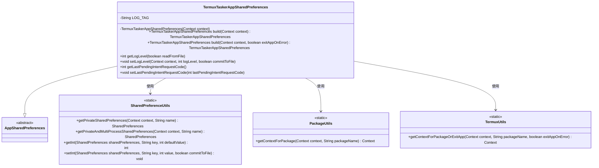
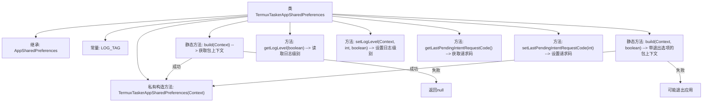

# 基础信息

|      |      |
|------|------|
| 名称 | TermuxTaskerAppSharedPreferences |
| 编码语言 | .java |
| 代码路径 | termux-app/termux-shared/src/main/java/com/termux/shared/termux/settings/preferences/TermuxTaskerAppSharedPreferences.java |
| 包名 | com.termux.shared.termux.settings.preferences |
| 依赖项 | ['android.content.Context', 'androidx.annotation.NonNull', 'androidx.annotation.Nullable', 'com.termux.shared.android.PackageUtils', 'com.termux.shared.settings.preferences.AppSharedPreferences', 'com.termux.shared.settings.preferences.SharedPreferenceUtils', 'com.termux.shared.termux.TermuxConstants', 'com.termux.shared.termux.TermuxUtils', 'com.termux.shared.termux.settings.preferences.TermuxPreferenceConstants.TERMUX_TASKER_APP', 'com.termux.shared.logger.Logger'] |
| 概述说明 | TermuxTasker应用共享偏好类，提供日志级别和请求码管理。 |

# 说明

TermuxTaskerAppSharedPreferences类继承自AppSharedPreferences，用于管理Termux Tasker应用的共享偏好设置。它通过私有构造方法初始化单进程和多进程共享偏好文件。提供两个静态build方法，根据上下文获取Termux Tasker包上下文并返回实例，支持错误处理选项。包含获取和设置日志级别的方法，支持从文件读取或直接操作。还提供管理最后待处理意图请求码的功能，包括获取和设置方法。所有操作均通过SharedPreferenceUtils工具类实现。

# 类列表 Class Summary

| 名称   | 类型  | 说明 |
|-------|------|-------------|
| TermuxTaskerAppSharedPreferences | class | TermuxTasker应用共享偏好类，提供日志级别和请求码管理。 |

## 类 TermuxTaskerAppSharedPreferences

|      |      |
|------|------|
| 访问范围 | public |
| 类型 | class |
| 名称 | TermuxTaskerAppSharedPreferences |
| 说明 | TermuxTasker应用共享偏好类，提供日志级别和请求码管理。 |

### UML类图

该类图展示了TermuxTaskerAppSharedPreferences继承自AppSharedPreferences，并依赖多个工具类实现功能。主要功能包括：通过两种build()方法构造实例（支持错误处理选项）、管理日志级别配置（支持文件读写）、维护最后待处理意图的请求码。关键工具类包括SharedPreferenceUtils（共享偏好操作）、PackageUtils/TermuxUtils（包上下文获取），体现了Android环境下配置管理的典型模式。

### 内部方法调用关系图

这段代码是TermuxTaskerAppSharedPreferences类的实现，主要用于管理Termux Tasker应用的共享偏好设置。它提供了两种构建方法（带/不带退出选项）来获取应用上下文，并包含日志级别管理和PendingIntent请求码管理的功能。类继承自AppSharedPreferences，通过私有构造方法初始化父类偏好设置，所有方法都通过SharedPreferenceUtils工具类操作实际数据存储。

### 字段列表 Field List

| 名称  | 类型  | 说明 |
|-------|-------|------|
| LOG_TAG = "TermuxTaskerAppSharedPreferences" | String | 私有静态常量LOG_TAG用于TermuxTaskerApp共享偏好设置日志标识。 |

### 方法列表 Method List

| 名称  | 类型  | 说明 |
|-------|-------|------|
| setLogLevel | void | 设置日志级别并保存到文件。 |
| getLogLevel | int | 根据参数从文件或内存获取日志级别，默认返回Logger.DEFAULT_LOG_LEVEL。 |
| getLastPendingIntentRequestCode | int | 获取最后待处理意图请求码，默认值来自共享偏好设置。 |
| build | TermuxTaskerAppSharedPreferences | 静态方法，根据上下文构建TermuxTaskerAppSharedPreferences对象，失败返回null。 |
| build | TermuxTaskerAppSharedPreferences | 构建TermuxTaskerAppSharedPreferences实例，依赖包上下文，失败可退出应用。 |
| setLastPendingIntentRequestCode | void | 设置最后待处理意图请求码并存储到共享偏好中。 |

