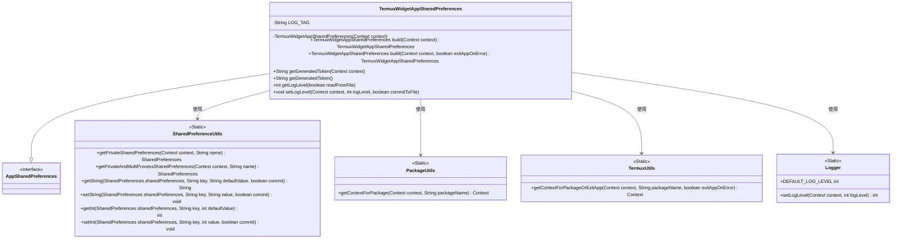
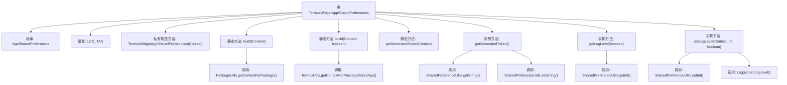

# 基础信息

|      |      |
|------|------|
| 名称 | TermuxWidgetAppSharedPreferences |
| 编码语言 | .java |
| 代码路径 | termux-app/termux-shared/src/main/java/com/termux/shared/termux/settings/preferences/TermuxWidgetAppSharedPreferences.java |
| 包名 | com.termux.shared.termux.settings.preferences |
| 依赖项 | ['android.content.Context', 'androidx.annotation.NonNull', 'androidx.annotation.Nullable', 'com.termux.shared.logger.Logger', 'com.termux.shared.android.PackageUtils', 'com.termux.shared.settings.preferences.AppSharedPreferences', 'com.termux.shared.settings.preferences.SharedPreferenceUtils', 'com.termux.shared.termux.TermuxUtils', 'com.termux.shared.termux.settings.preferences.TermuxPreferenceConstants.TERMUX_WIDGET_APP', 'com.termux.shared.termux.TermuxConstants', 'java.util.UUID'] |
| 概述说明 | Termux小部件应用共享偏好类，提供令牌生成和日志级别管理功能。 |

# 说明

TermuxWidgetAppSharedPreferences类继承自AppSharedPreferences，用于管理Termux小工具应用的共享偏好设置。它通过私有构造方法初始化上下文和偏好设置文件，提供两种build方法获取实例：一种在失败时返回null，另一种可配置失败时退出应用。类包含生成唯一令牌的功能，若不存在则创建并存储新令牌。此外，提供日志级别管理功能，支持从文件读取或直接获取当前值，并可设置日志级别同时可选是否立即提交到文件。所有操作均通过SharedPreferenceUtils工具类处理数据存取。

# 类列表 Class Summary

| 名称   | 类型  | 说明 |
|-------|------|-------------|
| TermuxWidgetAppSharedPreferences | class | Termux小部件应用共享偏好类，提供令牌生成和日志级别管理功能。 |

## 类 TermuxWidgetAppSharedPreferences

|      |      |
|------|------|
| 访问范围 | public |
| 类型 | class |
| 名称 | TermuxWidgetAppSharedPreferences |
| 说明 | Termux小部件应用共享偏好类，提供令牌生成和日志级别管理功能。 |

### UML类图

这段代码展示了一个Android共享偏好设置管理类TermuxWidgetAppSharedPreferences，它继承自AppSharedPreferences接口。该类通过静态工具类SharedPreferenceUtils、PackageUtils和TermuxUtils来管理应用配置数据，包括生成唯一令牌、获取/设置日志级别等功能。类设计遵循单一职责原则，通过封装工具类方法实现跨进程偏好设置访问，并提供了两种构建方式（普通构建和带错误处理的构建）。日志级别管理整合了Logger工具类，体现了良好的模块化设计。

### 内部方法调用关系图

该流程图展示了TermuxWidgetAppSharedPreferences类的结构和方法调用关系。该类继承自AppSharedPreferences，包含一个私有构造方法和多个静态/实例方法。关键功能包括通过build()方法获取实例、生成和管理token、以及日志级别设置。方法间通过SharedPreferenceUtils和Logger等工具类进行数据操作，体现了对Android共享偏好设置和日志系统的封装。

### 字段列表 Field List

| 名称  | 类型  | 说明 |
|-------|-------|------|
| LOG_TAG = "TermuxWidgetAppSharedPreferences" | String | 私有静态终字符串LOG_TAG值为TermuxWidgetAppSharedPreferences |

### 方法列表 Method List

| 名称  | 类型  | 说明 |
|-------|-------|------|
| getGeneratedToken | String | 获取Termux小部件应用的生成令牌，依赖上下文和共享偏好设置。 |
| setLogLevel | void | 设置日志级别并保存到文件。 |
| build | TermuxWidgetAppSharedPreferences | 静态方法根据上下文构建TermuxWidgetApp共享首选项，若包上下文为空则返回空。 |
| build | TermuxWidgetAppSharedPreferences | 构建TermuxWidgetAppSharedPreferences，依赖上下文和错误退出标志。 |
| getGeneratedToken | String | 获取或生成唯一令牌并存储。 |
| getLogLevel | int | 获取日志级别，根据参数决定从文件或共享配置读取。 |

