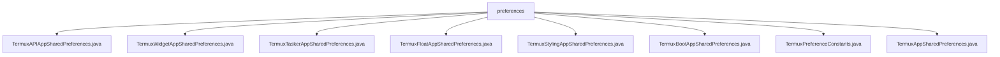

# 基础信息

|      |      |
|------|------|
| 名称 | preferences |
| 编码语言 | .java |
| 代码路径 | termux-app/termux-shared/src/main/java/com/termux/shared/termux/settings/preferences |
| 包名 | termux-app.termux-shared.src.main.java.com.termux.shared.termux.settings.preferences |
| 概述说明 | 
Termux应用及插件共享偏好设置管理类，提供日志级别、窗口位置、字体大小等配置项的存取功能，通过工具类实现多进程安全操作。 |

# 说明

## 概述

该代码模块是Termux应用及其插件的共享偏好设置管理系统，基于Android的`SharedPreferences`实现。模块采用分层设计，包含一个基础类`AppSharedPreferences`和多个子类，分别处理Termux主应用及其插件（API、Boot、Float、Styling、Tasker、Widget）的配置管理。所有子类通过`SharedPreferenceUtils`工具类进行数据操作，支持多进程安全访问，并提供统一的构建模式和错误处理机制。

核心功能包括：
- 管理各类应用的配置参数（如日志级别、窗口位置、字体大小等）
- 支持多进程共享偏好设置
- 提供带错误处理的实例构建方法
- 实现配置项的读取、写入和验证功能
- 维护终端会话状态和唯一标识符

## 主要业务场景

1. **应用配置管理**
   - 管理Termux主应用的终端显示设置（字体大小、边距、工具栏）
   - 控制功能开关（软键盘、屏幕常亮、错误报告）
   - 维护会话编号和终端编号

2. **插件专用配置**
   - Termux Float：浮动窗口的位置、尺寸和透明度设置
   - Termux API：最后待处理意图请求码管理
   - Termux Widget：生成和存储唯一令牌
   - Termux Tasker：任务执行相关的日志级别控制
   - Termux Boot：启动项配置管理
   - Termux Styling：终端颜色和样式配置

3. **日志系统控制**
   - 统一管理各模块的日志级别（读取/设置）
   - 支持从文件加载或直接修改配置
   - 提供立即提交到文件的选项

4. **多进程安全访问**
   - 通过多进程共享偏好文件实现跨进程配置同步
   - 确保关键配置（如窗口位置）在多进程环境中的一致性

5. **错误处理与恢复**
   - 提供可选的失败退出机制
   - 维护崩溃通知设置
   - 支持配置项默认值回退

6. **状态维护**
   - 管理会话和终端的自增编号
   - 跟踪最后待处理的意图请求
   - 保持字体大小等数值在有效范围内

### 包内部结构视图

该流程图展示了Termux应用中共享设置模块的层级结构，根节点为preferences目录，其下包含8个不同的Java偏好设置类文件，分别对应Termux的不同功能模块（如API、Widget、Tasker等）的共享偏好设置实现。所有子节点均为直接隶属于preferences目录的配置文件，没有更深层级的嵌套关系。

# 文件列表 File List

| 名称   | 类型  | 说明 |
|-------|------|-------------|
| [TermuxPreferenceConstants.java](TermuxPreferenceConstants.md) | file | Termux应用及插件配置常量，包括终端、键盘、日志、窗口等设置项。 |
| [TermuxBootAppSharedPreferences.java](TermuxBootAppSharedPreferences.md) | file | TermuxBootAppSharedPreferences类用于管理Termux启动应用的共享偏好设置，提供日志级别操作。 |
| [TermuxStylingAppSharedPreferences.java](TermuxStylingAppSharedPreferences.md) | file | Termux样式应用共享偏好类，提供日志级别读写功能。 |
| [TermuxFloatAppSharedPreferences.java](TermuxFloatAppSharedPreferences.md) | file | Termux浮动窗口应用共享偏好设置类，管理窗口位置、大小、字体和日志等级等配置。 |
| [TermuxTaskerAppSharedPreferences.java](TermuxTaskerAppSharedPreferences.md) | file | TermuxTasker应用共享偏好类，提供日志级别和请求码管理。 |
| [TermuxWidgetAppSharedPreferences.java](TermuxWidgetAppSharedPreferences.md) | file | Termux小部件应用共享偏好类，提供令牌生成和日志级别管理功能。 |
| [TermuxAPIAppSharedPreferences.java](TermuxAPIAppSharedPreferences.md) | file | TermuxAPI应用共享偏好类，提供日志级别和请求码管理功能。 |
| [TermuxAppSharedPreferences.java](TermuxAppSharedPreferences.md) | file | Termux应用共享偏好设置类，管理字体、工具栏、键盘等配置。 |

