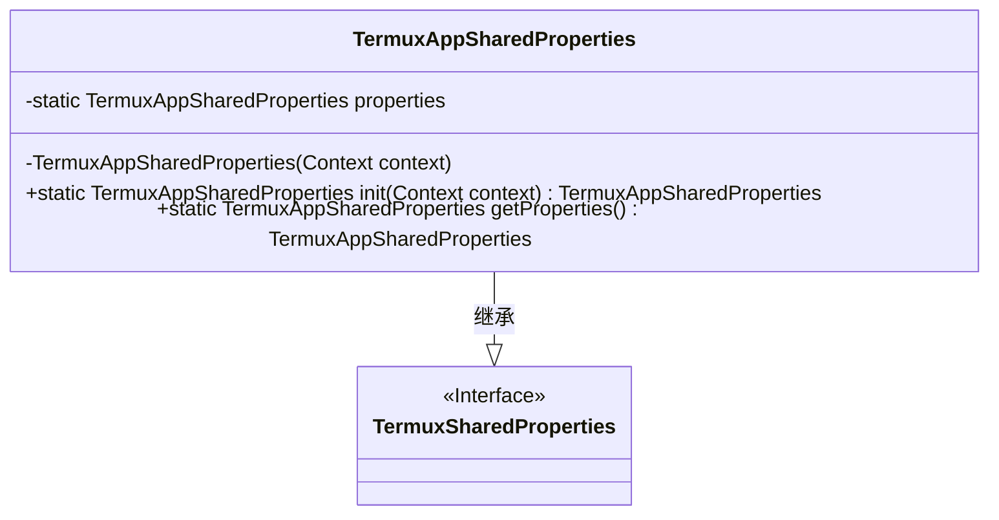
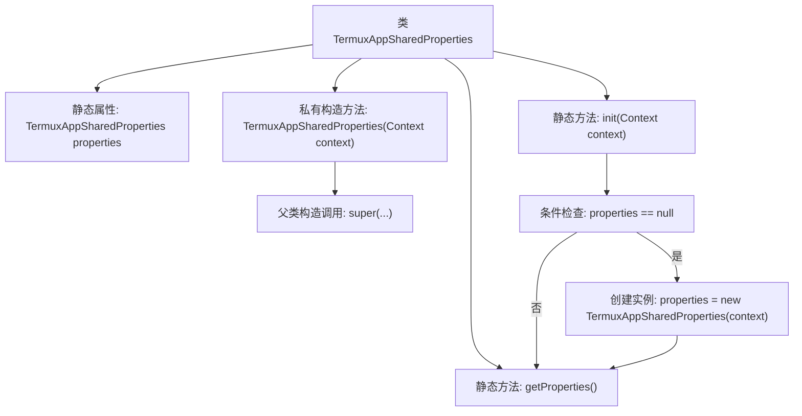

# 基础信息

|      |      |
|------|------|
| 名称 | TermuxAppSharedProperties |
| 编码语言 | .java |
| 代码路径 | termux-app/termux-shared/src/main/java/com/termux/shared/termux/settings/properties/TermuxAppSharedProperties.java |
| 包名 | com.termux.shared.termux.settings.properties |
| 依赖项 | ['android.content.Context', 'androidx.annotation.NonNull', 'com.termux.shared.termux.TermuxConstants'] |
| 概述说明 | TermuxAppSharedProperties类管理Termux应用属性，提供初始化和获取方法。 |

# 说明

TermuxAppSharedProperties是TermuxSharedProperties的子类，用于管理Termux应用的共享属性。该类采用单例模式，通过私有构造函数初始化，并接受Context参数及预定义的常量配置。提供静态方法init()用于首次初始化并加载磁盘属性，getProperties()用于获取实例。所有操作均基于NonNull上下文，确保线程安全与数据一致性。

# 类列表 Class Summary

| 名称   | 类型  | 说明 |
|-------|------|-------------|
| TermuxAppSharedProperties | class | TermuxAppSharedProperties类管理Termux应用属性，提供初始化和获取方法。 |

## 类 TermuxAppSharedProperties

|      |      |
|------|------|
| 访问范围 | public |
| 类型 | class |
| 名称 | TermuxAppSharedProperties |
| 说明 | TermuxAppSharedProperties类管理Termux应用属性，提供初始化和获取方法。 |

### UML类图

这段代码展示了一个单例模式的实现，TermuxAppSharedProperties继承自TermuxSharedProperties接口，通过私有构造函数和静态方法控制实例化过程。init()方法确保全局唯一实例，getProperties()提供访问入口，用于管理Termux应用的共享配置属性。类图清晰地体现了继承关系和单例控制逻辑，私有静态变量properties存储唯一实例，符合线程安全的懒加载模式。

### 内部方法调用关系图

该流程图展示了TermuxAppSharedProperties类的核心结构和工作流程。类包含一个静态单例属性properties，通过私有构造方法初始化，构造时调用父类TermuxSharedProperties的构造方法。init()方法实现延迟初始化模式，首次调用时创建实例并缓存，后续直接返回缓存实例。getProperties()方法直接返回静态属性，整个设计遵循单例模式确保全局唯一配置访问。

### 字段列表 Field List

| 名称  | 类型  | 说明 |
|-------|-------|------|
| properties | TermuxAppSharedProperties | 私有静态TermuxAppSharedProperties属性 |

### 方法列表 Method List

| 名称  | 类型  | 说明 |
|-------|-------|------|
| getProperties | TermuxAppSharedProperties | 获取TermuxApp共享属性对象。 |
| init | TermuxAppSharedProperties | 初始化Termux应用共享属性，单例模式确保唯一实例。 |

