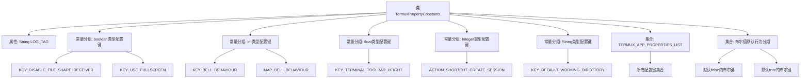

# 基础信息

|      |      |
|------|------|
| 名称 | TermuxPropertyConstants |
| 编码语言 | .java |
| 代码路径 | termux-app/termux-shared/src/main/java/com/termux/shared/termux/settings/properties/TermuxPropertyConstants.java |
| 包名 | com.termux.shared.termux.settings.properties |
| 依赖项 | ['com.google.common.collect.ImmutableBiMap', 'com.termux.shared.termux.shell.am.TermuxAmSocketServer', 'com.termux.shared.theme.NightMode', 'com.termux.shared.file.FileUtils', 'com.termux.shared.file.filesystem.FileType', 'com.termux.shared.settings.properties.SharedProperties', 'com.termux.shared.termux.TermuxConstants', 'com.termux.shared.logger.Logger', 'com.termux.terminal.TerminalEmulator', 'com.termux.view.TerminalView', 'java.io.File', 'java.util.Arrays', 'java.util.HashSet', 'java.util.List', 'java.util.Set'] |
| 概述说明 | Termux属性常量类，包含布尔、整型、浮点、字符串等配置键及默认值。 |

# 说明

TermuxPropertyConstants类定义了Termux应用的配置属性常量，包含布尔型、整型、浮点型和字符串型等多种类型。主要功能包括控制文件共享、键盘快捷键、终端行为、UI样式等。布尔型属性如禁用文件共享接收器、隐藏软键盘等；整型属性如终端光标样式、边距设置等；字符串型属性如默认工作目录、额外按键配置等。类中还定义了各属性的默认值、取值范围及双向映射关系，用于属性值的验证和转换。属性列表分为默认true/false布尔行为及反转布尔行为等不同集合，便于统一管理。

# 类列表 Class Summary

| 名称   | 类型  | 说明 |
|-------|------|-------------|
| TermuxPropertyConstants | class | Termux属性常量类，包含布尔、整型、浮点、字符串等配置键及默认值，用于控制终端行为、快捷键、UI等。 |

## 类 TermuxPropertyConstants

|      |      |
|------|------|
| 访问范围 | public final |
| 类型 | class |
| 名称 | TermuxPropertyConstants |
| 说明 | Termux属性常量类，包含布尔、整型、浮点、字符串等配置键及默认值，用于控制终端行为、快捷键、UI等。 |

### UML类图

```mermaid
classDiagram
    class TermuxPropertyConstants {
        -String LOG_TAG
        +String KEY_DISABLE_FILE_SHARE_RECEIVER
        +String KEY_DISABLE_FILE_VIEW_RECEIVER
        +String KEY_DISABLE_HARDWARE_KEYBOARD_SHORTCUTS
        +String KEY_DISABLE_TERMINAL_SESSION_CHANGE_TOAST
        +String KEY_ENFORCE_CHAR_BASED_INPUT
        +String KEY_EXTRA_KEYS_TEXT_ALL_CAPS
        +String KEY_HIDE_SOFT_KEYBOARD_ON_STARTUP
        +String KEY_RUN_TERMUX_AM_SOCKET_SERVER
        +String KEY_TERMINAL_ONCLICK_URL_OPEN
        +String KEY_USE_BLACK_UI
        +String KEY_USE_CTRL_SPACE_WORKAROUND
        +String KEY_USE_FULLSCREEN
        +String KEY_USE_FULLSCREEN_WORKAROUND
        +String KEY_BELL_BEHAVIOUR
        +String VALUE_BELL_BEHAVIOUR_VIBRATE
        +String VALUE_BELL_BEHAVIOUR_BEEP
        +String VALUE_BELL_BEHAVIOUR_IGNORE
        +String DEFAULT_VALUE_BELL_BEHAVIOUR
        +int IVALUE_BELL_BEHAVIOUR_VIBRATE
        +int IVALUE_BELL_BEHAVIOUR_BEEP
        +int IVALUE_BELL_BEHAVIOUR_IGNORE
        +int DEFAULT_IVALUE_BELL_BEHAVIOUR
        +ImmutableBiMap~String, Integer~ MAP_BELL_BEHAVIOUR
        +String KEY_TERMINAL_CURSOR_BLINK_RATE
        +int IVALUE_TERMINAL_CURSOR_BLINK_RATE_MIN
        +int IVALUE_TERMINAL_CURSOR_BLINK_RATE_MAX
        +int DEFAULT_IVALUE_TERMINAL_CURSOR_BLINK_RATE
        +String KEY_TERMINAL_CURSOR_STYLE
        +String VALUE_TERMINAL_CURSOR_STYLE_BLOCK
        +String VALUE_TERMINAL_CURSOR_STYLE_UNDERLINE
        +String VALUE_TERMINAL_CURSOR_STYLE_BAR
        +int IVALUE_TERMINAL_CURSOR_STYLE_BLOCK
        +int IVALUE_TERMINAL_CURSOR_STYLE_UNDERLINE
        +int IVALUE_TERMINAL_CURSOR_STYLE_BAR
        +int DEFAULT_IVALUE_TERMINAL_CURSOR_STYLE
        +ImmutableBiMap~String, Integer~ MAP_TERMINAL_CURSOR_STYLE
        +String KEY_DELETE_TMPDIR_FILES_OLDER_THAN_X_DAYS_ON_EXIT
        +int IVALUE_DELETE_TMPDIR_FILES_OLDER_THAN_X_DAYS_ON_EXIT_MIN
        +int IVALUE_DELETE_TMPDIR_FILES_OLDER_THAN_X_DAYS_ON_EXIT_MAX
        +int DEFAULT_IVALUE_DELETE_TMPDIR_FILES_OLDER_THAN_X_DAYS_ON_EXIT
        +String KEY_TERMINAL_MARGIN_HORIZONTAL
        +int IVALUE_TERMINAL_MARGIN_HORIZONTAL_MIN
        +int IVALUE_TERMINAL_MARGIN_HORIZONTAL_MAX
        +int DEFAULT_IVALUE_TERMINAL_MARGIN_HORIZONTAL
        +String KEY_TERMINAL_MARGIN_VERTICAL
        +int IVALUE_TERMINAL_MARGIN_VERTICAL_MIN
        +int IVALUE_TERMINAL_MARGIN_VERTICAL_MAX
        +int DEFAULT_IVALUE_TERMINAL_MARGIN_VERTICAL
        +String KEY_TERMINAL_TRANSCRIPT_ROWS
        +int IVALUE_TERMINAL_TRANSCRIPT_ROWS_MIN
        +int IVALUE_TERMINAL_TRANSCRIPT_ROWS_MAX
        +int DEFAULT_IVALUE_TERMINAL_TRANSCRIPT_ROWS
        +String KEY_TERMINAL_TOOLBAR_HEIGHT_SCALE_FACTOR
        +float IVALUE_TERMINAL_TOOLBAR_HEIGHT_SCALE_FACTOR_MIN
        +float IVALUE_TERMINAL_TOOLBAR_HEIGHT_SCALE_FACTOR_MAX
        +float DEFAULT_IVALUE_TERMINAL_TOOLBAR_HEIGHT_SCALE_FACTOR
        +String KEY_SHORTCUT_CREATE_SESSION
        +String KEY_SHORTCUT_NEXT_SESSION
        +String KEY_SHORTCUT_PREVIOUS_SESSION
        +String KEY_SHORTCUT_RENAME_SESSION
        +int ACTION_SHORTCUT_CREATE_SESSION
        +int ACTION_SHORTCUT_NEXT_SESSION
        +int ACTION_SHORTCUT_PREVIOUS_SESSION
        +int ACTION_SHORTCUT_RENAME_SESSION
        +ImmutableBiMap~String, Integer~ MAP_SESSION_SHORTCUTS
        +String KEY_BACK_KEY_BEHAVIOUR
        +String IVALUE_BACK_KEY_BEHAVIOUR_BACK
        +String IVALUE_BACK_KEY_BEHAVIOUR_ESCAPE
        +String DEFAULT_IVALUE_BACK_KEY_BEHAVIOUR
        +ImmutableBiMap~String, String~ MAP_BACK_KEY_BEHAVIOUR
        +String KEY_DEFAULT_WORKING_DIRECTORY
        +String DEFAULT_IVALUE_DEFAULT_WORKING_DIRECTORY
        +String KEY_EXTRA_KEYS
        +String DEFAULT_IVALUE_EXTRA_KEYS
        +String KEY_EXTRA_KEYS_STYLE
        +String DEFAULT_IVALUE_EXTRA_KEYS_STYLE
        +String KEY_NIGHT_MODE
        +String IVALUE_NIGHT_MODE_TRUE
        +String IVALUE_NIGHT_MODE_FALSE
        +String IVALUE_NIGHT_MODE_SYSTEM
        +String DEFAULT_IVALUE_NIGHT_MODE
        +ImmutableBiMap~String, String~ MAP_NIGHT_MODE
        +String KEY_SOFT_KEYBOARD_TOGGLE_BEHAVIOUR
        +String IVALUE_SOFT_KEYBOARD_TOGGLE_BEHAVIOUR_SHOW_HIDE
        +String IVALUE_SOFT_KEYBOARD_TOGGLE_BEHAVIOUR_ENABLE_DISABLE
        +String DEFAULT_IVALUE_SOFT_KEYBOARD_TOGGLE_BEHAVIOUR
        +ImmutableBiMap~String, String~ MAP_SOFT_KEYBOARD_TOGGLE_BEHAVIOUR
        +String KEY_VOLUME_KEYS_BEHAVIOUR
        +String IVALUE_VOLUME_KEY_BEHAVIOUR_VIRTUAL
        +String IVALUE_VOLUME_KEY_BEHAVIOUR_VOLUME
        +String DEFAULT_IVALUE_VOLUME_KEYS_BEHAVIOUR
        +ImmutableBiMap~String, String~ MAP_VOLUME_KEYS_BEHAVIOUR
        +Set~String~ TERMUX_APP_PROPERTIES_LIST
        +Set~String~ TERMUX_DEFAULT_FALSE_BOOLEAN_BEHAVIOUR_PROPERTIES_LIST
        +Set~String~ TERMUX_DEFAULT_TRUE_BOOLEAN_BEHAVIOUR_PROPERTIES_LIST
        +Set~String~ TERMUX_DEFAULT_INVERETED_FALSE_BOOLEAN_BEHAVIOUR_PROPERTIES_LIST
        +Set~String~ TERMUX_DEFAULT_INVERETED_TRUE_BOOLEAN_BEHAVIOUR_PROPERTIES_LIST
    }
```

TermuxPropertyConstants 是一个包含大量静态常量的最终类，主要用于定义 Termux 应用的各种配置键名、默认值及其行为映射。该类涵盖了布尔型、整型、浮点型和字符串型的配置项，并提供了多个预定义的常量集合，用于区分不同默认行为的配置项。通过 ImmutableBiMap 实现了键值与内部值的双向映射，便于配置的解析和使用。

### 内部方法调用关系图

该流程图展示了TermuxPropertyConstants类的核心结构，这是一个包含Termux应用所有配置常量的最终类。主要分为6大类配置常量（布尔型、整型等）和2个重要集合（所有属性列表和布尔值行为分组）。其中布尔型配置占比最大，包含12个独立配置键；整型配置包含7个键和2个双向映射表；字符串型配置包含6个键和3个映射表。流程图清晰呈现了常量分组逻辑和集合包含关系，反映了Termux应用复杂但组织良好的配置管理系统。

### 字段列表 Field List

| 名称  | 类型  | 说明 |
|-------|-------|------|
| DEFAULT_IVALUE_TERMINAL_CURSOR_STYLE = TerminalEmulator.DEFAULT_TERMINAL_CURSOR_STYLE | int | 定义终端光标样式的默认整型常量。 |
| KEY_DISABLE_FILE_SHARE_RECEIVER =  "disable-file-share-receiver" | String | 禁用文件共享接收器的常量键。 |
| MAP_BACK_KEY_BEHAVIOUR =        new ImmutableBiMap.Builder<String, String>()            .put(IVALUE_BACK_KEY_BEHAVIOUR_BACK, IVALUE_BACK_KEY_BEHAVIOUR_BACK)            .put(IVALUE_BACK_KEY_BEHAVIOUR_ESCAPE, IVALUE_BACK_KEY_BEHAVIOUR_ESCAPE)            .build() | ImmutableBiMap<String, String> | 定义不可变双向映射MAP_BACK_KEY_BEHAVIOUR，包含BACK和ESCAPE键值对。 |
| DEFAULT_IVALUE_TERMINAL_TOOLBAR_HEIGHT_SCALE_FACTOR = 1 | float | 静态常量DEFAULT_IVALUE_TERMINAL_TOOLBAR_HEIGHT_SCALE_FACTOR值为1。 |
| DEFAULT_IVALUE_TERMINAL_MARGIN_VERTICAL = 0 | int | 静态整型常量，默认垂直边距为0。 |
| KEY_TERMINAL_ONCLICK_URL_OPEN =  "terminal-onclick-url-open" | String | 终端点击URL打开键 |
| KEY_RUN_TERMUX_AM_SOCKET_SERVER =  "run-termux-am-socket-server" | String | 运行Termux AM Socket服务器的键值 |
| KEY_NIGHT_MODE = "night-mode" | String | 定义常量字符串KEY_NIGHT_MODE，值为"night-mode"。 |
| DEFAULT_IVALUE_BACK_KEY_BEHAVIOUR = IVALUE_BACK_KEY_BEHAVIOUR_BACK | String | 静态常量定义默认返回键行为为"BACK"。 |
| DEFAULT_IVALUE_TERMINAL_CURSOR_BLINK_RATE = 0 | int | 静态常量，默认终端光标闪烁速率为0。 |
| IVALUE_TERMINAL_MARGIN_VERTICAL_MAX = 100 | int | 静态整型常量，垂直边距最大值为100。 |
| IVALUE_TERMINAL_CURSOR_BLINK_RATE_MAX = TerminalView.TERMINAL_CURSOR_BLINK_RATE_MAX | int | 终端光标最大闪烁率常量 |
| IVALUE_VOLUME_KEY_BEHAVIOUR_VIRTUAL = "virtual" | String | 静态常量IVALUE_VOLUME_KEY_BEHAVIOUR_VIRTUAL值为"virtual"。 |
| KEY_HIDE_SOFT_KEYBOARD_ON_STARTUP =  "hide-soft-keyboard-on-startup" | String | 隐藏启动时的软键盘 |
| KEY_USE_BLACK_UI =  "use-black-ui" | String | 废弃常量KEY_USE_BLACK_UI，值为"use-black-ui"。 |
| IVALUE_TERMINAL_CURSOR_BLINK_RATE_MIN = TerminalView.TERMINAL_CURSOR_BLINK_RATE_MIN | int | 终端光标最小闪烁率常量，引用自TerminalView类。 |
| KEY_VOLUME_KEYS_BEHAVIOUR =  "volume-keys" | String | 音量键行为常量定义 |
| KEY_TERMINAL_CURSOR_STYLE =  "terminal-cursor-style" | String | 终端光标样式键常量 |
| DEFAULT_IVALUE_TERMINAL_MARGIN_HORIZONTAL = 3 | int | 静态整型常量，默认水平边距值为3。 |
| MAP_SOFT_KEYBOARD_TOGGLE_BEHAVIOUR =        new ImmutableBiMap.Builder<String, String>()            .put(IVALUE_SOFT_KEYBOARD_TOGGLE_BEHAVIOUR_SHOW_HIDE, IVALUE_SOFT_KEYBOARD_TOGGLE_BEHAVIOUR_SHOW_HIDE)            .put(IVALUE_SOFT_KEYBOARD_TOGGLE_BEHAVIOUR_ENABLE_DISABLE, IVALUE_SOFT_KEYBOARD_TOGGLE_BEHAVIOUR_ENABLE_DISABLE)            .build() | ImmutableBiMap<String, String> | 定义不可变双向映射，关联软键盘切换行为的两种键值。 |
| MAP_SESSION_SHORTCUTS =        new ImmutableBiMap.Builder<String, Integer>()            .put(KEY_SHORTCUT_CREATE_SESSION, ACTION_SHORTCUT_CREATE_SESSION)            .put(KEY_SHORTCUT_NEXT_SESSION, ACTION_SHORTCUT_NEXT_SESSION)            .put(KEY_SHORTCUT_PREVIOUS_SESSION, ACTION_SHORTCUT_PREVIOUS_SESSION)            .put(KEY_SHORTCUT_RENAME_SESSION, ACTION_SHORTCUT_RENAME_SESSION)            .build() | ImmutableBiMap<String, Integer> | 定义不可变双向映射，关联快捷键键名与操作值。 |
| KEY_TERMINAL_CURSOR_BLINK_RATE =  "terminal-cursor-blink-rate" | String | 终端光标闪烁频率键名 |
| IVALUE_TERMINAL_MARGIN_HORIZONTAL_MAX = 100 | int | 静态常量IVALUE_TERMINAL_MARGIN_HORIZONTAL_MAX值为100。 |
| ACTION_SHORTCUT_RENAME_SESSION = 4 | int | 静态常量ACTION_SHORTCUT_RENAME_SESSION值为4 |
| KEY_ENFORCE_CHAR_BASED_INPUT =  "enforce-char-based-input" | String | 静态常量KEY_ENFORCE_CHAR_BASED_INPUT，值为"enforce-char-based-input"。 |
| KEY_BACK_KEY_BEHAVIOUR =  "back-key" | String | 定义常量KEY_BACK_KEY_BEHAVIOUR，值为"back-key"。 |
| KEY_DISABLE_TERMINAL_SESSION_CHANGE_TOAST =  "disable-terminal-session-change-toast" | String | 静态常量KEY_DISABLE_TERMINAL_SESSION_CHANGE_TOAST，值为"disable-terminal-session-change-toast"。 |
| MAP_BELL_BEHAVIOUR =        new ImmutableBiMap.Builder<String, Integer>()            .put(VALUE_BELL_BEHAVIOUR_VIBRATE, IVALUE_BELL_BEHAVIOUR_VIBRATE)            .put(VALUE_BELL_BEHAVIOUR_BEEP, IVALUE_BELL_BEHAVIOUR_BEEP)            .put(VALUE_BELL_BEHAVIOUR_IGNORE, IVALUE_BELL_BEHAVIOUR_IGNORE)            .build() | ImmutableBiMap<String, Integer> | 定义不可变双向映射MAP_BELL_BEHAVIOUR，关联铃声行为值与常量。 |
| KEY_EXTRA_KEYS_TEXT_ALL_CAPS =  "extra-keys-text-all-caps" | String | 静态常量字符串，键名"extra-keys-text-all-caps"。 |
| KEY_TERMINAL_MARGIN_VERTICAL =  "terminal-margin-vertical" | String | 终端垂直边距键常量定义 |
| IVALUE_TERMINAL_MARGIN_HORIZONTAL_MIN = 0 | int | 静态整型常量，最小水平边距值为0。 |
| IVALUE_SOFT_KEYBOARD_TOGGLE_BEHAVIOUR_ENABLE_DISABLE = "enable/disable" | String | 软键盘切换行为设为启用/禁用 |
| DEFAULT_IVALUE_BELL_BEHAVIOUR = IVALUE_BELL_BEHAVIOUR_VIBRATE | int | 静态常量DEFAULT_IVALUE_BELL_BEHAVIOUR默认值为振动模式。 |
| KEY_SHORTCUT_CREATE_SESSION =  "shortcut.create-session" | String | 静态常量KEY_SHORTCUT_CREATE_SESSION，值为"shortcut.create-session"。 |
| KEY_TERMINAL_MARGIN_HORIZONTAL =  "terminal-margin-horizontal" | String | 静态常量字符串，定义终端水平边距键名。 |
| ACTION_SHORTCUT_NEXT_SESSION = 2 | int | 快捷键操作为下一会话，值为2。 |
| IVALUE_SOFT_KEYBOARD_TOGGLE_BEHAVIOUR_SHOW_HIDE = "show/hide" | String | 静态常量定义软键盘切换行为为显示/隐藏 |
| KEY_DISABLE_FILE_VIEW_RECEIVER =  "disable-file-view-receiver" | String | 静态常量KEY_DISABLE_FILE_VIEW_RECEIVER，值为"disable-file-view-receiver"。 |
| DEFAULT_IVALUE_DELETE_TMPDIR_FILES_OLDER_THAN_X_DAYS_ON_EXIT = 3 | int | 删除超过3天的临时目录文件 |
| KEY_DISABLE_HARDWARE_KEYBOARD_SHORTCUTS =  "disable-hardware-keyboard-shortcuts" | String | 禁用硬件键盘快捷键的静态常量键名 |
| ACTION_SHORTCUT_CREATE_SESSION = 1 | int | 创建会话快捷操作常量，值为1。 |
| KEY_SOFT_KEYBOARD_TOGGLE_BEHAVIOUR =  "soft-keyboard-toggle-behaviour" | String | 静态常量KEY_SOFT_KEYBOARD_TOGGLE_BEHAVIOUR表示软键盘切换行为键。 |
| IVALUE_BELL_BEHAVIOUR_BEEP = 2 | int | 常量IVALUE_BELL_BEHAVIOUR_BEEP值为2，表示蜂鸣行为。 |
| IVALUE_BELL_BEHAVIOUR_VIBRATE = 1 | int | 静态常量IVALUE_BELL_BEHAVIOUR_VIBRATE值为1，表示振动行为。 |
| IVALUE_NIGHT_MODE_TRUE = NightMode.TRUE.getName() | String | 静态常量定义夜间模式值为TRUE的名称。 |
| KEY_SHORTCUT_RENAME_SESSION =  "shortcut.rename-session" | String | 静态常量定义快捷键重命名会话的键名。 |
| IVALUE_DELETE_TMPDIR_FILES_OLDER_THAN_X_DAYS_ON_EXIT_MAX = 100000 | int | 删除超过10万天的临时目录文件 |
| MAP_NIGHT_MODE =        new ImmutableBiMap.Builder<String, String>()            .put(IVALUE_NIGHT_MODE_TRUE, IVALUE_NIGHT_MODE_TRUE)            .put(IVALUE_NIGHT_MODE_FALSE, IVALUE_NIGHT_MODE_FALSE)            .put(IVALUE_NIGHT_MODE_SYSTEM, IVALUE_NIGHT_MODE_SYSTEM)            .build() | ImmutableBiMap<String, String> | 定义不可变双向映射MAP_NIGHT_MODE，包含三种夜间模式键值对。 |
| IVALUE_BACK_KEY_BEHAVIOUR_BACK = "back" | String | 静态常量IVALUE_BACK_KEY_BEHAVIOUR_BACK值为"back"。 |
| DEFAULT_IVALUE_SOFT_KEYBOARD_TOGGLE_BEHAVIOUR = IVALUE_SOFT_KEYBOARD_TOGGLE_BEHAVIOUR_SHOW_HIDE | String | 静态常量定义软键盘默认切换行为为显示隐藏。 |
| VALUE_TERMINAL_CURSOR_STYLE_BLOCK = "block" | String | 定义终端光标样式常量"block"。 |
| LOG_TAG = "TermuxPropertyConstants" | String | 私有静态常量LOG_TAG值为TermuxPropertyConstants |
| DEFAULT_VALUE_BELL_BEHAVIOUR = VALUE_BELL_BEHAVIOUR_VIBRATE | String | 静态常量DEFAULT_VALUE_BELL_BEHAVIOUR默认值为VALUE_BELL_BEHAVIOUR_VIBRATE。 |
| IVALUE_TERMINAL_MARGIN_VERTICAL_MIN = 0 | int | 垂直边距最小值为0 |
| KEY_SHORTCUT_PREVIOUS_SESSION =  "shortcut.previous-session" | String | 静态常量KEY_SHORTCUT_PREVIOUS_SESSION存储快捷键键名"shortcut.previous-session"。 |
| ACTION_SHORTCUT_PREVIOUS_SESSION = 3 | int | 静态常量ACTION_SHORTCUT_PREVIOUS_SESSION值为3。 |
| IVALUE_DELETE_TMPDIR_FILES_OLDER_THAN_X_DAYS_ON_EXIT_MIN = -1 | int | 静态常量：删除退出时超过X天的临时目录文件，最小值为-1。 |
| DEFAULT_IVALUE_NIGHT_MODE = IVALUE_NIGHT_MODE_SYSTEM | String | 静态常量DEFAULT_IVALUE_NIGHT_MODE默认值为系统夜间模式。 |
| IVALUE_BELL_BEHAVIOUR_IGNORE = 3 | int | 静态常量IVALUE_BELL_BEHAVIOUR_IGNORE值为3。 |
| VALUE_BELL_BEHAVIOUR_IGNORE = "ignore" | String | 静态常量VALUE_BELL_BEHAVIOUR_IGNORE值为"ignore"。 |
| KEY_SHORTCUT_NEXT_SESSION =  "shortcut.next-session" | String | 静态常量KEY_SHORTCUT_NEXT_SESSION，值为"shortcut.next-session"。 |
| VALUE_BELL_BEHAVIOUR_BEEP = "beep" | String | 静态常量VALUE_BELL_BEHAVIOUR_BEEP值为"beep"。 |
| MAP_TERMINAL_CURSOR_STYLE =        new ImmutableBiMap.Builder<String, Integer>()            .put(VALUE_TERMINAL_CURSOR_STYLE_BLOCK, IVALUE_TERMINAL_CURSOR_STYLE_BLOCK)            .put(VALUE_TERMINAL_CURSOR_STYLE_UNDERLINE, IVALUE_TERMINAL_CURSOR_STYLE_UNDERLINE)            .put(VALUE_TERMINAL_CURSOR_STYLE_BAR, IVALUE_TERMINAL_CURSOR_STYLE_BAR)            .build() | ImmutableBiMap<String, Integer> | 定义终端光标样式与值的不可变双向映射。 |
| IVALUE_TERMINAL_CURSOR_STYLE_BAR = TerminalEmulator.TERMINAL_CURSOR_STYLE_BAR | int | 终端光标样式设为竖线。 |
| IVALUE_NIGHT_MODE_FALSE = NightMode.FALSE.getName() | String | 静态常量IVALUE_NIGHT_MODE_FALSE值为NightMode.FALSE的名称。 |
| DEFAULT_IVALUE_EXTRA_KEYS_STYLE = "default" | String | 静态常量DEFAULT_IVALUE_EXTRA_KEYS_STYLE值为"default"。 |
| IVALUE_TERMINAL_TOOLBAR_HEIGHT_SCALE_FACTOR_MIN = 0.4f | float | 静态常量最小工具栏高度比例因子0.4 |
| IVALUE_TERMINAL_CURSOR_STYLE_UNDERLINE = TerminalEmulator.TERMINAL_CURSOR_STYLE_UNDERLINE | int | 终端光标样式设为下划线 |
| KEY_EXTRA_KEYS_STYLE =  "extra-keys-style" | String | 常量KEY_EXTRA_KEYS_STYLE定义字符串"extra-keys-style"。 |
| KEY_BELL_BEHAVIOUR =  "bell-character" | String | 定义常量KEY_BELL_BEHAVIOUR表示铃声行为键。 |
| KEY_USE_FULLSCREEN_WORKAROUND =  "use-fullscreen-workaround" | String | 静态常量KEY_USE_FULLSCREEN_WORKAROUND，值为"use-fullscreen-workaround"。 |
| KEY_DELETE_TMPDIR_FILES_OLDER_THAN_X_DAYS_ON_EXIT =  "delete-tmpdir-files-older-than-x-days-on-exit" | String | 删除退出时超过X天的临时目录文件 |
| IVALUE_TERMINAL_CURSOR_STYLE_BLOCK = TerminalEmulator.TERMINAL_CURSOR_STYLE_BLOCK | int | 终端光标样式块常量，值为TerminalEmulator的对应属性。 |
| DEFAULT_IVALUE_EXTRA_KEYS = "[['ESC','/',{key: '-', popup: '|'},'HOME','UP','END','PGUP'], ['TAB','CTRL','ALT','LEFT','DOWN','RIGHT','PGDN']]" | String | 静态常量DEFAULT_IVALUE_EXTRA_KEYS定义了两组键盘按键配置。 |
| IVALUE_TERMINAL_TOOLBAR_HEIGHT_SCALE_FACTOR_MAX = 3 | float | 静态常量定义工具栏高度最大缩放因子为3。 |
| DEFAULT_IVALUE_TERMINAL_TRANSCRIPT_ROWS = TerminalEmulator.DEFAULT_TERMINAL_TRANSCRIPT_ROWS | int | 定义终端默认行数常量，引用TerminalEmulator的值。 |
| KEY_USE_FULLSCREEN =  "fullscreen" | String | 静态常量KEY_USE_FULLSCREEN值为"fullscreen"。 |
| IVALUE_NIGHT_MODE_SYSTEM = NightMode.SYSTEM.getName() | String | 静态常量IVALUE_NIGHT_MODE_SYSTEM赋值为NightMode.SYSTEM的名称。 |
| KEY_EXTRA_KEYS =  "extra-keys" | String | 定义常量字符串KEY_EXTRA_KEYS，值为"extra-keys"。 |
| VALUE_TERMINAL_CURSOR_STYLE_BAR = "bar" | String | 静态常量定义光标样式为"bar"。 |
| IVALUE_TERMINAL_TRANSCRIPT_ROWS_MAX = TerminalEmulator.TERMINAL_TRANSCRIPT_ROWS_MAX | int | 终端最大行数常量引用自TerminalEmulator类。 |
| VALUE_BELL_BEHAVIOUR_VIBRATE = "vibrate" | String | 静态常量VALUE_BELL_BEHAVIOUR_VIBRATE值为"vibrate"。 |
| KEY_USE_CTRL_SPACE_WORKAROUND =  "ctrl-space-workaround" | String | 静态常量KEY_USE_CTRL_SPACE_WORKAROUND值为ctrl-space-workaround。 |
| DEFAULT_IVALUE_DEFAULT_WORKING_DIRECTORY = TermuxConstants.TERMUX_HOME_DIR_PATH | String | 静态常量DEFAULT_IVALUE_DEFAULT_WORKING_DIRECTORY设为TERMUX_HOME_DIR_PATH。 |
| VALUE_TERMINAL_CURSOR_STYLE_UNDERLINE = "underline" | String | 终端光标样式下划线常量定义 |
| IVALUE_TERMINAL_TRANSCRIPT_ROWS_MIN = TerminalEmulator.TERMINAL_TRANSCRIPT_ROWS_MIN | int | 静态常量IVALUE_TERMINAL_TRANSCRIPT_ROWS_MIN引用TerminalEmulator.TERMINAL_TRANSCRIPT_ROWS_MIN的值。 |
| KEY_DEFAULT_WORKING_DIRECTORY =  "default-working-directory" | String | 定义默认工作目录的常量字符串。 |
| KEY_TERMINAL_TRANSCRIPT_ROWS =  "terminal-transcript-rows" | String | 终端日志行数键值常量 |
| KEY_TERMINAL_TOOLBAR_HEIGHT_SCALE_FACTOR =  "terminal-toolbar-height" | String | 终端工具栏高度比例因子的静态常量键名。 |
| IVALUE_BACK_KEY_BEHAVIOUR_ESCAPE = "escape" | String | 静态常量IVALUE_BACK_KEY_BEHAVIOUR_ESCAPE值为escape |
| IVALUE_VOLUME_KEY_BEHAVIOUR_VOLUME = "volume" | String | 静态常量字符串，键名"volume"用于音量行为。 |
| DEFAULT_IVALUE_VOLUME_KEYS_BEHAVIOUR = IVALUE_VOLUME_KEY_BEHAVIOUR_VIRTUAL | String | 静态常量DEFAULT_IVALUE_VOLUME_KEYS_BEHAVIOUR默认值为虚拟音量键行为。 |
| MAP_VOLUME_KEYS_BEHAVIOUR =        new ImmutableBiMap.Builder<String, String>()            .put(IVALUE_VOLUME_KEY_BEHAVIOUR_VIRTUAL, IVALUE_VOLUME_KEY_BEHAVIOUR_VIRTUAL)            .put(IVALUE_VOLUME_KEY_BEHAVIOUR_VOLUME, IVALUE_VOLUME_KEY_BEHAVIOUR_VOLUME)            .build() | ImmutableBiMap<String, String> | 定义不可变双向映射MAP_VOLUME_KEYS_BEHAVIOUR，包含虚拟和实体键行为。 |
| TERMUX_APP_PROPERTIES_LIST = new HashSet<>(Arrays.asList(        /* boolean */        KEY_DISABLE_FILE_SHARE_RECEIVER,        KEY_DISABLE_FILE_VIEW_RECEIVER,        KEY_DISABLE_HARDWARE_KEYBOARD_SHORTCUTS,        KEY_DISABLE_TERMINAL_SESSION_CHANGE_TOAST,        KEY_ENFORCE_CHAR_BASED_INPUT,        KEY_EXTRA_KEYS_TEXT_ALL_CAPS,        KEY_HIDE_SOFT_KEYBOARD_ON_STARTUP,        KEY_RUN_TERMUX_AM_SOCKET_SERVER,        KEY_TERMINAL_ONCLICK_URL_OPEN,        KEY_USE_CTRL_SPACE_WORKAROUND,        KEY_USE_FULLSCREEN,        KEY_USE_FULLSCREEN_WORKAROUND,        TermuxConstants.PROP_ALLOW_EXTERNAL_APPS,        /* int */        KEY_BELL_BEHAVIOUR,        KEY_DELETE_TMPDIR_FILES_OLDER_THAN_X_DAYS_ON_EXIT,        KEY_TERMINAL_CURSOR_BLINK_RATE,        KEY_TERMINAL_CURSOR_STYLE,        KEY_TERMINAL_MARGIN_HORIZONTAL,        KEY_TERMINAL_MARGIN_VERTICAL,        KEY_TERMINAL_TRANSCRIPT_ROWS,        /* float */        KEY_TERMINAL_TOOLBAR_HEIGHT_SCALE_FACTOR,        /* Integer */        KEY_SHORTCUT_CREATE_SESSION,        KEY_SHORTCUT_NEXT_SESSION,        KEY_SHORTCUT_PREVIOUS_SESSION,        KEY_SHORTCUT_RENAME_SESSION,        /* String */        KEY_BACK_KEY_BEHAVIOUR,        KEY_DEFAULT_WORKING_DIRECTORY,        KEY_EXTRA_KEYS,        KEY_EXTRA_KEYS_STYLE,        KEY_NIGHT_MODE,        KEY_SOFT_KEYBOARD_TOGGLE_BEHAVIOUR,        KEY_VOLUME_KEYS_BEHAVIOUR    )) | Set<String> | Termux应用属性集合，包含布尔、整型、浮点、字符串等配置项，控制终端行为、快捷键、界面等。 |
| TERMUX_DEFAULT_FALSE_BOOLEAN_BEHAVIOUR_PROPERTIES_LIST = new HashSet<>(Arrays.asList(        KEY_DISABLE_FILE_SHARE_RECEIVER,        KEY_DISABLE_FILE_VIEW_RECEIVER,        KEY_DISABLE_HARDWARE_KEYBOARD_SHORTCUTS,        KEY_DISABLE_TERMINAL_SESSION_CHANGE_TOAST,        KEY_ENFORCE_CHAR_BASED_INPUT,        KEY_HIDE_SOFT_KEYBOARD_ON_STARTUP,        KEY_TERMINAL_ONCLICK_URL_OPEN,        KEY_USE_CTRL_SPACE_WORKAROUND,        KEY_USE_FULLSCREEN,        KEY_USE_FULLSCREEN_WORKAROUND,        TermuxConstants.PROP_ALLOW_EXTERNAL_APPS    )) | Set<String> | Termux默认禁用布尔行为属性集合 |
| TERMUX_DEFAULT_TRUE_BOOLEAN_BEHAVIOUR_PROPERTIES_LIST = new HashSet<>(Arrays.asList(        KEY_EXTRA_KEYS_TEXT_ALL_CAPS,        KEY_RUN_TERMUX_AM_SOCKET_SERVER    )) | Set<String> | Termux默认布尔属性集合，包含全大写键和AM套接字服务器运行键。 |
| TERMUX_DEFAULT_INVERETED_FALSE_BOOLEAN_BEHAVIOUR_PROPERTIES_LIST = new HashSet<>(Arrays.asList(    )) | Set<String> | 空集合定义，用于存储特定布尔行为属性。 |
| TERMUX_DEFAULT_INVERETED_TRUE_BOOLEAN_BEHAVIOUR_PROPERTIES_LIST = new HashSet<>(Arrays.asList(    )) | Set<String> | 空集合初始化，用于存储特定布尔行为属性。 |

### 方法列表 Method List

| 名称  | 类型  | 说明 |
|-------|-------|------|

