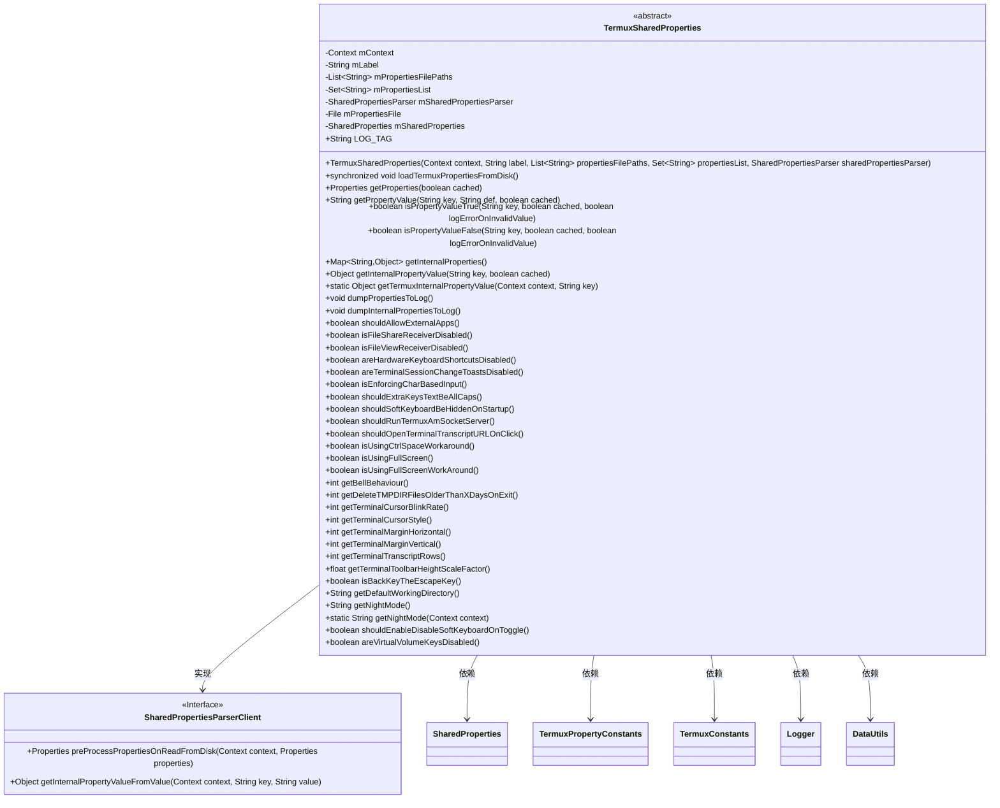

# 基础信息

|      |      |
|------|------|
| 名称 | TermuxSharedProperties |
| 编码语言 | .java |
| 代码路径 | termux-app/termux-shared/src/main/java/com/termux/shared/termux/settings/properties/TermuxSharedProperties.java |
| 包名 | com.termux.shared.termux.settings.properties |
| 依赖项 | ['android.content.Context', 'androidx.annotation.NonNull', 'com.termux.shared.logger.Logger', 'com.termux.shared.data.DataUtils', 'com.termux.shared.settings.properties.SharedProperties', 'com.termux.shared.settings.properties.SharedPropertiesParser', 'com.termux.shared.termux.TermuxConstants', 'java.io.File', 'java.util.HashMap', 'java.util.List', 'java.util.Map', 'java.util.Properties', 'java.util.Set'] |
| 概述说明 | TermuxSharedProperties类管理Termux应用的属性配置，支持从磁盘加载、缓存和转换属性值。 |

# 说明

TermuxSharedProperties是一个抽象类，用于管理Termux应用的共享属性配置。它通过文件路径列表加载属性文件，支持内存缓存和磁盘直接读取两种模式。类提供了多种方法获取属性值，包括布尔值、整型、浮点型和字符串类型，并对无效值进行默认值处理。内部实现了属性值的转换逻辑，如铃声行为、终端光标样式等特定属性的映射处理。类还包含日志记录功能，可输出当前属性和内部属性状态。通过静态方法可直接读取属性文件中的值，支持会话快捷键、工作目录等复杂属性的处理。

# 类列表 Class Summary

| 名称   | 类型  | 说明 |
|-------|------|-------------|
| TermuxSharedProperties | class | TermuxSharedProperties类管理Termux应用属性，支持从磁盘加载、缓存及类型转换功能。 |

## 类 TermuxSharedProperties

|      |      |
|------|------|
| 访问范围 | public abstract |
| 类型 | class |
| 名称 | TermuxSharedProperties |
| 说明 | TermuxSharedProperties类管理Termux应用属性，支持从磁盘加载、缓存及类型转换功能。 |

### UML类图

这段代码展示了一个抽象类TermuxSharedProperties，它用于管理Termux应用的共享属性配置。该类通过读取属性文件、解析属性值并提供各种类型转换方法（如布尔值、整型、浮点型等）来管理应用配置。它依赖于SharedPropertiesParser接口实现属性解析逻辑，并与SharedProperties类协作处理属性文件的加载和缓存。该类提供了丰富的API来获取和验证不同类型的属性值，同时支持日志记录和调试功能。

### 内部方法调用关系图

```mermaid
graph TD
    A["抽象类TermuxSharedProperties"]
    B["属性: Context mContext"]
    C["属性: String mLabel"]
    D["属性: List<String> mPropertiesFilePaths"]
    E["属性: Set<String> mPropertiesList"]
    F["属性: SharedPropertiesParser mSharedPropertiesParser"]
    G["属性: File mPropertiesFile"]
    H["属性: SharedProperties mSharedProperties"]
    I["常量: String LOG_TAG = 'TermuxSharedProperties'"]
    J["构造方法: TermuxSharedProperties(Context,String,List<String>,Set<String>,SharedPropertiesParser)"]
    K["核心方法: loadTermuxPropertiesFromDisk()"]
    L["属性获取方法: getProperties(boolean)"]
    M["属性获取方法: getPropertyValue(String,String,boolean)"]
    N["布尔检查方法: isPropertyValueTrue/isPropertyValueFalse"]
    O["内部属性方法: getInternalProperties()"]
    P["内部属性方法: getInternalPropertyValue(String,boolean)"]
    Q["静态工具方法: getTermuxInternalPropertyValue()"]
    R["静态解析类: SharedPropertiesParserClient"]
    S["属性转换方法: getInternalTermuxPropertyValueFromValue()"]
    T["专用属性检查方法: shouldAllowExternalApps()等40+方法"]
    U["日志方法: dumpPropertiesToLog()/dumpInternalPropertiesToLog()"]

    A --> B
    A --> C
    A --> D
    A --> E
    A --> F
    A --> G
    A --> H
    A --> I
    A --> J
    J --> K
    A --> L
    A --> M
    A --> N
    A --> O
    A --> P
    A --> Q
    A --> R
    R --> S
    A --> T
    A --> U
    K -->|调用| G
    K -->|调用| H
    S -->|被| P
    S -->|被| R
```

该流程图展示了TermuxSharedProperties抽象类的完整结构，包含8个核心属性、1个构造方法和6类主要方法。关键流程是通过loadTermuxPropertiesFromDisk()加载属性文件，再通过getInternalPropertyValue()获取转换后的属性值。类采用双重缓存机制（内存缓存+磁盘文件），提供40多个专用属性检查方法，并通过SharedPropertiesParserClient实现属性值的预处理和类型转换。所有属性操作都支持缓存控制，日志方法可完整输出原始属性和内部转换值。

### 字段列表 Field List

| 名称  | 类型  | 说明 |
|-------|-------|------|
| mContext | Context | 受保护的最终上下文变量mContext。 |
| mPropertiesList | Set<String> | 受保护最终字符串集合mPropertiesList |
| mLabel | String | 受保护常量字符串mLabel |
| mPropertiesFilePaths | List<String> | 保护性字符串列表属性文件路径 |
| LOG_TAG = "TermuxSharedProperties" | String | TermuxSharedProperties的日志标签常量 |
| mSharedPropertiesParser | SharedPropertiesParser | 受保护的最终共享属性解析器实例。 |
| mSharedProperties | SharedProperties | 声明共享属性变量mSharedProperties |
| mPropertiesFile | File | 保护的文件属性对象。 |

### 方法列表 Method List

| 名称  | 类型  | 说明 |
|-------|-------|------|
| getBellBehaviour | int | 获取终端铃声行为设置值。 |
| areTerminalSessionChangeToastsDisabled | boolean | 检查终端会话变更提示是否禁用。 |
| getExtraKeysStyleInternalPropertyValueFromValue | String | 获取额外按键样式属性值，若空则返回默认值。 |
| areVirtualVolumeKeysDisabled | boolean | 检查虚拟音量键是否禁用，返回布尔值。 |
| getTerminalCursorBlinkRate | int | 获取终端光标闪烁频率的整数值。 |
| shouldAllowExternalApps | boolean | 检查是否允许外部应用，默认允许。 |
| getTerminalMarginVertical | int | 获取终端垂直边距值的方法。 |
| getTerminalMarginHorizontal | int | 获取终端水平边距值的方法。 |
| areHardwareKeyboardShortcutsDisabled | boolean | 检查硬件键盘快捷键是否禁用，返回布尔值。 |
| getTerminalCursorBlinkRateInternalPropertyValueFromValue | int | 获取终端光标闪烁频率的内部属性值。 |
| isUsingFullScreen | boolean | 检查是否启用全屏模式。 |
| isFileViewReceiverDisabled | boolean | 检查文件视图接收器是否禁用，返回布尔值。 |
| getSoftKeyboardToggleBehaviourInternalPropertyValueFromValue | String | 获取软键盘切换行为属性值，默认值未找到时返回预设值。 |
| isUsingCtrlSpaceWorkaround | boolean | 检查是否启用Ctrl+Space修复方案 |
| getTerminalMarginVerticalInternalPropertyValueFromValue | int | 获取终端垂直边距属性值，默认值范围内验证。 |
| getTerminalCursorStyle | int | 获取终端光标样式值的方法。 |
| shouldRunTermuxAmSocketServer | boolean | 检查是否运行Termux AM Socket服务器，默认返回true。 |
| getDeleteTMPDIRFilesOlderThanXDaysOnExitInternalPropertyValueFromValue | int | 获取删除X天前TMPDIR文件的属性值，确保在有效范围内。 |
| getTerminalTranscriptRowsInternalPropertyValueFromValue | int | 获取终端行数属性值，确保在有效范围内。 |
| getVolumeKeysBehaviourInternalPropertyValueFromValue | String | 获取音量键行为属性值，默认值未找到时返回预设值。 |
| isFileShareReceiverDisabled | boolean | 检查文件分享接收功能是否禁用。 |
| isPropertyValueTrue | boolean | 检查属性值是否为真，支持缓存和错误日志。 |
| getTerminalTranscriptRows | int | 获取终端显示行数的方法，返回内部属性值。 |
| getTermuxInternalPropertyValue | Object | 获取Termux内部属性值的方法，通过上下文和键名调用。 |
| getDefaultWorkingDirectoryInternalPropertyValueFromValue | String | 检查路径有效性，无效则返回默认目录。 |
| getPropertyValue | String | 获取属性值，支持缓存和默认值。 |
| getDeleteTMPDIRFilesOlderThanXDaysOnExit | int | 获取退出时删除TMPDIR中超过X天文件的配置值。 |
| getTerminalToolbarHeightScaleFactorInternalPropertyValueFromValue | float | 获取终端工具栏高度缩放因子的内部属性值。 |
| replaceUseBlackUIProperty | Properties | 替换废弃属性KEY_USE_BLACK_UI为KEY_NIGHT_MODE，若未设置则转换布尔值。 |
| isEnforcingCharBasedInput | boolean | 检查是否启用基于字符的输入强制模式。 |
| isPropertyValueFalse | boolean | 检查属性值是否为false，返回布尔结果。 |
| isUsingFullScreenWorkAround | boolean | 检查是否启用全屏工作区模式。 |
| loadTermuxPropertiesFromDisk | void | 同步加载Termux属性文件，更新共享属性并记录日志。 |
| getProperties | Properties | 获取属性数据，支持缓存选项。 |
| getInternalTermuxPropertyValueFromValue | Object | 根据键值返回Termux内部属性值，处理多种类型如int、float、String等。 |
| getTerminalCursorStyleInternalPropertyValueFromValue | int | 获取终端光标样式属性值，基于输入值返回对应整型常量。 |
| getCodePointForSessionShortcuts | Integer | 静态方法检查快捷键格式是否为Ctrl+<字符>，返回对应码点或null。 |
| shouldExtraKeysTextBeAllCaps | boolean | 方法判断是否应将额外按键文本转为大写，默认返回true。 |
| getBackKeyBehaviourInternalPropertyValueFromValue | String | 获取返回键行为属性值，默认值未找到时返回预设值。 |
| getTerminalMarginHorizontalInternalPropertyValueFromValue | int | 获取终端水平边距属性值，若无效则返回默认值。 |
| getNightModeInternalPropertyValueFromValue | String | 获取夜间模式属性值，若不存在则返回默认值。 |
| getInternalProperties | Map<String, Object> | 获取内部属性映射表 |
| shouldSoftKeyboardBeHiddenOnStartup | boolean | 检查启动时是否隐藏软键盘，默认返回true。 |
| getInternalPropertyValue | Object | 方法根据缓存标志获取内部属性值：缓存时优先从共享属性读取，未命中则从文件加载并记录警告；非缓存时直接从文件读取。 |
| shouldOpenTerminalTranscriptURLOnClick | boolean | 方法返回终端点击URL时是否打开链接的布尔值，默认true。 |
| getExtraKeysInternalPropertyValueFromValue | String | 静态方法返回属性值，若空则返回默认值。 |
| getBellBehaviourInternalPropertyValueFromValue | int | 获取铃声行为属性值，默认值未找到时返回预设值。 |
| getTerminalToolbarHeightScaleFactor | float | 获取终端工具栏高度缩放因子的浮点数值。 |
| isBackKeyTheEscapeKey | boolean | 检查返回键是否为转义键行为。 |
| getDefaultWorkingDirectory | String | 获取默认工作目录的内部属性值。 |
| getNightMode | String | 获取夜间模式属性值的方法。 |
| getNightMode | String | 获取Termux夜间模式设置的方法。 |
| shouldEnableDisableSoftKeyboardOnToggle | boolean | 检查软键盘切换行为是否启用或禁用。 |
| dumpPropertiesToLog | void | 方法dumpPropertiesToLog将属性转储到日志，包含标签和键值对，若无属性则记录null。 |
| dumpInternalPropertiesToLog | void | 方法记录内部属性到日志，包含标签和键值对。 |

