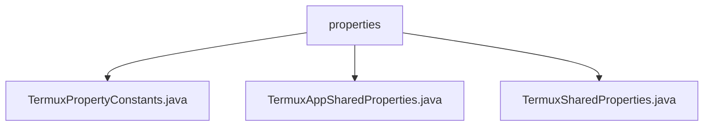

# 基础信息

|      |      |
|------|------|
| 名称 | properties |
| 编码语言 | .java |
| 代码路径 | termux-app/termux-shared/src/main/java/com/termux/shared/termux/settings/properties |
| 包名 | termux-app.termux-shared.src.main.java.com.termux.shared.termux.settings.properties |
| 概述说明 | Termux属性常量类定义配置项，管理类处理属性加载与验证。 |

# 说明

```markdown
## 概述

该代码模块是Termux应用的核心配置管理系统，主要提供属性常量的定义、属性文件的加载解析以及属性值的统一管理功能。模块采用分层设计，包含常量定义层（`TermuxPropertyConstants`）、抽象管理层（`TermuxSharedProperties`）和应用实现层（`TermuxAppSharedProperties`），支持多种数据类型（布尔型、整型、浮点型、字符串型）的配置管理，并通过单例模式、内存缓存和线程安全机制保障系统稳定性。

## 主要业务场景

1. **应用配置管理**  
   - 管理终端行为（如光标样式、边距设置）、UI样式、键盘快捷键等运行时配置
   - 处理文件共享接收器、软键盘显示等功能的开关控制
   - 维护默认工作目录、额外按键配置等路径/布局设置

2. **属性验证与转换**  
   - 通过预定义的取值范围和双向映射（如铃声行为、终端光标样式）实现属性值校验
   - 自动处理无效值（返回默认值）并记录相关日志

3. **多模式属性加载**  
   - 支持从多个属性文件路径按优先级加载配置
   - 提供内存缓存（提升读取性能）和磁盘直接读取（保证数据最新）两种模式

4. **线程安全访问**  
   - 通过单例模式（`TermuxAppSharedProperties`）和`@NonNull`上下文约束
   - 静态方法`init()`和`getProperties()`确保全局唯一实例的初始化和获取

5. **扩展性支持**  
   - 抽象基类`TermuxSharedProperties`允许派生不同子类
   - 属性集合分类管理（如默认true/false布尔行为、反转布尔行为）
```


### 包内部结构视图



该流程图展示了Termux项目中properties目录下的三个Java文件层级关系。properties作为父节点，包含TermuxPropertyConstants.java、TermuxAppSharedProperties.java和TermuxSharedProperties.java三个子节点文件，清晰地反映了项目配置属性相关类的组织结构。所有节点均采用路径末端命名，符合Mermaid语法规范。

# 文件列表 File List

| 名称   | 类型  | 说明 |
|-------|------|-------------|
| [TermuxSharedProperties.java](TermuxSharedProperties.md) | file | TermuxSharedProperties类管理Termux应用的属性配置，支持从磁盘加载、缓存和转换属性值。 |
| [TermuxAppSharedProperties.java](TermuxAppSharedProperties.md) | file | TermuxAppSharedProperties类管理Termux应用属性，提供初始化和获取方法。 |
| [TermuxPropertyConstants.java](TermuxPropertyConstants.md) | file | Termux属性常量类，包含布尔、整型、浮点、字符串等配置键及默认值。 |


