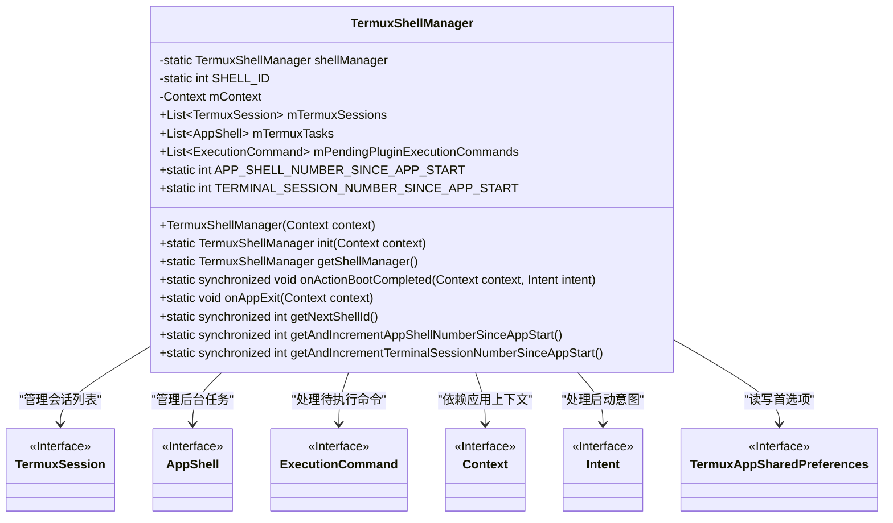

# 基础信息

|      |      |
|------|------|
| 名称 | TermuxShellManager |
| 编码语言 | .java |
| 代码路径 | termux-app/termux-shared/src/main/java/com/termux/shared/termux/shell/TermuxShellManager.java |
| 包名 | com.termux.shared.termux.shell |
| 依赖项 | ['android.content.Context', 'android.content.Intent', 'android.widget.ArrayAdapter', 'androidx.annotation.NonNull', 'com.termux.shared.shell.command.ExecutionCommand', 'com.termux.shared.shell.command.runner.app.AppShell', 'com.termux.shared.termux.settings.preferences.TermuxAppSharedPreferences', 'com.termux.shared.termux.shell.command.runner.terminal.TermuxSession', 'java.util.ArrayList', 'java.util.List'] |
| 概述说明 | TermuxShellManager管理终端会话和后台任务，处理启动、退出及ID分配。 |

# 说明

TermuxShellManager是一个单例类，用于管理Termux应用中的Shell会话和任务。它包含三个主要列表：mTermuxSessions（前台会话）、mTermuxTasks（后台任务）和mPendingPluginExecutionCommands（待处理的插件命令）。类中维护了APP_SHELL_NUMBER_SINCE_APP_START和TERMINAL_SESSION_NUMBER_SINCE_APP_START计数器，用于跟踪应用启动后的Shell和会话数量。提供了初始化、获取实例、处理启动完成和应用退出等方法，以及生成唯一Shell ID和递增计数器的同步方法。计数器在溢出时会保持最大值而非归零。

# 类列表 Class Summary

| 名称   | 类型  | 说明 |
|-------|------|-------------|
| TermuxShellManager | class | TermuxShellManager管理终端会话和后台任务，处理启动、退出及ID分配。 |

## 类 TermuxShellManager

|      |      |
|------|------|
| 访问范围 | public |
| 类型 | class |
| 名称 | TermuxShellManager |
| 说明 | TermuxShellManager管理终端会话和后台任务，处理启动、退出及ID分配。 |

### UML类图

这段代码描述了一个TermuxShellManager类，它是一个单例模式的管理器，用于管理Termux应用中的Shell会话、后台任务和待执行的插件命令。该类提供了静态方法来初始化、获取管理器实例，处理启动完成和应用退出事件，以及生成唯一的Shell ID和递增计数器。类图中清晰地展示了TermuxShellManager与其他接口（如TermuxSession、AppShell等）的依赖关系，体现了其作为核心管理组件的职责。

### 内部方法调用关系图

```mermaid
graph TD
    A["类TermuxShellManager"]
    B["静态属性: TermuxShellManager shellManager"]
    C["静态属性: int SHELL_ID"]
    D["属性: Context mContext"]
    E["属性: List<TermuxSession> mTermuxSessions"]
    F["属性: List<AppShell> mTermuxTasks"]
    G["属性: List<ExecutionCommand> mPendingPluginExecutionCommands"]
    H["静态属性: int APP_SHELL_NUMBER_SINCE_APP_START"]
    I["静态属性: int TERMINAL_SESSION_NUMBER_SINCE_APP_START"]
    J["构造方法: TermuxShellManager(Context context)"]
    K["静态方法: init(Context context)"]
    L["静态方法: getShellManager()"]
    M["静态方法: onActionBootCompleted(Context context, Intent intent)"]
    N["静态方法: onAppExit(Context context)"]
    O["静态方法: getNextShellId()"]
    P["静态方法: getAndIncrementAppShellNumberSinceAppStart()"]
    Q["静态方法: getAndIncrementTerminalSessionNumberSinceAppStart()"]

    A --> B
    A --> C
    A --> D
    A --> E
    A --> F
    A --> G
    A --> H
    A --> I
    A --> J
    A --> K
    A --> L
    A --> M
    A --> N
    A --> O
    A --> P
    A --> Q
```

该流程图展示了TermuxShellManager类的完整结构，包含静态属性、实例属性、构造方法和关键静态方法。类核心功能包括管理Termux会话和后台任务列表，处理插件执行命令队列，并通过静态方法实现shell ID生成、启动计数维护等系统级操作。特别值得注意的是线程安全的计数递增方法和应用生命周期事件处理逻辑，这些构成了shell管理的核心机制。

### 字段列表 Field List

| 名称  | 类型  | 说明 |
|-------|-------|------|
| APP_SHELL_NUMBER_SINCE_APP_START | int | 静态整型变量，记录应用启动后的Shell数量。 |
| mContext | Context | 受保护的最终上下文变量mContext。 |
| TERMINAL_SESSION_NUMBER_SINCE_APP_START | int | 静态整型变量，记录应用启动后的终端会话数。 |
| mTermuxSessions = new ArrayList<>() | List<TermuxSession> | Termux会话列表初始化 |
| shellManager | TermuxShellManager | 私有静态TermuxShellManager实例shellManager |
| mPendingPluginExecutionCommands = new ArrayList<>() | List<ExecutionCommand> | 声明一个不可变列表变量mPendingPluginExecutionCommands，初始化为空ArrayList。 |
| mTermuxTasks = new ArrayList<>() | List<AppShell> | Termux任务列表，存储AppShell对象。 |
| SHELL_ID = 0 | int | 私有静态整型变量SHELL_ID初始化为0。 |

### 方法列表 Method List

| 名称  | 类型  | 说明 |
|-------|-------|------|
| getAndIncrementAppShellNumberSinceAppStart | int | 同步方法获取并递增应用启动后的shell计数，溢出时保持最大值。 |
| onAppExit | void | 应用退出时重置Shell和终端会话计数器为0。 |
| onActionBootCompleted | void | 同步静态方法，启动时重置shell和会话计数。 |
| getNextShellId | int | 静态同步方法，返回递增的SHELL_ID值。 |
| init | TermuxShellManager | 初始化TermuxShellManager单例实例，若为空则新建。 |
| getShellManager | TermuxShellManager | 获取TermuxShellManager实例的静态方法。 |
| getAndIncrementTerminalSessionNumberSinceAppStart | int | 同步方法获取并递增终端会话数，溢出时保持最大值。 |

