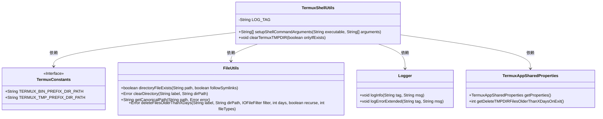
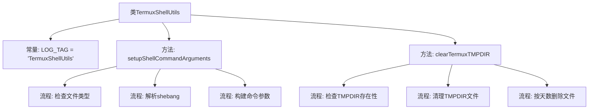
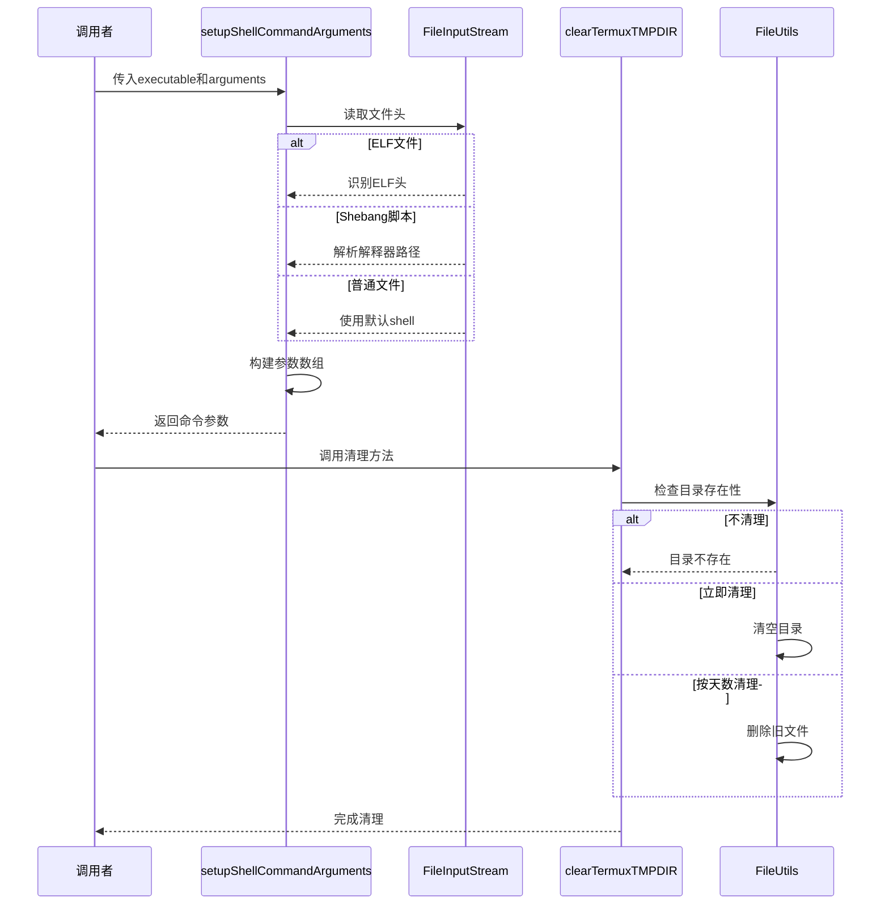

# 基础信息

|      |      |
|------|------|
| 名称 | TermuxShellUtils |
| 编码语言 | .java |
| 代码路径 | termux-app/termux-shared/src/main/java/com/termux/shared/termux/shell/TermuxShellUtils.java |
| 包名 | com.termux.shared.termux.shell |
| 依赖项 | ['androidx.annotation.NonNull', 'androidx.annotation.Nullable', 'com.termux.shared.errors.Error', 'com.termux.shared.file.filesystem.FileTypes', 'com.termux.shared.termux.TermuxConstants', 'com.termux.shared.file.FileUtils', 'com.termux.shared.logger.Logger', 'com.termux.shared.termux.settings.properties.TermuxAppSharedProperties', 'org.apache.commons.io.filefilter.TrueFileFilter', 'java.io.File', 'java.io.FileInputStream', 'java.io.IOException', 'java.util.ArrayList', 'java.util.Collections', 'java.util.List'] |
| 概述说明 | Termux工具类：处理Shell命令参数和清理临时目录。 |

# 说明

TermuxShellUtils类提供两个核心功能：setupShellCommandArguments方法根据可执行文件类型（ELF、带shebang脚本或无shebang脚本）动态设置解释器路径，确保正确执行；clearTermuxTMPDIR方法清理Termux临时目录，支持按天数过滤或完全清空，包含错误处理和日志记录机制。两类方法均涉及文件系统操作和路径处理，重点关注跨平台兼容性和用户自定义配置。

# 类列表 Class Summary

| 名称   | 类型  | 说明 |
|-------|------|-------------|
| TermuxShellUtils | class | Termux工具类：执行命令参数设置与临时目录清理。 |

## 类 TermuxShellUtils

|      |      |
|------|------|
| 访问范围 | public |
| 类型 | class |
| 名称 | TermuxShellUtils |
| 说明 | Termux工具类：执行命令参数设置与临时目录清理。 |

### UML类图

这段代码主要包含两个功能：`setupShellCommandArguments`用于设置Shell命令参数，根据可执行文件类型（ELF、脚本或带shebang的文件）选择解释器；`clearTermuxTMPDIR`用于清理Termux临时目录，支持按天数删除旧文件或清空整个目录。代码涉及文件类型检测、路径处理和错误日志记录，通过多个工具类（FileUtils、Logger等）协作完成功能，体现了对Android环境下Shell命令执行和临时文件管理的细致处理。

### 内部方法调用关系图

这段代码主要包含两个核心功能：1) setupShellCommandArguments方法通过分析可执行文件类型（ELF/Shebang/普通文件）动态构建Shell命令参数，智能处理不同解释器路径；2) clearTermuxTMPDIR方法提供三种清理临时目录的模式（立即清理/按天数清理/跳过清理），包含详细的错误处理和日志记录机制。流程图展示了类结构和主要方法调用关系，时序图则详细描述了两个核心方法的执行逻辑和条件分支。

### 字段列表 Field List

| 名称  | 类型  | 说明 |
|-------|-------|------|
| LOG_TAG = "TermuxShellUtils" | String | TermuxShellUtils的日志标签常量 |

### 方法列表 Method List

| 名称  | 类型  | 说明 |
|-------|-------|------|
| setupShellCommandArguments | String[] | 方法根据文件类型设置执行参数：ELF直接执行，无Shebang脚本用标准shell，Shebang脚本解析并替换路径。 |
| clearTermuxTMPDIR | void | 清理Termux临时目录，可选条件检查，按天数删除或清空文件。 |

