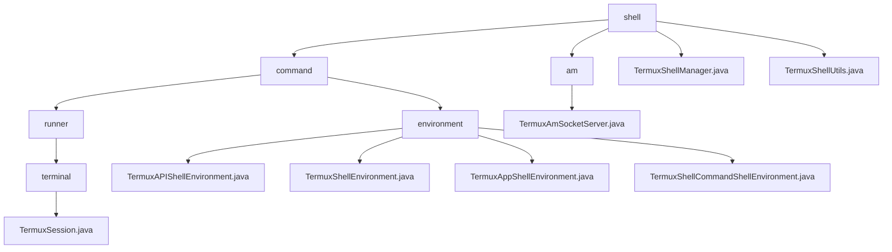

# 基础信息

|      |      |
|------|------|
| 名称 | shell |
| 编码语言 | .java |
| 代码路径 | termux-app/termux-shared/src/main/java/com/termux/shared/termux/shell |
| 包名 | termux-app.termux-shared.src.main.java.com.termux.shared.termux.shell |
| 概述说明 | 代码模块含Termux会话管理和环境变量系统，支持多级环境控制与命令执行。 |

# 说明

```markdown
## 概述

该代码模块是Termux应用的核心功能组件，主要包含以下四个核心子系统：

1. **TermuxSession组件**  
   实现完整的终端会话生命周期管理，包括会话创建、状态维护、命令执行控制和结果回调处理。

2. **环境变量管理系统**  
   采用分层架构设计，支持从系统基础环境到命令临时环境的多级环境变量管理。

3. **Socket服务器管理**  
   通过`TermuxAmSocketServer`类实现本地套接字服务器的全生命周期管理。

4. **Shell会话与任务管理**  
   通过`TermuxShellManager`单例类统一管理所有Shell会话和后台任务。

## 主要业务场景

### 终端会话管理
1. **会话全生命周期控制**
   - 通过`TermuxSession`类实现会话创建、状态跟踪和强制终止
   - 支持同步/异步命令执行模式
   - 自动捕获并处理命令执行结果

2. **多级环境管理**
   - 四级环境变量体系（系统/应用/插件/命令）
   - 动态环境配置（运行模式切换/特性开关管理）
   - 安全与兼容性处理（SELinux/SDK版本适配）

3. **Socket服务管理**
   - 服务器启停控制与状态维护
   - 客户端连接监听与异常处理
   - 基于配置的运行时状态管理

4. **Shell任务调度**
   - 统一管理前台会话和后台任务
   - 全局计数器维护（Shell/会话数量统计）
   - 插件命令队列管理

5. **Shell工具服务**
   - 智能命令参数设置（支持多种可执行文件类型）
   - 临时目录清理维护（支持按时间过滤）
   - 跨平台兼容性保障

### 系统特性
- 采用分层架构设计，各组件职责明确
- 强调线程安全（同步方法/单例模式）
- 完善的错误处理与日志记录机制
- 注重安全控制（SELinux/权限管理）
- 支持动态配置与运行时状态管理
```


### 包内部结构视图



该流程图展示了Termux项目中shell模块的层级结构，从顶层shell目录开始，向下分为command、am等子目录，其中command目录进一步细分为runner和environment子目录。runner目录包含terminal子目录和TermuxSession.java文件，environment目录包含四个不同的环境类文件。am目录包含TermuxAmSocketServer.java文件，顶层还有两个独立的工具类文件。

# 文件列表 File List

| 名称   | 类型  | 说明 |
|-------|------|-------------|
| [TermuxShellManager.java](TermuxShellManager.md) | file | TermuxShellManager管理终端会话和后台任务，处理启动、退出及ID分配。 |
| [TermuxShellUtils.java](TermuxShellUtils.md) | file | Termux工具类：处理Shell命令参数和清理临时目录。 |
| [command](command/_module.md) | package | TermuxSession类管理终端会话和执行命令，提供执行、结束、终止等功能。环境变量系统分层管理，支持插件、运行时控制和命令执行。 |
| [am](am/_module.md) | package | TermuxAmSocketServer管理本地套接字服务，支持启动、停止及状态更新。 |


