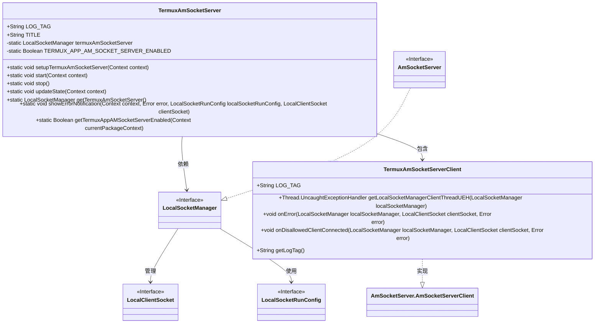
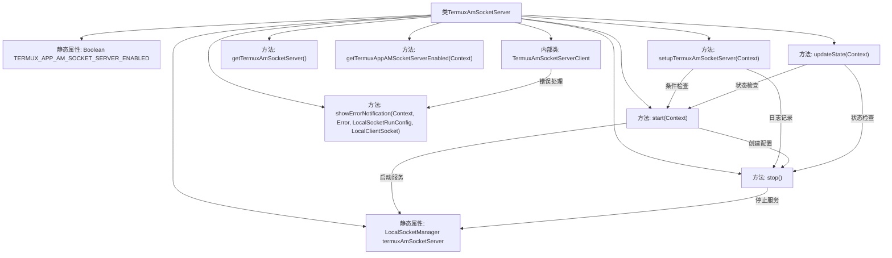

# 基础信息

|      |      |
|------|------|
| 名称 | TermuxAmSocketServer |
| 编码语言 | .java |
| 代码路径 | termux-app/termux-shared/src/main/java/com/termux/shared/termux/shell/am/TermuxAmSocketServer.java |
| 包名 | com.termux.shared.termux.shell.am |
| 依赖项 | ['android.content.Context', 'androidx.annotation.Keep', 'androidx.annotation.NonNull', 'androidx.annotation.Nullable', 'com.termux.shared.errors.Error', 'com.termux.shared.logger.Logger', 'com.termux.shared.net.socket.local.LocalClientSocket', 'com.termux.shared.net.socket.local.LocalServerSocket', 'com.termux.shared.net.socket.local.LocalSocketManager', 'com.termux.shared.net.socket.local.LocalSocketManagerClientBase', 'com.termux.shared.net.socket.local.LocalSocketRunConfig', 'com.termux.shared.shell.am.AmSocketServerRunConfig', 'com.termux.shared.shell.am.AmSocketServer', 'com.termux.shared.termux.TermuxConstants', 'com.termux.shared.termux.crash.TermuxCrashUtils', 'com.termux.shared.termux.plugins.TermuxPluginUtils', 'com.termux.shared.termux.settings.properties.TermuxAppSharedProperties', 'com.termux.shared.termux.settings.properties.TermuxPropertyConstants', 'com.termux.shared.termux.shell.command.environment.TermuxAppShellEnvironment'] |
| 概述说明 | TermuxAmSocketServer管理本地套接字服务，支持启动、停止及状态更新。 |

# 说明

TermuxAmSocketServer是一个用于管理本地套接字服务器的类，主要功能包括启动、停止和更新服务器状态。它通过LocalSocketManager管理AmSocketServer实例，支持监听新客户端连接。服务器状态由用户配置决定，启动时会检查是否启用，并记录运行状态。提供错误处理机制，包括发送错误通知和日志记录。TermuxAmSocketServerClient是增强的客户端实现，处理异常和错误，使用Termux的崩溃处理器。服务器状态在应用启动后不可更改，需重启应用更新。支持获取当前服务器实例和启用状态，但插件应用无法直接访问状态信息。

# 类列表 Class Summary

| 名称   | 类型  | 说明 |
|-------|------|-------------|
| TermuxAmSocketServer | class | TermuxAmSocketServer管理本地套接字服务，支持启动、停止及状态更新。 |

## 类 TermuxAmSocketServer

|      |      |
|------|------|
| 访问范围 | public |
| 类型 | class |
| 名称 | TermuxAmSocketServer |
| 说明 | TermuxAmSocketServer管理本地套接字服务，支持启动、停止及状态更新。 |

### UML类图

这段代码描述了一个TermuxAmSocketServer类，用于管理本地套接字服务器的生命周期和状态。该类包含静态方法用于启动、停止和更新服务器状态，以及处理错误通知。TermuxAmSocketServerClient是AmSocketServer.AmSocketServerClient的增强实现，用于处理客户端连接错误和异常。类图中展示了TermuxAmSocketServer与LocalSocketManager、TermuxAmSocketServerClient等接口和类之间的关系，包括依赖、包含和实现关系。该设计允许灵活地管理套接字服务器，并提供错误处理和状态管理功能。

### 内部方法调用关系图

这段代码实现了一个Termux应用的AM（Activity Manager）套接字服务器管理类，主要功能包括：1) 通过setupTermuxAmSocketServer方法根据用户配置启动/停止服务；2) 使用start/stop方法控制服务器运行状态；3) 通过TermuxAmSocketServerClient内部类处理客户端连接错误和异常。类通过静态属性维护服务器状态，并提供了状态更新、错误通知等功能，同时考虑了线程安全和跨进程通信的限制条件。

### 字段列表 Field List

| 名称  | 类型  | 说明 |
|-------|-------|------|
| TITLE = "TermuxAm" | String | TermuxAm的静态常量字符串TITLE |
| termuxAmSocketServer | LocalSocketManager | 私有静态Termux AM套接字服务器实例 |
| LOG_TAG = "TermuxAmSocketServer" | String | TermuxAmSocketServer日志标签常量 |
| TERMUX_APP_AM_SOCKET_SERVER_ENABLED | Boolean | 保护静态布尔变量TERMUX_APP_AM_SOCKET_SERVER_ENABLED |

### 方法列表 Method List

| 名称  | 类型  | 说明 |
|-------|-------|------|
| stop | void | 静态同步方法stop()，停止termuxAmSocketServer并处理错误。 |
| start | void | 静态同步方法启动Termux AM Socket服务，配置路径和客户端后启动服务。 |
| getTermuxAmSocketServer | LocalSocketManager | 获取Termux AM Socket服务器实例 |
| updateState | void | 静态同步方法更新状态，根据属性启停Socket服务。 |
| setupTermuxAmSocketServer | void | 启动Termux AM Socket服务，根据用户设置更新状态。 |
| showErrorNotification | void | 静态同步方法显示错误通知，发送插件命令错误信息。 |
| getTermuxAppAMSocketServerEnabled | Boolean | 检查Termux应用是否启用AM Socket服务，非Termux应用返回null。 |

