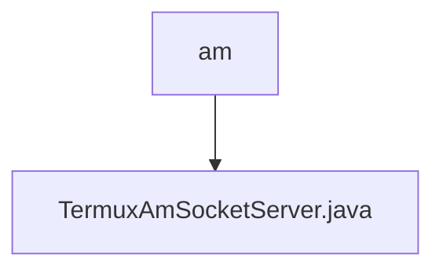

# 基础信息

|      |      |
|------|------|
| 名称 | am |
| 编码语言 | .java |
| 代码路径 | termux-app/termux-shared/src/main/java/com/termux/shared/termux/shell/am |
| 包名 | termux-app.termux-shared.src.main.java.com.termux.shared.termux.shell.am |
| 概述说明 | TermuxAmSocketServer管理本地套接字服务，支持启动、停止及状态更新。 |

# 说明

TermuxAmSocketServer是一个用于管理本地套接字服务器的类，主要功能包括启动、停止和更新服务器状态。它通过LocalSocketManager管理AmSocketServer实例，支持监听新客户端连接。服务器状态由用户配置决定，启动时会检查是否启用，并记录运行状态。提供错误处理机制，包括发送错误通知和日志记录。TermuxAmSocketServerClient是增强的客户端实现，处理异常和错误，使用Termux的崩溃处理器。服务器状态在应用启动后不可更改，需重启应用更新。支持获取当前服务器实例和启用状态，但插件应用无法直接访问状态信息。

### 包内部结构视图

该流程图展示了Termux项目中am目录与TermuxAmSocketServer.java文件的层级关系。am作为父目录节点，TermuxAmSocketServer.java作为其子节点文件，体现了Android模块中Socket服务实现的代码组织结构。这种简洁的层级表示符合Mermaid语法规范，仅保留末端元素名称。

# 文件列表 File List

| 名称   | 类型  | 说明 |
|-------|------|-------------|
| [TermuxAmSocketServer.java](TermuxAmSocketServer.md) | file | TermuxAmSocketServer管理本地套接字服务，支持启动、停止及状态更新。 |

