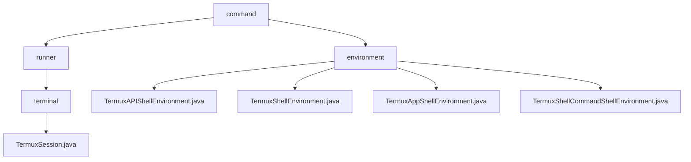

# 基础信息

|      |      |
|------|------|
| 名称 | command |
| 编码语言 | .java |
| 代码路径 | termux-app/termux-shared/src/main/java/com/termux/shared/termux/shell/command |
| 包名 | termux-app.termux-shared.src.main.java.com.termux.shared.termux.shell.command |
| 概述说明 | TermuxSession类管理终端会话和执行命令，提供执行、结束、终止等功能。环境变量系统分层管理，支持插件、运行时控制和命令执行。 |

# 说明

## 概述

该代码模块包含两个核心组件：

1. **TermuxSession组件**  
   位于`termux-shared/termux/shell/command/runner`路径，实现了完整的终端会话生命周期管理。通过`TermuxSession`类管理终端会话和执行命令，包含会话状态维护、命令执行控制、结果回调处理等核心功能，支持同步/异步命令执行模式。

2. **环境变量管理系统**  
   位于`termux-shared/termux/shell/command/environment`路径，采用分层架构设计实现多级环境变量管理。包含4个核心类分别处理不同层级的环境变量需求，从Android系统基础环境到Termux应用特定环境，再到插件专有环境和命令执行临时环境。

## 主要业务场景

### TermuxSession组件
1. **终端会话管理**
   - 创建并维护终端会话实例
   - 跟踪会话执行状态（运行中/已结束）
   - 支持强制终止正在执行的会话

2. **命令执行控制**
   - 处理工作目录设置
   - 管理环境变量配置
   - 通过`execute`方法启动命令执行流程

3. **结果处理机制**
   - 自动捕获命令执行结果
   - 通过`processTermuxSessionResult`处理原始结果
   - 通过`TermuxSessionClient`接口回调通知调用方

### 环境变量管理系统
1. **运行环境初始化**
   - 设置核心路径变量（HOME/PREFIX等）
   - 根据Android版本和安全模式动态调整环境
   - 持久化环境配置到文件系统

2. **多级环境管理**
   - 系统基础环境（AndroidShellEnvironment）
   - Termux应用环境（TermuxAppShellEnvironment）
   - 插件专有环境（TermuxAPIShellEnvironment）
   - 命令执行临时环境（TermuxShellCommandShellEnvironment）

3. **运行时环境控制**
   - 区分APP_SHELL/TERMINAL_SESSION运行模式
   - 动态注入会话统计变量
   - 管理特性开关（如AMSocketServer）

4. **安全与兼容性**
   - 维护SELinux安全上下文
   - 注入应用元数据（版本/包名/UID）
   - 处理SDK版本兼容性问题

### 包内部结构视图

该流程图展示了Termux项目中shell命令模块的层级结构。顶层节点"command"下分为"runner"和"environment"两个子模块。"runner"模块进一步包含"terminal"子目录和终端会话实现文件，而"environment"模块则包含四个不同的shell环境实现类，分别处理API、基础、应用和命令相关的shell环境配置。

# 文件列表 File List

| 名称   | 类型  | 说明 |
|-------|------|-------------|
| [environment](environment/_module.md) | package | Termux环境管理类：API环境检查版本变量，应用环境设置路径变量，命令环境记录会话数量。 |
| [runner](runner/_module.md) | package | TermuxSession类用于执行命令并管理终端会话，包含启动、结束和处理结果功能。 |

