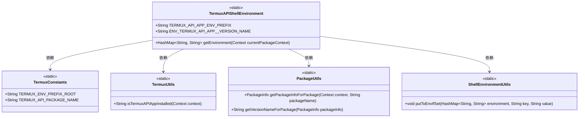
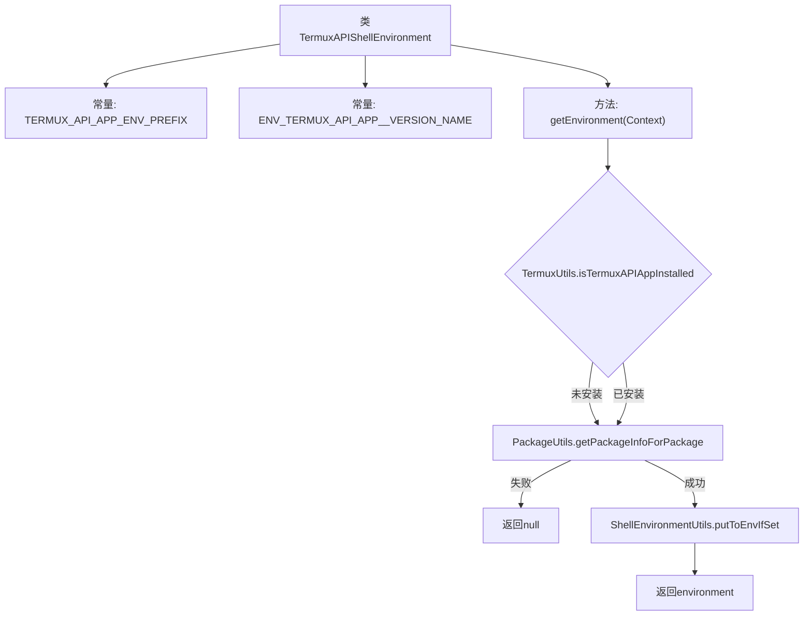

# 基础信息

|      |      |
|------|------|
| 名称 | TermuxAPIShellEnvironment |
| 编码语言 | .java |
| 代码路径 | termux-app/termux-shared/src/main/java/com/termux/shared/termux/shell/command/environment/TermuxAPIShellEnvironment.java |
| 包名 | com.termux.shared.termux.shell.command.environment |
| 依赖项 | ['android.content.Context', 'android.content.pm.PackageInfo', 'androidx.annotation.NonNull', 'androidx.annotation.Nullable', 'com.termux.shared.android.PackageUtils', 'com.termux.shared.shell.command.environment.ShellEnvironmentUtils', 'com.termux.shared.termux.TermuxConstants', 'com.termux.shared.termux.TermuxUtils', 'java.util.HashMap'] |
| 概述说明 | TermuxAPI环境变量类，包含版本信息获取方法。 |

# 说明

该代码定义了一个TermuxAPIShellEnvironment类，用于管理Termux:API应用的shell环境变量。关键点包括：定义了环境变量前缀TERMUX_API_APP_ENV_PREFIX和版本变量ENV_TERMUX_API_APP__VERSION_NAME。getEnvironment方法检查Termux:API应用是否安装，获取其包信息并创建环境变量映射，将版本名称存入环境变量后返回。若应用未安装或包信息获取失败则返回null。

# 类列表 Class Summary

| 名称   | 类型  | 说明 |
|-------|------|-------------|
| TermuxAPIShellEnvironment | class | Termux API应用环境变量设置，包含版本信息获取方法。 |

## 类 TermuxAPIShellEnvironment

|      |      |
|------|------|
| 访问范围 | public |
| 类型 | class |
| 名称 | TermuxAPIShellEnvironment |
| 说明 | Termux API应用环境变量设置，包含版本信息获取方法。 |

### UML类图

这段代码定义了一个`TermuxAPIShellEnvironment`类，主要用于获取Termux:API应用的shell环境变量。它通过静态工具类`TermuxUtils`检查应用是否安装，使用`PackageUtils`获取包信息，并通过`ShellEnvironmentUtils`将版本名称等数据存入环境变量HashMap。核心功能是构建包含API应用版本信息的环境变量映射表，依赖多个工具类完成各步骤操作。

### 内部方法调用关系图

该流程图展示了TermuxAPIShellEnvironment类的核心逻辑。首先检查Termux:API应用是否安装，若未安装则直接返回null。若已安装则尝试获取其包信息，失败时同样返回null。成功获取包信息后，将版本号存入HashMap环境变量并返回。整个过程严格遵循Android环境变量处理规范，确保在应用未安装或获取信息失败时安全退出。

### 字段列表 Field List

| 名称  | 类型  | 说明 |
|-------|-------|------|
| TERMUX_API_APP_ENV_PREFIX = TermuxConstants.TERMUX_ENV_PREFIX_ROOT + "_API_APP__" | String | Termux API应用环境变量前缀常量定义。 |
| ENV_TERMUX_API_APP__VERSION_NAME = TERMUX_API_APP_ENV_PREFIX + "VERSION_NAME" | String | Termux API应用版本名的环境变量常量定义。 |

### 方法列表 Method List

| 名称  | 类型  | 说明 |
|-------|-------|------|
| getEnvironment | HashMap<String, String> | 检查Termux API应用安装状态，返回其版本信息的环境变量。 |

