# 基础信息

|      |      |
|------|------|
| 名称 | TermuxAppShellEnvironment |
| 编码语言 | .java |
| 代码路径 | termux-app/termux-shared/src/main/java/com/termux/shared/termux/shell/command/environment/TermuxAppShellEnvironment.java |
| 包名 | com.termux.shared.termux.shell.command.environment |
| 依赖项 | ['android.content.Context', 'android.content.pm.ApplicationInfo', 'android.content.pm.PackageInfo', 'android.os.Build', 'androidx.annotation.NonNull', 'androidx.annotation.Nullable', 'com.termux.shared.android.PackageUtils', 'com.termux.shared.android.SELinuxUtils', 'com.termux.shared.data.DataUtils', 'com.termux.shared.shell.command.environment.ShellEnvironmentUtils', 'com.termux.shared.termux.TermuxBootstrap', 'com.termux.shared.termux.TermuxConstants', 'com.termux.shared.termux.TermuxUtils', 'com.termux.shared.termux.shell.am.TermuxAmSocketServer', 'java.util.HashMap'] |
| 概述说明 | Termux应用环境变量类，包含版本、包名、进程ID等关键信息。 |

# 说明

该代码定义了一个TermuxAppShellEnvironment类，用于管理Termux应用的环境变量。类中包含多个静态常量，表示不同的环境变量键名，如版本号、包名、进程ID、UID、目标SDK版本、调试状态、安装路径等。通过setTermuxAppEnvironment方法设置环境变量，包括应用版本信息、包信息、SELinux上下文、用户ID等。还提供了更新特定环境变量的方法，如updateTermuxAppAMSocketServerEnabled用于更新AM套接字服务器启用状态。整体实现了对Termux应用环境变量的全面管理。

# 类列表 Class Summary

| 名称   | 类型  | 说明 |
|-------|------|-------------|
| TermuxAppShellEnvironment | class | Termux应用环境变量类，包含版本、包名、进程ID等关键信息。 |

## 类 TermuxAppShellEnvironment

|      |      |
|------|------|
| 访问范围 | public |
| 类型 | class |
| 名称 | TermuxAppShellEnvironment |
| 说明 | Termux应用环境变量类，包含版本、包名、进程ID等关键信息。 |

### UML类图

```mermaid
classDiagram
    class TermuxAppShellEnvironment {
        <<static>>
        +HashMap~String, String~ termuxAppEnvironment
        +String ENV_TERMUX_VERSION
        +String TERMUX_APP_ENV_PREFIX
        +String ENV_TERMUX_APP__VERSION_NAME
        +String ENV_TERMUX_APP__VERSION_CODE
        +String ENV_TERMUX_APP__PACKAGE_NAME
        +String ENV_TERMUX_APP__PID
        +String ENV_TERMUX_APP__UID
        +String ENV_TERMUX_APP__TARGET_SDK
        +String ENV_TERMUX_APP__IS_DEBUGGABLE_BUILD
        +String ENV_TERMUX_APP__APK_RELEASE
        +String ENV_TERMUX_APP__APK_PATH
        +String ENV_TERMUX_APP__IS_INSTALLED_ON_EXTERNAL_STORAGE
        +String ENV_TERMUX_APP__SE_PROCESS_CONTEXT
        +String ENV_TERMUX_APP__SE_FILE_CONTEXT
        +String ENV_TERMUX_APP__SE_INFO
        +String ENV_TERMUX_APP__USER_ID
        +String ENV_TERMUX_APP__PROFILE_OWNER
        +String ENV_TERMUX_APP__PACKAGE_MANAGER
        +String ENV_TERMUX_APP__PACKAGE_VARIANT
        +String ENV_TERMUX_APP__FILES_DIR
        +String ENV_TERMUX_APP__AM_SOCKET_SERVER_ENABLED
        +HashMap~String, String~ getEnvironment(Context currentPackageContext)
        +void setTermuxAppEnvironment(Context currentPackageContext)
        +void putTermuxAPKSignature(Context currentPackageContext, HashMap~String, String~ environment)
        +void updateTermuxAppAMSocketServerEnabled(Context currentPackageContext)
    }

    class TermuxConstants {
        <<static>>
        +String TERMUX_PACKAGE_NAME
        +String TERMUX_ENV_PREFIX_ROOT
    }

    class PackageUtils {
        <<static>>
        +PackageInfo getPackageInfoForPackage(Context context, String packageName)
        +ApplicationInfo getApplicationInfoForPackage(Context context, String packageName)
        +String getVersionNameForPackage(PackageInfo packageInfo)
        +int getVersionCodeForPackage(PackageInfo packageInfo)
        +int getUidForPackage(ApplicationInfo applicationInfo)
        +int getTargetSDKForPackage(ApplicationInfo applicationInfo)
        +String isAppForPackageADebuggableBuild(ApplicationInfo applicationInfo)
        +String getBaseAPKPathForPackage(ApplicationInfo applicationInfo)
        +boolean isAppInstalledOnExternalStorage(ApplicationInfo applicationInfo)
        +String getApplicationInfoSeInfoForPackage(ApplicationInfo applicationInfo)
        +String getApplicationInfoSeInfoUserForPackage(ApplicationInfo applicationInfo)
        +String getProfileOwnerPackageNameForUser(Context context)
        +String getSigningCertificateSHA256DigestForPackage(Context context, String packageName)
        +int getUserIdForPackage(Context context)
    }

    class ShellEnvironmentUtils {
        <<static>>
        +void putToEnvIfSet(HashMap~String, String~ environment, String key, String value)
    }

    class TermuxUtils {
        <<static>>
        +String getTermuxAppPID(Context context)
        +Context getTermuxPackageContext(Context context)
        +String getAPKRelease(String signingCertificateSHA256Digest)
    }

    class TermuxBootstrap {
        <<static>>
        +String TERMUX_APP_PACKAGE_MANAGER
        +String TERMUX_APP_PACKAGE_VARIANT
    }

    class TermuxAmSocketServer {
        <<static>>
        +String getTermuxAppAMSocketServerEnabled(Context context)
    }

    class SELinuxUtils {
        <<static>>
        +String getContext()
        +String getFileContext(String path)
    }

    TermuxAppShellEnvironment --> TermuxConstants : 使用常量
    TermuxAppShellEnvironment --> PackageUtils : 获取包信息
    TermuxAppShellEnvironment --> ShellEnvironmentUtils : 环境变量操作
    TermuxAppShellEnvironment --> TermuxUtils : 工具方法
    TermuxAppShellEnvironment --> TermuxBootstrap : 获取包管理器
    TermuxAppShellEnvironment --> TermuxAmSocketServer : 检查Socket服务
    TermuxAppShellEnvironment --> SELinuxUtils : 获取SELinux上下文
```

该代码定义了一个TermuxAppShellEnvironment类，用于管理Termux应用的环境变量。它包含多个静态常量定义环境变量键名，以及方法用于获取和设置环境变量。类通过多个工具类（如PackageUtils、TermuxUtils等）获取应用包信息、PID、UID等数据，并使用ShellEnvironmentUtils将数据存入HashMap。该类设计为单例模式，通过静态方法和变量维护环境状态，主要服务于Termux应用及其插件。

### 内部方法调用关系图

该流程图展示了TermuxAppShellEnvironment类的核心结构和调用关系。类主要维护一个静态环境变量映射表termuxAppEnvironment，包含18个预定义的环境变量常量。核心方法setTermuxAppEnvironment()负责初始化环境变量，通过调用PackageUtils、ShellEnvironmentUtils等工具类获取应用信息并填充环境变量。getEnvironment()方法对外提供访问接口，putTermuxAPKSignature()和updateTermuxAppAMSocketServerEnabled()则提供特定环境变量的更新功能。整个设计采用懒加载和同步机制确保线程安全，适用于Android环境下的Termux应用环境管理。

### 字段列表 Field List

| 名称  | 类型  | 说明 |
|-------|-------|------|
| ENV_TERMUX_APP__PID = TERMUX_APP_ENV_PREFIX + "PID" | String | Termux应用环境变量PID定义 |
| ENV_TERMUX_APP__TARGET_SDK = TERMUX_APP_ENV_PREFIX + "TARGET_SDK" | String | Termux应用环境变量TARGET_SDK定义 |
| ENV_TERMUX_APP__VERSION_NAME = TERMUX_APP_ENV_PREFIX + "VERSION_NAME" | String | Termux应用版本名的环境变量常量定义。 |
| TERMUX_APP_ENV_PREFIX = TermuxConstants.TERMUX_ENV_PREFIX_ROOT + "_APP__" | String | Termux应用环境变量前缀常量定义。 |
| ENV_TERMUX_APP__PACKAGE_VARIANT = TERMUX_APP_ENV_PREFIX + "PACKAGE_VARIANT" | String | Termux应用包变体的环境变量键名。 |
| ENV_TERMUX_APP__APK_RELEASE = TERMUX_APP_ENV_PREFIX + "APK_RELEASE" | String | Termux应用APK发布环境变量定义。 |
| ENV_TERMUX_VERSION = TermuxConstants.TERMUX_ENV_PREFIX_ROOT + "_VERSION" | String | Termux环境变量版本常量定义 |
| termuxAppEnvironment | HashMap<String, String> | 静态哈希映射存储Termux应用环境变量 |
| ENV_TERMUX_APP__IS_DEBUGGABLE_BUILD = TERMUX_APP_ENV_PREFIX + "IS_DEBUGGABLE_BUILD" | String | Termux应用环境变量：标识是否为可调试构建版本。 |
| ENV_TERMUX_APP__PROFILE_OWNER = TERMUX_APP_ENV_PREFIX + "PROFILE_OWNER" | String | Termux应用环境变量PROFILE_OWNER的静态常量定义。 |
| ENV_TERMUX_APP__APK_PATH = TERMUX_APP_ENV_PREFIX + "APK_PATH" | String | 静态常量定义Termux应用APK路径环境变量键名。 |
| ENV_TERMUX_APP__USER_ID = TERMUX_APP_ENV_PREFIX + "USER_ID" | String | 静态常量ENV_TERMUX_APP__USER_ID，值为TERMUX_APP_ENV_PREFIX加USER_ID。 |
| ENV_TERMUX_APP__VERSION_CODE = TERMUX_APP_ENV_PREFIX + "VERSION_CODE" | String | Termux应用环境变量版本代码常量定义 |
| ENV_TERMUX_APP__IS_INSTALLED_ON_EXTERNAL_STORAGE = TERMUX_APP_ENV_PREFIX + "IS_INSTALLED_ON_EXTERNAL_STORAGE" | String | Termux环境变量：标识是否安装在外置存储 |
| ENV_TERMUX_APP__PACKAGE_NAME = TERMUX_APP_ENV_PREFIX + "PACKAGE_NAME" | String | 静态常量定义Termux应用包名环境变量键。 |
| ENV_TERMUX_APP__PACKAGE_MANAGER = TERMUX_APP_ENV_PREFIX + "PACKAGE_MANAGER" | String | Termux应用环境变量：包管理器前缀。 |
| ENV_TERMUX_APP__SE_INFO = TERMUX_APP_ENV_PREFIX + "SE_INFO" | String | 静态常量ENV_TERMUX_APP__SE_INFO，值为TERMUX_APP_ENV_PREFIX拼接"SE_INFO"。 |
| ENV_TERMUX_APP__UID = TERMUX_APP_ENV_PREFIX + "UID" | String | 静态常量定义环境变量键名，格式为前缀加UID。 |
| ENV_TERMUX_APP__SE_FILE_CONTEXT = TERMUX_APP_ENV_PREFIX + "SE_FILE_CONTEXT" | String | Termux应用环境变量SE_FILE_CONTEXT定义。 |
| ENV_TERMUX_APP__SE_PROCESS_CONTEXT = TERMUX_APP_ENV_PREFIX + "SE_PROCESS_CONTEXT" | String | Termux应用环境变量SE_PROCESS_CONTEXT定义 |
| ENV_TERMUX_APP__FILES_DIR = TERMUX_APP_ENV_PREFIX + "FILES_DIR" | String | Termux应用环境变量FILES_DIR定义 |
| ENV_TERMUX_APP__AM_SOCKET_SERVER_ENABLED = TERMUX_APP_ENV_PREFIX + "AM_SOCKET_SERVER_ENABLED" | String | Termux应用环境变量：AM_SOCKET_SERVER_ENABLED |

### 方法列表 Method List

| 名称  | 类型  | 说明 |
|-------|-------|------|
| getEnvironment | HashMap<String, String> | 获取Termux应用环境变量的静态方法，返回HashMap。 |
| setTermuxAppEnvironment | void | 同步方法设置Termux应用环境，检查包信息并更新环境变量。 |
| putTermuxAPKSignature | void | 获取Termux应用签名并更新环境变量。 |
| updateTermuxAppAMSocketServerEnabled | void | 同步方法更新Termux应用AM套接字服务器状态。 |

