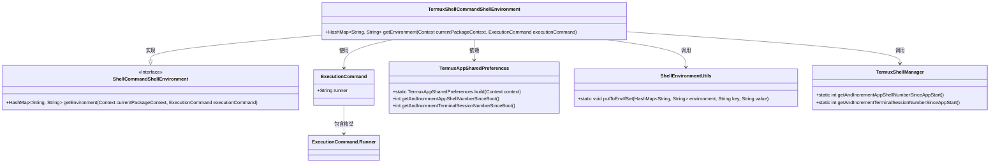
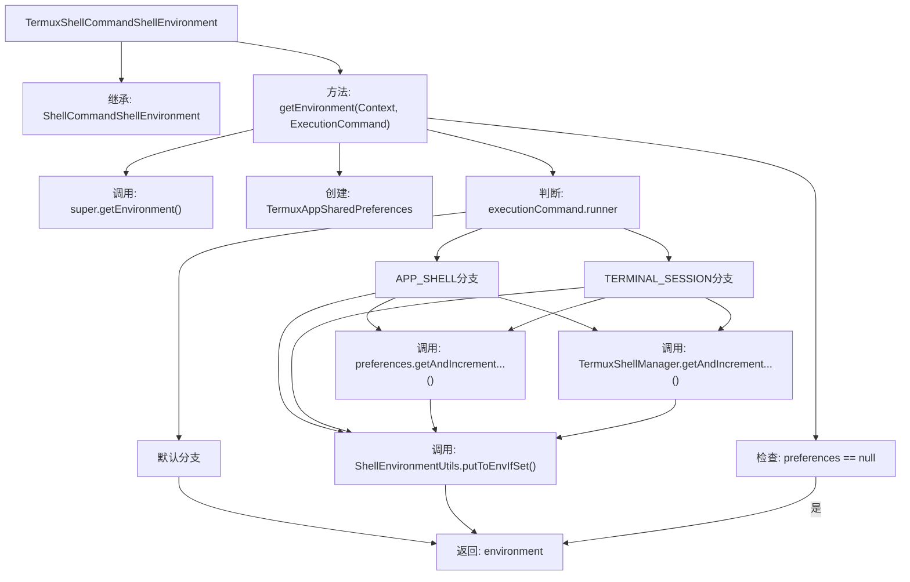

# 基础信息

|      |      |
|------|------|
| 名称 | TermuxShellCommandShellEnvironment |
| 编码语言 | .java |
| 代码路径 | termux-app/termux-shared/src/main/java/com/termux/shared/termux/shell/command/environment/TermuxShellCommandShellEnvironment.java |
| 包名 | com.termux.shared.termux.shell.command.environment |
| 依赖项 | ['android.content.Context', 'androidx.annotation.NonNull', 'com.termux.shared.shell.command.ExecutionCommand', 'com.termux.shared.shell.command.environment.ShellCommandShellEnvironment', 'com.termux.shared.shell.command.environment.ShellEnvironmentUtils', 'com.termux.shared.termux.settings.preferences.TermuxAppSharedPreferences', 'com.termux.shared.termux.shell.TermuxShellManager', 'java.util.HashMap'] |
| 概述说明 | TermuxShellCommandShellEnvironment类扩展父类方法，根据运行器类型更新环境变量。 |

# 说明

TermuxShellCommandShellEnvironment类继承自ShellCommandShellEnvironment，用于获取Termux执行命令的Shell环境信息。它重写了getEnvironment方法，接收当前包上下文和执行命令作为参数。方法首先调用父类获取基础环境变量，然后根据执行命令的运行器类型（APP_SHELL或TERMINAL_SESSION）设置相应的环境变量。对于APP_SHELL，记录自启动和自应用启动后的Shell数量；对于TERMINAL_SESSION，记录自启动和自应用启动后的终端会话数量。这些值通过TermuxAppSharedPreferences和TermuxShellManager进行获取和递增。最后返回更新后的环境变量。

# 类列表 Class Summary

| 名称   | 类型  | 说明 |
|-------|------|-------------|
| TermuxShellCommandShellEnvironment | class | TermuxShellCommandShellEnvironment类扩展父类方法，根据运行器类型设置环境变量并返回。 |

## 类 TermuxShellCommandShellEnvironment

|      |      |
|------|------|
| 访问范围 | public |
| 类型 | class |
| 名称 | TermuxShellCommandShellEnvironment |
| 说明 | TermuxShellCommandShellEnvironment类扩展父类方法，根据运行器类型设置环境变量并返回。 |

### UML类图

该类图展示了TermuxShellCommandShellEnvironment继承自ShellCommandShellEnvironment接口，并实现了获取Termux执行命令环境的方法。它依赖于ExecutionCommand类判断运行器类型，使用TermuxAppSharedPreferences获取启动计数，调用ShellEnvironmentUtils工具类更新环境变量，并通过TermuxShellManager管理应用启动后的计数。整体结构清晰地反映了Android Termux应用中Shell环境配置的层次关系和协作方式。

### 内部方法调用关系图

这段代码流程图展示了TermuxShellCommandShellEnvironment类的核心逻辑。该类继承自ShellCommandShellEnvironment，主要功能是通过getEnvironment方法构建并返回一个包含Termux执行命令相关环境变量的HashMap。流程首先调用父类方法获取基础环境变量，然后根据runner类型(APP_SHELL或TERMINAL_SESSION)添加不同的计数器变量，这些计数器来自共享首选项(preferences)和Shell管理器(TermuxShellManager)。整个过程包含空值检查和多条件分支处理，最终返回完整的环境变量映射。

### 字段列表 Field List

| 名称  | 类型  | 说明 |
|-------|-------|------|

### 方法列表 Method List

| 名称  | 类型  | 说明 |
|-------|-------|------|
| getEnvironment | HashMap<String, String> | 重写环境变量方法，根据运行器类型更新启动计数。 |

