# 基础信息

|      |      |
|------|------|
| 名称 | TermuxShellEnvironment |
| 编码语言 | .java |
| 代码路径 | termux-app/termux-shared/src/main/java/com/termux/shared/termux/shell/command/environment/TermuxShellEnvironment.java |
| 包名 | com.termux.shared.termux.shell.command.environment |
| 依赖项 | ['android.content.Context', 'androidx.annotation.NonNull', 'com.termux.shared.errors.Error', 'com.termux.shared.file.FileUtils', 'com.termux.shared.logger.Logger', 'com.termux.shared.shell.command.ExecutionCommand', 'com.termux.shared.shell.command.environment.AndroidShellEnvironment', 'com.termux.shared.shell.command.environment.ShellEnvironmentUtils', 'com.termux.shared.shell.command.environment.ShellCommandShellEnvironment', 'com.termux.shared.termux.TermuxBootstrap', 'com.termux.shared.termux.TermuxConstants', 'com.termux.shared.termux.shell.TermuxShellUtils', 'java.nio.charset.Charset', 'java.util.HashMap'] |
| 概述说明 | TermuxShellEnvironment继承AndroidShellEnvironment，管理Termux环境变量和路径配置。 |

# 说明

TermuxShellEnvironment是AndroidShellEnvironment的子类，用于管理Termux应用的环境变量。它包含初始化方法init和writeEnvironmentToFile，后者将环境变量写入临时文件并移动到最终位置。getEnvironment方法构建Termux环境变量，包括HOME、PREFIX等路径，并根据Android版本和是否安全模式调整PATH和LD_LIBRARY_PATH。此外，它还提供了默认工作目录路径、二进制路径和设置Shell命令参数的方法。

# 类列表 Class Summary

| 名称   | 类型  | 说明 |
|-------|------|-------------|
| TermuxShellEnvironment | class | TermuxShellEnvironment继承AndroidShellEnvironment，管理Termux环境变量和路径。 |

## 类 TermuxShellEnvironment

|      |      |
|------|------|
| 访问范围 | public |
| 类型 | class |
| 名称 | TermuxShellEnvironment |
| 说明 | TermuxShellEnvironment继承AndroidShellEnvironment，管理Termux环境变量和路径。 |

### UML类图

```mermaid
classDiagram
    class AndroidShellEnvironment {
        <<Interface>>
        +HashMap~String, String~ getEnvironment(Context currentPackageContext, boolean isFailSafe)
        +String getDefaultWorkingDirectoryPath()
        +String getDefaultBinPath()
        +String[] setupShellCommandArguments(String executable, String[] arguments)
    }

    class TermuxShellEnvironment {
        -String LOG_TAG
        +String ENV_PREFIX
        +TermuxShellEnvironment()
        +static void init(Context currentPackageContext)
        +static void writeEnvironmentToFile(Context currentPackageContext)
        +HashMap~String, String~ getEnvironment(Context currentPackageContext, boolean isFailSafe)
        +String getDefaultWorkingDirectoryPath()
        +String getDefaultBinPath()
        +String[] setupShellCommandArguments(String executable, String[] arguments)
    }

    class TermuxAppShellEnvironment {
        +static void setTermuxAppEnvironment(Context currentPackageContext)
        +static HashMap~String, String~ getEnvironment(Context currentPackageContext)
    }

    class TermuxAPIShellEnvironment {
        +static HashMap~String, String~ getEnvironment(Context currentPackageContext)
    }

    class TermuxShellCommandShellEnvironment {
    }

    class ShellEnvironmentUtils {
        +static String convertEnvironmentToDotEnvFile(HashMap~String, String~ environmentMap)
    }

    class FileUtils {
        +static Error writeTextToFile(String fileLabel, String filePath, Charset charset, String text, boolean append)
        +static Error moveRegularFile(String srcFileLabel, String srcFilePath, String destFilePath, boolean deleteSourceFile)
    }

    class Logger {
        +static void logErrorExtended(String tag, String message)
    }

    class TermuxConstants {
        <<final>>
        +String TERMUX_PREFIX_DIR_PATH
        +String TERMUX_ENV_TEMP_FILE_PATH
        +String TERMUX_ENV_FILE_PATH
        +String TERMUX_HOME_DIR_PATH
        +String TERMUX_TMP_PREFIX_DIR_PATH
        +String TERMUX_BIN_PREFIX_DIR_PATH
        +String TERMUX_LIB_PREFIX_DIR_PATH
    }

    class TermuxBootstrap {
        +static boolean isAppPackageVariantAPTAndroid5()
    }

    class TermuxShellUtils {
        +static String[] setupShellCommandArguments(String executable, String[] arguments)
    }

    AndroidShellEnvironment <|-- TermuxShellEnvironment
    TermuxShellEnvironment --> TermuxAppShellEnvironment : 依赖
    TermuxShellEnvironment --> TermuxAPIShellEnvironment : 依赖
    TermuxShellEnvironment --> TermuxShellCommandShellEnvironment : 依赖
    TermuxShellEnvironment --> ShellEnvironmentUtils : 依赖
    TermuxShellEnvironment --> FileUtils : 依赖
    TermuxShellEnvironment --> Logger : 依赖
    TermuxShellEnvironment --> TermuxConstants : 依赖
    TermuxShellEnvironment --> TermuxBootstrap : 依赖
    TermuxShellEnvironment --> TermuxShellUtils : 依赖
```

这段类图展示了TermuxShellEnvironment及其相关类的结构关系。TermuxShellEnvironment继承自AndroidShellEnvironment接口，实现了获取环境变量、默认路径等核心功能。它依赖多个辅助类：TermuxAppShellEnvironment和TermuxAPIShellEnvironment用于获取特定环境变量，FileUtils和Logger处理文件操作与日志记录，TermuxConstants存储常量路径，TermuxBootstrap提供版本检查功能。整体设计体现了分层架构思想，核心类通过组合多个工具类实现复杂功能，同时保持职责单一。

### 内部方法调用关系图

```mermaid
graph TD
    A["类TermuxShellEnvironment"]
    B["继承: AndroidShellEnvironment"]
    C["常量: LOG_TAG = 'TermuxShellEnvironment'"]
    D["常量: ENV_PREFIX = 'PREFIX'"]
    E["构造方法: TermuxShellEnvironment()"]
    F["静态方法: init(Context currentPackageContext)"]
    G["静态方法: writeEnvironmentToFile(Context currentPackageContext)"]
    H["方法: getEnvironment(Context currentPackageContext, boolean isFailSafe)"]
    I["方法: getDefaultWorkingDirectoryPath()"]
    J["方法: getDefaultBinPath()"]
    K["方法: setupShellCommandArguments(String executable, String[] arguments)"]
    L["调用: TermuxAppShellEnvironment.setTermuxAppEnvironment()"]
    M["调用: ShellEnvironmentUtils.convertEnvironmentToDotEnvFile()"]
    N["调用: FileUtils.writeTextToFile()"]
    O["调用: FileUtils.moveRegularFile()"]
    P["调用: Logger.logErrorExtended()"]
    Q["调用: super.getEnvironment()"]
    R["调用: TermuxAppShellEnvironment.getEnvironment()"]
    S["调用: TermuxAPIShellEnvironment.getEnvironment()"]
    T["调用: TermuxShellUtils.setupShellCommandArguments()"]

    A --> B
    A --> C
    A --> D
    A --> E
    A --> F
    A --> G
    A --> H
    A --> I
    A --> J
    A --> K
    F --> L
    G --> M
    G --> N
    G --> O
    G --> P
    H --> Q
    H --> R
    H --> S
    K --> T
```

这段代码是TermuxShellEnvironment类的实现，继承自AndroidShellEnvironment，主要用于管理Termux应用的环境变量和路径配置。流程图展示了类结构、常量定义、方法调用关系，包括环境初始化、文件写入、环境变量获取等核心功能。关键操作涉及文件处理、日志记录和多环境变量合并，同时处理了不同Android版本的特殊路径配置逻辑。

### 字段列表 Field List

| 名称  | 类型  | 说明 |
|-------|-------|------|
| ENV_PREFIX = "PREFIX" | String | 定义常量字符串ENV_PREFIX，值为"PREFIX"。 |
| LOG_TAG = "TermuxShellEnvironment" | String | TermuxShellEnvironment日志标签 |

### 方法列表 Method List

| 名称  | 类型  | 说明 |
|-------|-------|------|
| getEnvironment | HashMap<String, String> | 方法重写获取环境变量，合并Termux及API环境，设置路径并处理安全模式。 |
| writeEnvironmentToFile | void | 同步方法写入环境变量到文件，先写临时文件再移动，错误记录日志。 |
| init | void | 同步静态方法初始化Termux应用环境，需传入上下文参数。 |
| getDefaultWorkingDirectoryPath | String | 非空方法返回Termux默认工作目录路径 |
| getDefaultBinPath | String | 非空方法返回Termux默认bin路径常量。 |
| setupShellCommandArguments | String[] | 重写方法，调用TermuxShellUtils处理shell命令参数。 |

