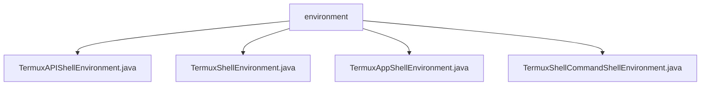

# 基础信息

|      |      |
|------|------|
| 名称 | environment |
| 编码语言 | .java |
| 代码路径 | termux-app/termux-shared/src/main/java/com/termux/shared/termux/shell/command/environment |
| 包名 | termux-app.termux-shared.src.main.java.com.termux.shared.termux.shell.command.environment |
| 概述说明 | Termux环境管理类：API环境检查版本变量，应用环境设置路径变量，命令环境记录会话数量。 |

# 说明

```markdown
## 概述
该代码模块是Termux应用的环境变量管理系统，由四个核心类组成，分别负责不同层级的环境变量管理：
1. `TermuxAPIShellEnvironment` - 专用于Termux:API插件的环境变量管理
2. `TermuxShellEnvironment` - 基础Termux环境变量管理（继承自AndroidShellEnvironment）
3. `TermuxAppShellEnvironment` - Termux应用级环境变量管理
4. `TermuxShellCommandShellEnvironment` - 命令执行时的Shell环境管理（继承自ShellCommandShellEnvironment）

模块通过分层设计实现了从系统底层到应用层面的环境变量管理，支持动态环境变量更新、多运行模式适配以及跨组件环境共享。

## 主要业务场景
1. **Termux应用启动初始化**
   - 设置核心路径变量（HOME/PREFIX等）
   - 根据Android版本和安全模式调整PATH/LD_LIBRARY_PATH
   - 持久化环境变量到文件系统

2. **插件环境管理**
   - 检测Termux:API插件安装状态
   - 动态注入插件版本等环境变量
   - 提供插件专用的环境变量前缀(TERMUX_API_APP_ENV_PREFIX)

3. **运行时环境控制**
   - 区分APP_SHELL/TERMINAL_SESSION两种运行模式
   - 统计并注入会话计数变量（自启动/应用启动后的shell/终端数量）
   - 动态更新AMSocketServer等特性开关

4. **应用状态监控**
   - 注入应用元数据（版本号/包名/UID等）
   - 维护SELinux安全上下文
   - 跟踪调试状态和SDK版本兼容性

5. **命令执行环境准备**
   - 继承基础环境变量
   - 根据命令类型追加特定变量
   - 支持环境变量文件的原子写入（通过临时文件过渡）
```


### 包内部结构视图



该流程图展示了Termux项目中shell命令环境相关的Java文件结构。根节点"environment"下包含四个具体实现类，分别处理不同类型的shell环境：API调用环境、基础shell环境、应用shell环境和命令shell环境。这些类都位于termux-shared模块的同一目录层级下，属于命令执行环境的核心组件。

# 文件列表 File List

| 名称   | 类型  | 说明 |
|-------|------|-------------|
| [TermuxShellCommandShellEnvironment.java](TermuxShellCommandShellEnvironment.md) | file | TermuxShellCommandShellEnvironment类扩展父类方法，根据运行器类型更新环境变量。 |
| [TermuxAppShellEnvironment.java](TermuxAppShellEnvironment.md) | file | Termux应用环境变量类，包含版本、包名、进程ID等关键信息。 |
| [TermuxShellEnvironment.java](TermuxShellEnvironment.md) | file | TermuxShellEnvironment继承AndroidShellEnvironment，管理Termux环境变量和路径配置。 |
| [TermuxAPIShellEnvironment.java](TermuxAPIShellEnvironment.md) | file | TermuxAPI环境变量类，包含版本信息获取方法。 |


