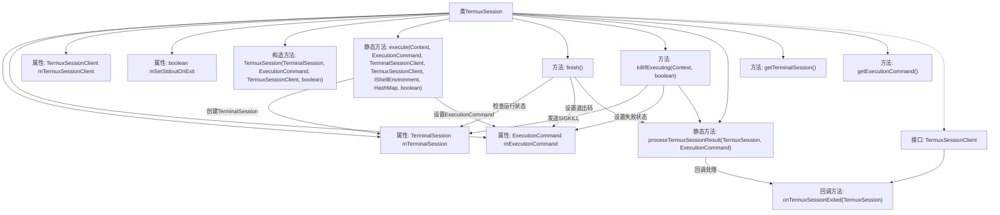

# 基础信息

|      |      |
|------|------|
| 名称 | TermuxSession |
| 编码语言 | .java |
| 代码路径 | termux-app/termux-shared/src/main/java/com/termux/shared/termux/shell/command/runner/terminal/TermuxSession.java |
| 包名 | com.termux.shared.termux.shell.command.runner.terminal |
| 依赖项 | ['android.content.Context', 'android.system.OsConstants', 'androidx.annotation.NonNull', 'androidx.annotation.Nullable', 'com.google.common.base.Joiner', 'com.termux.shared.R', 'com.termux.shared.shell.command.ExecutionCommand', 'com.termux.shared.shell.command.environment.ShellEnvironmentUtils', 'com.termux.shared.shell.command.environment.UnixShellEnvironment', 'com.termux.shared.shell.command.result.ResultData', 'com.termux.shared.errors.Errno', 'com.termux.shared.logger.Logger', 'com.termux.shared.shell.command.environment.IShellEnvironment', 'com.termux.shared.shell.ShellUtils', 'com.termux.terminal.TerminalSession', 'com.termux.terminal.TerminalSessionClient', 'java.io.File', 'java.util.Collections', 'java.util.HashMap', 'java.util.List'] |
| 概述说明 | TermuxSession类用于执行命令并管理终端会话，包含启动、结束和处理结果功能。 |

# 说明

TermuxSession类用于管理终端会话和执行命令。它包含终端会话、执行命令、客户端接口等关键属性，提供执行命令、结束会话、终止会话等功能。execute方法负责启动命令执行，处理工作目录、环境变量等配置。finish方法处理会话结束后的结果，killIfExecuting方法可强制终止会话。processTermuxSessionResult方法处理会话结果并触发回调。TermuxSessionClient接口定义了会话结束时的回调方法。整体实现了完整的终端会话生命周期管理。

# 类列表 Class Summary

| 名称   | 类型  | 说明 |
|-------|------|-------------|
| TermuxSession | class | TermuxSession类用于执行命令并管理终端会话，包含启动、结束和终止会话的方法。 |


## 类 TermuxSession

|      |      |
|------|------|
| 访问范围 | public |
| 类型 | class |
| 名称 | TermuxSession |
| 说明 | TermuxSession类用于执行命令并管理终端会话，包含启动、结束和终止会话的方法。 |


### UML类图

```mermaid
classDiagram
    class TermuxSession {
        -TerminalSession mTerminalSession
        -ExecutionCommand mExecutionCommand
        -TermuxSessionClient mTermuxSessionClient
        -boolean mSetStdoutOnExit
        -static String LOG_TAG
        +TermuxSession(TerminalSession, ExecutionCommand, TermuxSessionClient, boolean)
        +static TermuxSession execute(Context, ExecutionCommand, TerminalSessionClient, TermuxSessionClient, IShellEnvironment, HashMap~String,String~, boolean) TermuxSession
        +finish()
        +killIfExecuting(Context, boolean)
        -static processTermuxSessionResult(TermuxSession, ExecutionCommand)
        +getTerminalSession() TerminalSession
        +getExecutionCommand() ExecutionCommand
        <<Interface>> TermuxSessionClient {
            +onTermuxSessionExited(TermuxSession)
        }
    }

    class ExecutionCommand {
        // 假设类中定义的成员和方法
    }

    class TerminalSession {
        // 假设类中定义的成员和方法
    }

    class TerminalSessionClient {
        <<Interface>>
        // 假设接口中定义的方法
    }

    class IShellEnvironment {
        <<Interface>>
        // 假设接口中定义的方法
    }

    TermuxSession --> ExecutionCommand : 包含
    TermuxSession --> TerminalSession : 包含
    TermuxSession --> TermuxSessionClient : 依赖
    TermuxSession --> TerminalSessionClient : 依赖
    TermuxSession --> IShellEnvironment : 依赖
```

这段代码定义了一个`TermuxSession`类，用于在Termux环境中执行命令并管理会话。它包含了对终端会话、执行命令、客户端回调等的封装，提供了执行、结束、终止会话等功能。类图中展示了`TermuxSession`与`ExecutionCommand`、`TerminalSession`的包含关系，以及与`TermuxSessionClient`、`TerminalSessionClient`、`IShellEnvironment`等接口的依赖关系。通过静态工厂方法`execute()`创建会话实例，并通过回调接口处理会话退出事件。


### 内部方法调用关系图



这段代码是TermuxSession类的实现，主要用于管理和控制终端会话的执行过程。流程图展示了类的主要结构和关键方法调用关系，包括构造方法、执行命令、结束会话、终止会话以及结果处理等核心功能。TermuxSession通过TerminalSession和ExecutionCommand对象来管理具体的终端会话和执行命令，并通过TermuxSessionClient接口回调处理会话退出事件。整个流程体现了从会话创建、执行到结束的完整生命周期管理。

### 字段列表 Field List

| 名称  | 类型  | 说明 |
|-------|-------|------|
| mTerminalSession | TerminalSession | 私有终端会话对象mTerminalSession |
| LOG_TAG = "TermuxSession" | String | 私有静态终态字符串LOG_TAG值为TermuxSession |
| mTermuxSessionClient | TermuxSessionClient | 私有Termux会话客户端实例。 |
| mExecutionCommand | ExecutionCommand | 私有执行命令对象 |
| mSetStdoutOnExit | boolean | 私有布尔变量mSetStdoutOnExit控制退出时是否设置标准输出。 |

### 方法列表 Method List

| 名称  | 类型  | 说明 |
|-------|-------|------|
| getTerminalSession | TerminalSession | 获取终端会话对象的方法。 |
| getExecutionCommand | ExecutionCommand | 获取执行命令的方法。 |
| processTermuxSessionResult | void | 处理Termux会话结果，检查执行命令状态并回调或设置成功状态。 |
| execute | TermuxSession | 执行Termux会话，设置命令参数和环境变量，处理失败状态并返回结果。 |
| finish | void | 检查会话状态，记录退出码，处理结果数据，更新执行状态。 |
| killIfExecuting | void | 终止执行中的Termux会话，若未完成则发送SIGKILL并处理结果。 |


