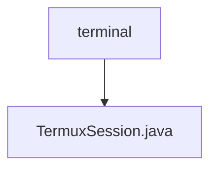

# 基础信息

|      |      |
|------|------|
| 名称 | terminal |
| 编码语言 | .java |
| 代码路径 | termux-app/termux-shared/src/main/java/com/termux/shared/termux/shell/command/runner/terminal |
| 包名 | termux-app.termux-shared.src.main.java.com.termux.shared.termux.shell.command.runner.terminal |
| 概述说明 | TermuxSession类用于执行命令并管理终端会话，包含启动、结束和处理结果功能。 |

# 说明

TermuxSession类用于管理终端会话和执行命令。它包含终端会话、执行命令、客户端接口等关键属性，提供执行命令、结束会话、终止会话等功能。execute方法负责启动命令执行，处理工作目录、环境变量等配置。finish方法处理会话结束后的结果，killIfExecuting方法可强制终止会话。processTermuxSessionResult方法处理会话结果并触发回调。TermuxSessionClient接口定义了会话结束时的回调方法。整体实现了完整的终端会话生命周期管理。

### 包内部结构视图

该流程图展示了Termux项目中终端命令运行器的目录结构关系。顶层节点"terminal"代表终端命令运行器目录，其下包含一个具体的Java实现文件"TermuxSession.java"。这种结构体现了典型的MVC架构中控制器层与具体实现类的关系，层级清晰且符合Java项目标准目录规范。

# 文件列表 File List

| 名称   | 类型  | 说明 |
|-------|------|-------------|
| [TermuxSession.java](TermuxSession.md) | file | TermuxSession类用于执行命令并管理终端会话，包含启动、结束和处理结果功能。 |

