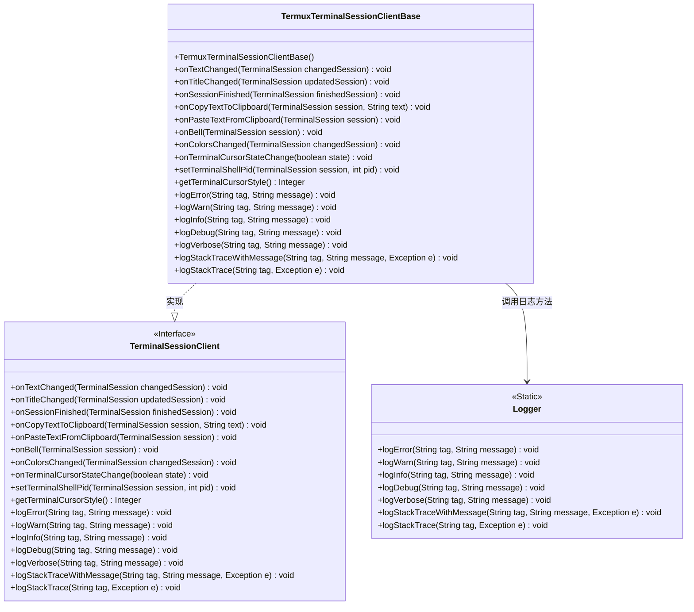

# 基础信息

|      |      |
|------|------|
| 名称 | TermuxTerminalSessionClientBase |
| 编码语言 | .java |
| 代码路径 | termux-app/termux-shared/src/main/java/com/termux/shared/termux/terminal/TermuxTerminalSessionClientBase.java |
| 包名 | com.termux.shared.termux.terminal |
| 依赖项 | ['androidx.annotation.NonNull', 'androidx.annotation.Nullable', 'com.termux.shared.logger.Logger', 'com.termux.terminal.TerminalSession', 'com.termux.terminal.TerminalSessionClient'] |
| 概述说明 | Termux终端会话客户端基类，实现文本、标题、会话等事件处理和日志功能。 |

# 说明

该代码定义了一个名为TermuxTerminalSessionClientBase的类，实现了TerminalSessionClient接口。它包含多个回调方法，用于处理终端会话事件，如文本变化、标题更新、会话结束、剪贴板操作、响铃通知、颜色变化和光标状态改变等。此外，还提供了日志功能，支持不同级别的日志记录和异常堆栈跟踪。该类主要用于监听和管理终端会话的各种状态变化和事件。

# 类列表 Class Summary

| 名称   | 类型  | 说明 |
|-------|------|-------------|
| TermuxTerminalSessionClientBase | class | Termux终端会话客户端基类，包含会话事件处理和日志功能。 |

## 类 TermuxTerminalSessionClientBase

|      |      |
|------|------|
| 访问范围 | public |
| 类型 | class |
| 名称 | TermuxTerminalSessionClientBase |
| 说明 | Termux终端会话客户端基类，包含会话事件处理和日志功能。 |

### UML类图

该类图展示了TermuxTerminalSessionClientBase类实现了TerminalSessionClient接口，并依赖Logger类进行日志记录。TerminalSessionClient接口定义了终端会话的各种回调方法，包括文本变化、标题更新、会话结束等事件处理，以及日志记录功能。TermuxTerminalSessionClientBase作为基础实现类，通过Logger提供的静态方法实现具体的日志记录功能，体现了接口隔离和依赖倒置的设计原则。

### 内部方法调用关系图

```mermaid
graph TD
    A["类TermuxTerminalSessionClientBase"]
    B["构造方法: TermuxTerminalSessionClientBase()"]
    C["回调方法: onTextChanged(TerminalSession)"]
    D["回调方法: onTitleChanged(TerminalSession)"]
    E["回调方法: onSessionFinished(TerminalSession)"]
    F["剪贴板方法: onCopyTextToClipboard(TerminalSession, String)"]
    G["剪贴板方法: onPasteTextFromClipboard(TerminalSession)"]
    H["事件方法: onBell(TerminalSession)"]
    I["样式方法: onColorsChanged(TerminalSession)"]
    J["光标方法: onTerminalCursorStateChange(boolean)"]
    K["进程方法: setTerminalShellPid(TerminalSession, int)"]
    L["样式方法: getTerminalCursorStyle()"]
    M["日志方法组: logError/logWarn/logInfo/logDebug/logVerbose"]
    N["异常日志方法: logStackTraceWithMessage(String, String, Exception)"]
    O["异常日志方法: logStackTrace(String, Exception)"]
    P["日志委托: Logger类方法调用"]

    A --> B
    A --> C
    A --> D
    A --> E
    A --> F
    A --> G
    A --> H
    A --> I
    A --> J
    A --> K
    A --> L
    A --> M
    A --> N
    A --> O
    M --> P
    N --> P
    O --> P
```

该流程图展示了TermuxTerminalSessionClientBase类的完整结构，包含构造方法、12个终端会话回调方法（分为文本变更、标题变更、会话结束、剪贴板操作、铃声事件、颜色样式变更、光标状态控制等类别）、7个日志记录方法（按错误级别细分），以及它们与Logger类的委托关系。所有日志方法最终都委托给Logger类的静态方法处理，体现了单一职责原则。类结构清晰地分为终端事件处理和日志记录两大功能模块。

### 字段列表 Field List

| 名称  | 类型  | 说明 |
|-------|-------|------|

### 方法列表 Method List

| 名称  | 类型  | 说明 |
|-------|-------|------|
| logInfo | void | 重写logInfo方法，调用Logger记录信息。 |
| onColorsChanged | void | 终端会话颜色变化时触发空操作。 |
| onPasteTextFromClipboard | void | 重写粘贴剪贴板文本方法，空实现。 |
| logWarn | void | 重写logWarn方法，调用Logger的logWarn记录警告日志。 |
| logDebug | void | 重写logDebug方法，调用Logger.logDebug输出调试日志。 |
| setTerminalShellPid | void | 重写方法设置终端会话的shell进程ID。 |
| onTerminalCursorStateChange | void | 方法重写，处理终端光标状态变更。 |
| logStackTrace | void | 重写方法，调用Logger记录异常堆栈。 |
| getTerminalCursorStyle | Integer | 方法返回空值，未设置终端光标样式。 |
| onCopyTextToClipboard | void | 重写方法，处理终端会话文本复制到剪贴板。 |
| onSessionFinished | void | 重写方法，处理会话结束事件。 |
| logVerbose | void | 重写logVerbose方法，调用Logger.logVerbose记录日志。 |
| logStackTraceWithMessage | void | 重写logStackTraceWithMessage方法，调用Logger记录带标签和消息的异常堆栈。 |
| onTextChanged | void | 终端会话文本变化时触发方法。 |
| onBell | void | 重写终端会话的响铃事件方法。 |
| logError | void | 重写logError方法，调用Logger记录错误信息。 |
| onTitleChanged | void | 终端会话标题变更时触发的方法。 |

