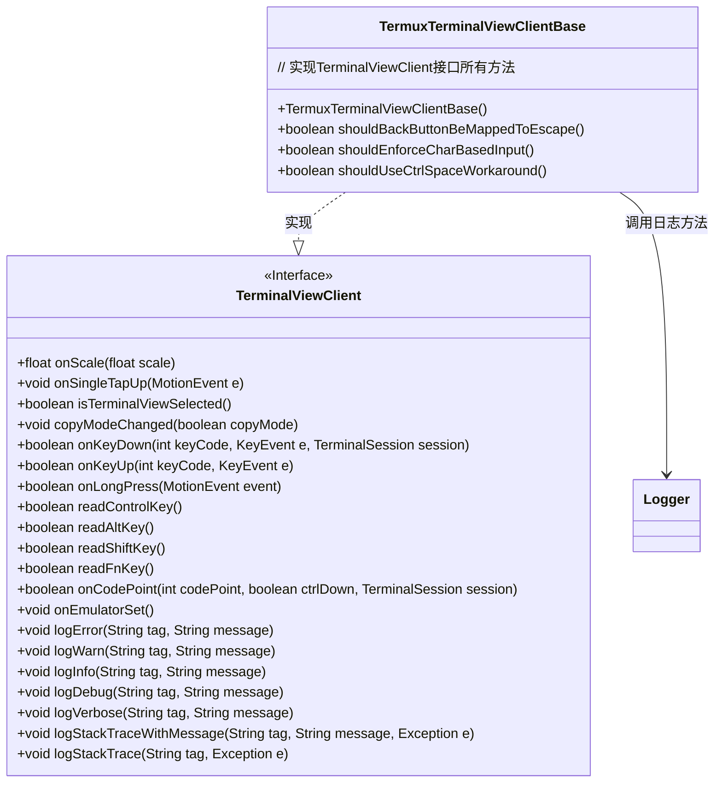

# 基础信息

|      |      |
|------|------|
| 名称 | TermuxTerminalViewClientBase |
| 编码语言 | .java |
| 代码路径 | termux-app/termux-shared/src/main/java/com/termux/shared/termux/terminal/TermuxTerminalViewClientBase.java |
| 包名 | com.termux.shared.termux.terminal |
| 依赖项 | ['android.view.KeyEvent', 'android.view.MotionEvent', 'com.termux.shared.logger.Logger', 'com.termux.terminal.TerminalSession', 'com.termux.view.TerminalViewClient'] |
| 概述说明 | Termux终端视图客户端基类，实现默认行为和日志功能。 |

# 说明

该代码定义了一个名为TermuxTerminalViewClientBase的类，实现了TerminalViewClient接口。它提供了默认实现，包括缩放、触摸事件、按键处理、修饰键状态检查等功能。所有方法默认返回false或空操作，仅isTerminalViewSelected返回true。类还包含日志功能，通过Logger记录不同级别的错误、警告、信息和调试日志，以及堆栈跟踪。该类主要用于处理终端视图的客户端交互和日志记录。

# 类列表 Class Summary

| 名称   | 类型  | 说明 |
|-------|------|-------------|
| TermuxTerminalViewClientBase | class | Termux终端视图客户端基类，实现默认行为和日志功能。 |

## 类 TermuxTerminalViewClientBase

|      |      |
|------|------|
| 访问范围 | public |
| 类型 | class |
| 名称 | TermuxTerminalViewClientBase |
| 说明 | Termux终端视图客户端基类，实现默认行为和日志功能。 |

### UML类图

该类图展示了TermuxTerminalViewClientBase类与TerminalViewClient接口的关系。TermuxTerminalViewClientBase是一个具体实现类，提供了终端视图客户端的默认行为，包括按键处理、手势识别、修饰键状态读取以及日志记录等功能。其中日志方法委托给Logger工具类处理，类中额外实现了三个配置查询方法用于控制终端行为。该实现类为空操作提供了默认返回值，适合作为基类进行扩展。

### 内部方法调用关系图

```mermaid
graph TD
    A["类TermuxTerminalViewClientBase"]
    B["构造方法: TermuxTerminalViewClientBase()"]
    C["方法: float onScale(float scale)"]
    D["方法: void onSingleTapUp(MotionEvent e)"]
    E["方法: boolean shouldBackButtonBeMappedToEscape()"]
    F["方法: boolean shouldEnforceCharBasedInput()"]
    G["方法: boolean shouldUseCtrlSpaceWorkaround()"]
    H["方法: boolean isTerminalViewSelected()"]
    I["方法: void copyModeChanged(boolean copyMode)"]
    J["方法: boolean onKeyDown(int keyCode, KeyEvent e, TerminalSession session)"]
    K["方法: boolean onKeyUp(int keyCode, KeyEvent e)"]
    L["方法: boolean onLongPress(MotionEvent event)"]
    M["方法: boolean readControlKey()"]
    N["方法: boolean readAltKey()"]
    O["方法: boolean readShiftKey()"]
    P["方法: boolean readFnKey()"]
    Q["方法: boolean onCodePoint(int codePoint, boolean ctrlDown, TerminalSession session)"]
    R["方法: void onEmulatorSet()"]
    S["日志方法组: logError/logWarn/logInfo/logDebug/logVerbose"]
    T["异常方法组: logStackTraceWithMessage/logStackTrace"]

    A --> B
    A --> C
    A --> D
    A --> E
    A --> F
    A --> G
    A --> H
    A --> I
    A --> J
    A --> K
    A --> L
    A --> M
    A --> N
    A --> O
    A --> P
    A --> Q
    A --> R
    A --> S
    A --> T
```

该流程图展示了TermuxTerminalViewClientBase类的完整结构，包含构造方法和18个成员方法。类主要分为三大功能模块：终端视图控制方法（如onScale、onSingleTapUp）、键盘事件处理方法（如onKeyDown、readControlKey）和日志记录方法（如logError、logStackTrace）。所有方法都直接继承自TerminalViewClient接口，其中大部分方法返回默认布尔值false或空实现，日志方法则委托给Logger工具类处理。类设计体现了终端模拟器客户端的核心交互功能，包括手势控制、按键处理和日志记录等关键操作。

### 字段列表 Field List

| 名称  | 类型  | 说明 |
|-------|-------|------|

### 方法列表 Method List

| 名称  | 类型  | 说明 |
|-------|-------|------|
| logVerbose | void | 重写logVerbose方法，调用Logger的同名方法。 |
| logStackTraceWithMessage | void | 重写方法，调用Logger记录带标签、消息和异常的堆栈跟踪。 |
| logStackTrace | void | 重写logStackTrace方法，调用Logger记录异常堆栈。 |
| shouldBackButtonBeMappedToEscape | boolean | 方法返回false，表示不应将返回键映射为Esc键。 |
| onSingleTapUp | void | 重写单次点击抬起事件处理方法。 |
| logWarn | void | 重写logWarn方法，调用Logger的logWarn记录警告日志。 |
| isTerminalViewSelected | boolean | 方法始终返回true，表示终端视图被选中。 |
| shouldEnforceCharBasedInput | boolean | 方法返回false，不强制字符输入。 |
| onScale | float | 重写onScale方法，固定返回1.0f。 |
| readFnKey | boolean | 重写方法，始终返回false。 |
| logDebug | void | 重写logDebug方法，调用Logger.logDebug记录调试日志。 |
| onEmulatorSet | void | 重写父类方法，设置模拟器时调用。 |
| readAltKey | boolean | 重写方法，始终返回false。 |
| onKeyDown | boolean | 重写按键事件处理方法，默认返回false。 |
| readControlKey | boolean | 重写方法readControlKey，固定返回false。 |
| onLongPress | boolean | 重写长按事件处理，默认返回false。 |
| logError | void | 重写logError方法，调用Logger记录错误信息。 |
| onCodePoint | boolean | 重写终端会话的代码点处理方法。 |
| copyModeChanged | void | 方法重写，处理复制模式变更。 |
| onKeyUp | boolean | 重写按键抬起事件处理，默认返回false。 |
| logInfo | void | 重写logInfo方法，调用Logger记录信息。 |
| shouldUseCtrlSpaceWorkaround | boolean | 方法返回false，不使用Ctrl+Space解决方案。 |
| readShiftKey | boolean | 重写方法，返回固定值false。 |

