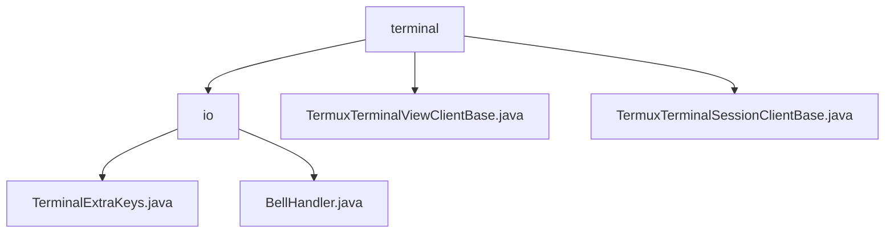

# 基础信息

|      |      |
|------|------|
| 名称 | terminal |
| 编码语言 | .java |
| 代码路径 | termux-app/termux-shared/src/main/java/com/termux/shared/termux/terminal |
| 包名 | termux-app.termux-shared.src.main.java.com.termux.shared.termux.terminal |
| 概述说明 | 终端模块含按键处理和振动反馈组件，支持跨版本兼容和设备适配。 |

# 说明

```markdown
## 概述

该代码模块是Termux应用的核心终端交互组件，主要实现终端视图的交互增强和会话管理功能，包含以下核心组件：

1. **终端交互增强组件**
   - `TerminalExtraKeys`：处理终端视图的扩展按键操作，包括宏按键分发、组合键状态管理及跨版本兼容性处理
   - `BellHandler`：单例振动管理器，为终端操作提供标准化触觉反馈，支持设备特定兼容性处理

2. **基础客户端实现**
   - `TermuxTerminalViewClientBase`：提供终端视图交互的默认实现（缩放/触摸/按键处理），集成多级日志系统
   - `TermuxTerminalSessionClientBase`：实现终端会话事件的全生命周期监听（文本/标题/状态变更等）

## 主要业务场景

- **终端扩展输入处理**
  - 通过`TerminalExtraKeys`解析宏按键/组合键事件，生成对应终端输入序列
  - 处理Android各版本（特别是振动API差异）和厂商设备（如三星Android 8）的兼容性问题

- **多模态交互反馈**
  - 当终端触发响铃事件时，`BellHandler`调度符合人机工程学的振动反馈（≥150ms间隔）
  - 通过主线程调度和异常捕获机制保证触觉反馈的稳定性

- **终端会话全生命周期管理**
  - `TermuxTerminalSessionClientBase`监听文本变化、标题更新、会话结束等关键事件
  - 处理剪贴板操作、颜色配置更新、光标状态变更等扩展功能

- **可扩展的交互框架**
  - `TermuxTerminalViewClientBase`提供默认的视图交互实现（返回false/空操作）
  - 通过集成Logger系统实现全链路调试（支持ERROR/WARN/INFO/DEBUG多级日志）
```


### 包内部结构视图



该流程图展示了Termux终端模块的层级结构。顶层节点为terminal目录，包含io子目录和两个终端客户端基类文件。io目录下又包含两个处理终端输入输出的具体实现类文件，分别处理额外按键和铃声事件。结构清晰地反映了终端功能模块的文件组织方式。

# 文件列表 File List

| 名称   | 类型  | 说明 |
|-------|------|-------------|
| [TermuxTerminalViewClientBase.java](TermuxTerminalViewClientBase.md) | file | Termux终端视图客户端基类，实现默认行为和日志功能。 |
| [TermuxTerminalSessionClientBase.java](TermuxTerminalSessionClientBase.md) | file | Termux终端会话客户端基类，实现文本、标题、会话等事件处理和日志功能。 |
| [io](io/_module.md) | package | TerminalExtraKeys类处理终端按键操作，含宏和普通按键逻辑。BellHandler类管理线程安全振动，支持Android O+，防止重复触发。 |


