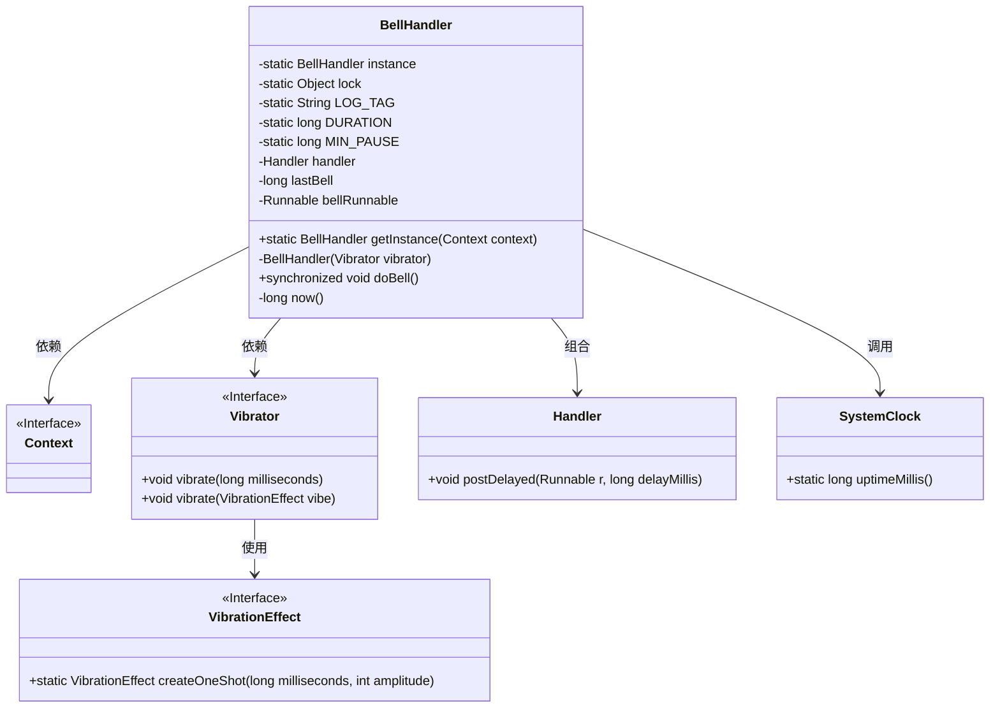
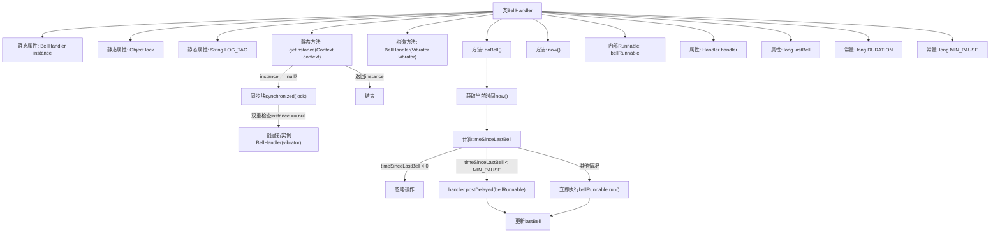
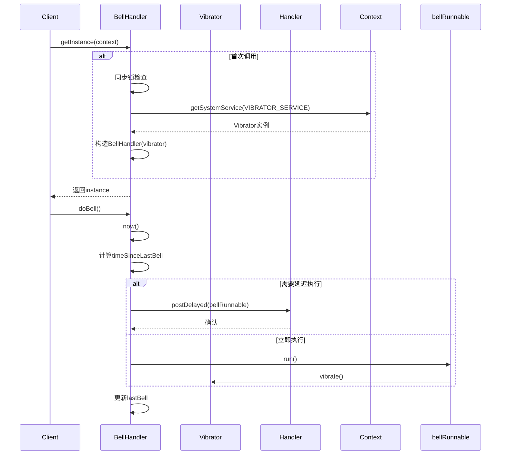

# 基础信息

|      |      |
|------|------|
| 名称 | BellHandler |
| 编码语言 | .java |
| 代码路径 | termux-app/termux-shared/src/main/java/com/termux/shared/termux/terminal/io/BellHandler.java |
| 包名 | com.termux.shared.termux.terminal.io |
| 依赖项 | ['android.content.Context', 'android.os.Build', 'android.os.Handler', 'android.os.Looper', 'android.os.SystemClock', 'android.os.VibrationEffect', 'android.os.Vibrator', 'com.termux.shared.logger.Logger'] |
| 概述说明 | 单例振动处理器，控制振动频率和时长。 |

# 说明

这是一个实现单例模式的振动器管理类BellHandler，通过双重检查锁定确保线程安全。主要功能包括：使用Vibrator服务创建短振动效果（50毫秒），支持Android O及以上版本的振动API；通过Handler在主线程调度振动，确保两次振动间隔至少150毫秒；记录上次振动时间防止重复触发，并处理三星设备在Android 8上的异常情况。类提供同步方法doBell()来触发受控的振动序列。

# 类列表 Class Summary

| 名称   | 类型  | 说明 |
|-------|------|-------------|
| BellHandler | class | 单例振动处理器，双检锁实现，控制振动频率和延迟。 |

## 类 BellHandler

|      |      |
|------|------|
| 访问范围 | public |
| 类型 | class |
| 名称 | BellHandler |
| 说明 | 单例振动处理器，双检锁实现，控制振动频率和延迟。 |

### UML类图

这段代码展示了一个单例模式实现的BellHandler类，主要用于管理设备振动功能。通过双重检查锁定确保线程安全，使用Handler实现延时振动，并处理Android不同版本间的振动API差异。类图清晰地呈现了与系统服务(Context/Vibrator)、时间工具(SystemClock)和线程调度器(Handler)的交互关系，同时体现了对VibrationEffect接口的版本适配逻辑。

### 内部方法调用关系图

这段代码实现了一个单例模式的振动控制器BellHandler，通过双重检查锁确保线程安全。核心功能doBell()会根据上次振动时间智能调度：时间间隔过短时延迟执行，避免频繁振动；否则立即触发。内部通过Handler实现延迟任务，并针对不同Android版本适配振动API。流程图展示了类结构和主要方法调用关系，时序图则详细描述了获取实例和触发振动的完整交互过程。特别注意对三星设备Android 8的异常处理，体现了良好的健壮性设计。

### 字段列表 Field List

| 名称  | 类型  | 说明 |
|-------|-------|------|
| lock = new Object() | Object | 私有静态锁对象 |
| bellRunnable | Runnable | 私有终态Runnable钟声任务 |
| DURATION = 50 | long | 定义私有静态长整型常量DURATION，值为50。 |
| instance = null | BellHandler | 单例模式中的私有静态实例变量 |
| lastBell = 0 | long | 私有长整型变量lastBell初始化为0。 |
| handler = new Handler(Looper.getMainLooper()) | Handler | 主线程Handler初始化 |
| LOG_TAG = "BellHandler" | String | 私有常量LOG_TAG值为"BellHandler"。 |
| MIN_PAUSE = 3 * DURATION | long | 私有静态长整型常量MIN_PAUSE值为3倍DURATION |

### 方法列表 Method List

| 名称  | 类型  | 说明 |
|-------|-------|------|
| getInstance | BellHandler | 单例模式获取BellHandler实例，双重检查锁确保线程安全。 |
| doBell | void | 同步方法doBell控制铃声触发，根据上次铃声时间决定立即执行或延迟调度。 |
| now | long | 获取系统启动后的毫秒时间。 |

