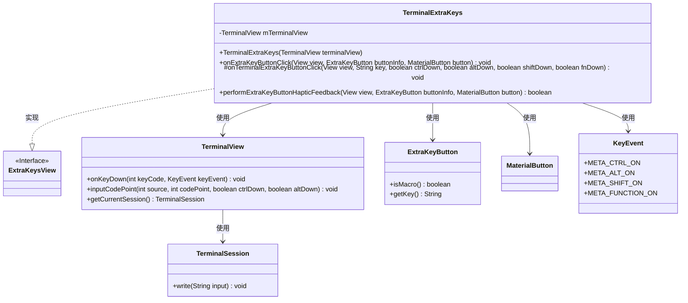
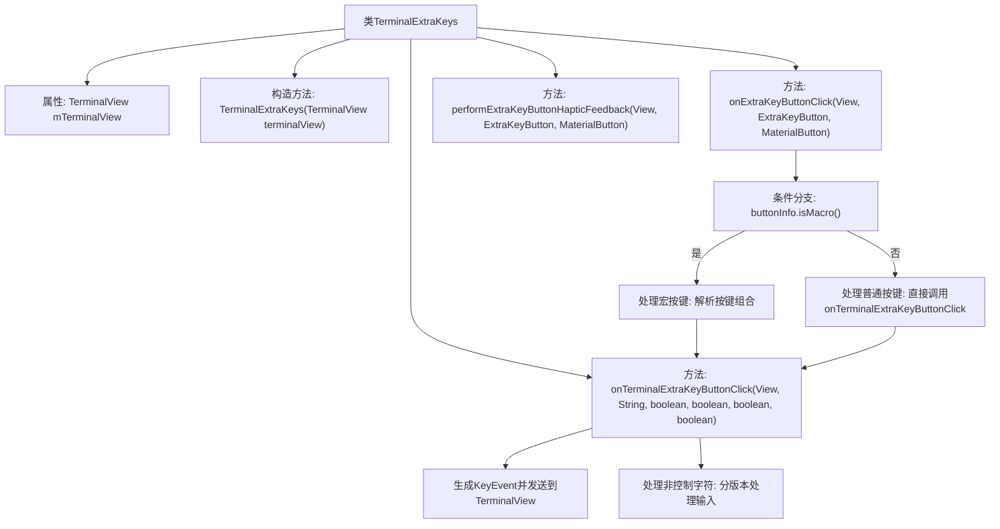

# 基础信息

|      |      |
|------|------|
| 名称 | TerminalExtraKeys |
| 编码语言 | .java |
| 代码路径 | termux-app/termux-shared/src/main/java/com/termux/shared/termux/terminal/io/TerminalExtraKeys.java |
| 包名 | com.termux.shared.termux.terminal.io |
| 依赖项 | ['android.os.Build', 'android.view.KeyEvent', 'android.view.View', 'androidx.annotation.NonNull', 'com.google.android.material.button.MaterialButton', 'com.termux.shared.termux.extrakeys.ExtraKeyButton', 'com.termux.shared.termux.extrakeys.ExtraKeysView', 'com.termux.shared.termux.extrakeys.SpecialButton', 'com.termux.terminal.TerminalSession', 'com.termux.view.TerminalView', 'com.termux.shared.termux.extrakeys.ExtraKeysConstants.PRIMARY_KEY_CODES_FOR_STRINGS'] |
| 概述说明 | 终端额外按键处理类，实现宏按键解析和按键事件分发。 |

# 说明

该代码定义了一个TerminalExtraKeys类，用于处理终端视图的额外按键操作。类中包含两个主要方法：onExtraKeyButtonClick处理按键点击事件，根据按键类型（宏或普通）执行不同操作；onTerminalExtraKeyButtonClick处理具体按键逻辑，包括组合键状态处理和字符输入。代码还涉及按键事件生成、终端会话写入等功能，支持不同Android版本的处理方式。

# 类列表 Class Summary

| 名称   | 类型  | 说明 |
|-------|------|-------------|
| TerminalExtraKeys | class | 终端按键处理类，实现宏按键解析和事件分发功能。 |

## 类 TerminalExtraKeys

|      |      |
|------|------|
| 访问范围 | public |
| 类型 | class |
| 名称 | TerminalExtraKeys |
| 说明 | 终端按键处理类，实现宏按键解析和事件分发功能。 |

### UML类图

类图描述：
TerminalExtraKeys类实现了ExtraKeysView接口，用于处理终端视图的额外按键功能。它包含一个TerminalView成员变量，通过构造函数注入依赖。主要方法onExtraKeyButtonClick处理按键点击事件，根据按键类型（宏或普通）调用onTerminalExtraKeyButtonClick方法。后者根据按键状态生成KeyEvent或直接输入字符到终端。类图中还展示了相关的辅助类如ExtraKeyButton、MaterialButton、KeyEvent和TerminalSession，它们共同协作完成终端按键功能。

### 内部方法调用关系图

这段代码流程图展示了TerminalExtraKeys类的核心结构和逻辑流程。该类主要处理终端模拟器的额外按键事件，包含构造方法、按键点击处理和触觉反馈三个主要部分。按键处理分为宏按键(组合键)和普通按键两种路径，最终都会调用onTerminalExtraKeyButtonClick方法。该方法根据按键类型分别处理控制字符(生成KeyEvent)和非控制字符(分Android版本处理输入)。整个流程体现了从按键事件捕获到终端输入的完整处理链条，特别注重了组合键解析和不同Android版本的兼容性处理。

### 字段列表 Field List

| 名称  | 类型  | 说明 |
|-------|-------|------|
| mTerminalView | TerminalView | 终端视图私有成员变量 |

### 方法列表 Method List

| 名称  | 类型  | 说明 |
|-------|-------|------|
| onExtraKeyButtonClick | void | 处理宏按键点击，解析组合键并触发终端按键事件。 |
| onTerminalExtraKeyButtonClick | void | 处理终端按键事件，根据按键类型和修饰键状态发送相应事件或字符输入。 |
| performExtraKeyButtonHapticFeedback | boolean | 重写方法，返回false，不执行额外按键触觉反馈。 |

