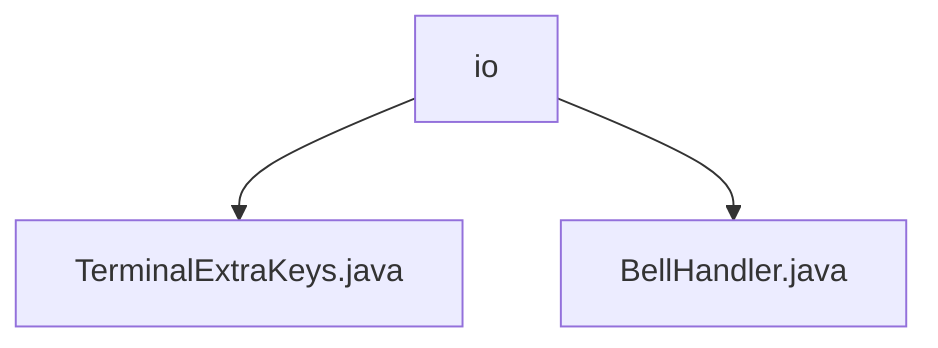

# 基础信息

|      |      |
|------|------|
| 名称 | io |
| 编码语言 | .java |
| 代码路径 | termux-app/termux-shared/src/main/java/com/termux/shared/termux/terminal/io |
| 包名 | termux-app.termux-shared.src.main.java.com.termux.shared.termux.terminal.io |
| 概述说明 | TerminalExtraKeys类处理终端按键操作，含宏和普通按键逻辑。BellHandler类管理线程安全振动，支持Android O+，防止重复触发。 |

# 说明

## 概述

该代码模块主要实现终端视图的交互增强功能，包含以下两个核心组件：

1. **TerminalExtraKeys**  
   负责处理终端视图的额外按键操作，提供按键事件处理和终端输入功能。支持宏按键和普通按键的分发处理，包含组合键状态管理、字符输入以及跨Android版本的兼容性处理。

2. **BellHandler**  
   采用单例模式实现的振动器管理器，为终端操作提供触觉反馈。通过双重检查锁定保证线程安全，支持短振动效果调度，兼容不同Android版本（特别是Android O+的振动API），并包含设备特定异常处理（如三星设备兼容性）。

## 主要业务场景

- **终端扩展按键处理**  
  当用户在终端视图中触发自定义按键（如宏按键或组合键）时，`TerminalExtraKeys`类负责解析按键类型，生成对应事件并写入终端会话，实现快速命令输入或特殊操作响应。

- **振动反馈管理**  
  在终端发生铃声事件（如错误提示或操作确认）时，`BellHandler`通过受控的振动序列提供触觉反馈。通过时间间隔控制（≥150ms）和主线程调度，避免振动频繁触发影响用户体验，同时处理特定设备的兼容性问题。

- **跨版本兼容性支持**  
  模块针对不同Android版本（如新旧振动API差异）和厂商设备（如三星Android 8异常）进行了适配，确保功能在多样化环境中的稳定性。

### 包内部结构视图

该流程图展示了Termux项目中终端IO模块的文件结构关系。顶层节点"io"表示终端输入输出目录，其下包含两个关键文件：TerminalExtraKeys.java处理终端额外按键功能，BellHandler.java负责终端铃声事件处理。结构清晰地反映了终端IO模块的核心组件及其层级关系。

# 文件列表 File List

| 名称   | 类型  | 说明 |
|-------|------|-------------|
| [BellHandler.java](BellHandler.md) | file | 单例振动处理器，控制振动频率和时长。 |
| [TerminalExtraKeys.java](TerminalExtraKeys.md) | file | 终端额外按键处理类，实现宏按键解析和按键事件分发。 |

