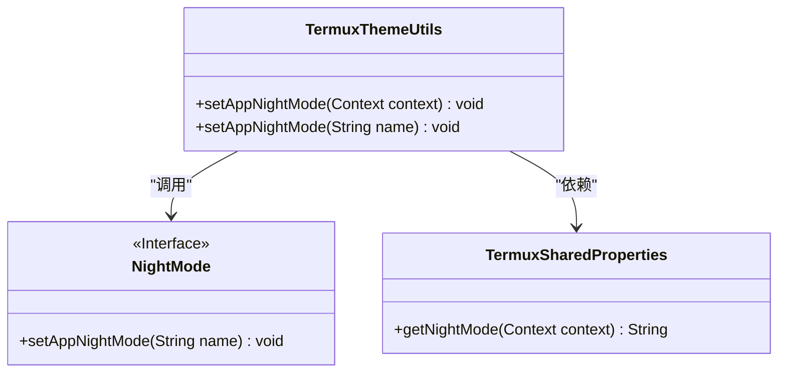
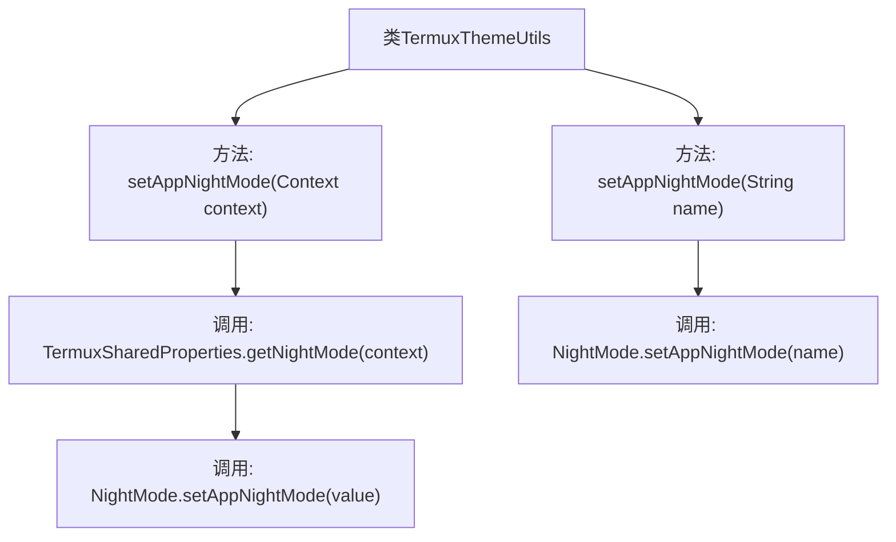

# 基础信息

|      |      |
|------|------|
| 名称 | TermuxThemeUtils |
| 编码语言 | .java |
| 代码路径 | termux-app/termux-shared/src/main/java/com/termux/shared/termux/theme/TermuxThemeUtils.java |
| 包名 | com.termux.shared.termux.theme |
| 依赖项 | ['android.content.Context', 'androidx.annotation.NonNull', 'androidx.annotation.Nullable', 'com.termux.shared.termux.settings.properties.TermuxPropertyConstants', 'com.termux.shared.termux.settings.properties.TermuxSharedProperties', 'com.termux.shared.theme.NightMode'] |
| 概述说明 | TermuxThemeUtils类提供设置夜间模式的方法，支持从文件或直接指定模式。 |

# 说明

TermuxThemeUtils类提供了两个静态方法来设置应用程序的夜间模式。第一个方法setAppNightMode接收Context参数，从属性文件中读取夜间模式值并设置为应用全局值。第二个方法setAppNightMode直接接收字符串参数，将其设为应用全局夜间模式值。两者都通过NightMode类的setAppNightMode方法实现功能。

# 类列表 Class Summary

| 名称   | 类型  | 说明 |
|-------|------|-------------|
| TermuxThemeUtils | class | TermuxThemeUtils类提供设置夜间模式的方法。 |

## 类 TermuxThemeUtils

|      |      |
|------|------|
| 访问范围 | public |
| 类型 | class |
| 名称 | TermuxThemeUtils |
| 说明 | TermuxThemeUtils类提供设置夜间模式的方法。 |

### UML类图

该代码展示了TermuxThemeUtils工具类，它提供了两种设置应用夜间模式的方法：一种通过Context获取配置值，另一种直接接收模式名称。类图中包含三个关键组件：TermuxThemeUtils作为入口点，NightMode接口定义核心功能，TermuxSharedProperties负责配置读取。箭头清晰地表明了工具类对另外两个组件的调用和依赖关系，体现了配置读取与模式设置的分层设计。

### 内部方法调用关系图

这段代码流程图展示了TermuxThemeUtils类的两个重载方法setAppNightMode的工作流程。第一个方法接收Context参数，通过TermuxSharedProperties获取夜间模式配置后传递给NightMode.setAppNightMode()；第二个方法直接接收字符串参数并传递给NightMode.setAppNightMode()。两个方法最终都通过NightMode类完成夜间模式设置，体现了清晰的职责分离设计模式。

### 字段列表 Field List

| 名称  | 类型  | 说明 |
|-------|-------|------|

### 方法列表 Method List

| 名称  | 类型  | 说明 |
|-------|-------|------|
| setAppNightMode | void | 设置应用夜间模式，根据上下文获取模式参数。 |
| setAppNightMode | void | 静态方法设置应用夜间模式，参数为名称。 |

