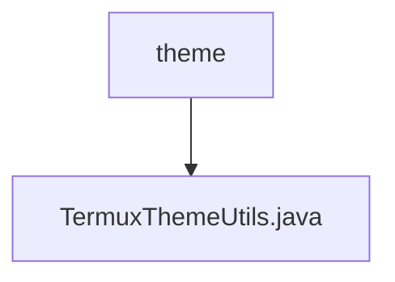

# 基础信息

|      |      |
|------|------|
| 名称 | theme |
| 编码语言 | .java |
| 代码路径 | termux-app/termux-shared/src/main/java/com/termux/shared/termux/theme |
| 包名 | termux-app.termux-shared.src.main.java.com.termux.shared.termux.theme |
| 概述说明 | TermuxThemeUtils类提供设置夜间模式的方法，支持从文件或直接指定模式。 |

# 说明

TermuxThemeUtils类提供了两个静态方法来设置应用程序的夜间模式。第一个方法setAppNightMode接收Context参数，从属性文件中读取夜间模式值并设置为应用全局值。第二个方法setAppNightMode直接接收字符串参数，将其设为应用全局夜间模式值。两者都通过NightMode类的setAppNightMode方法实现功能。

### 包内部结构视图

该流程图展示了Termux项目中主题模块的层级结构。顶层节点为"theme"目录，其下包含一个名为"TermuxThemeUtils.java"的Java工具类文件。这种结构体现了典型的工具类组织方式，将主题相关的工具方法集中存放在特定目录下的单一文件中，便于维护和调用。

# 文件列表 File List

| 名称   | 类型  | 说明 |
|-------|------|-------------|
| [TermuxThemeUtils.java](TermuxThemeUtils.md) | file | TermuxThemeUtils类提供设置夜间模式的方法，支持从文件或直接指定模式。 |

