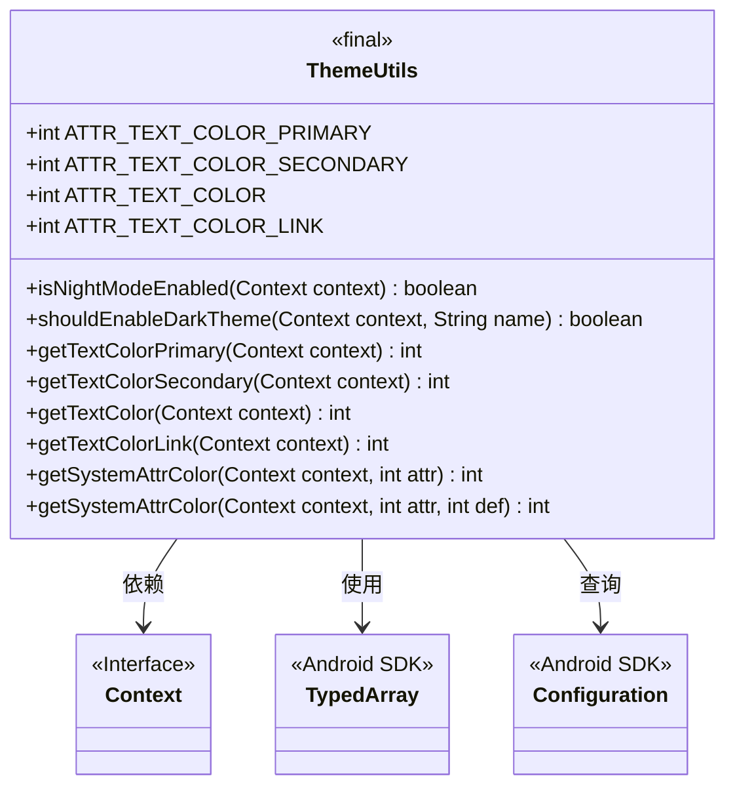
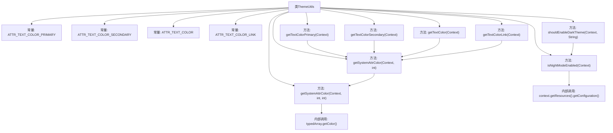

# 基础信息

|      |      |
|------|------|
| 名称 | ThemeUtils |
| 编码语言 | .java |
| 代码路径 | termux-app/termux-shared/src/main/java/com/termux/shared/theme/ThemeUtils.java |
| 包名 | com.termux.shared.theme |
| 依赖项 | ['android.app.Activity', 'android.content.Context', 'android.content.res.Configuration', 'android.content.res.TypedArray', 'androidx.appcompat.app.AppCompatActivity'] |
| 概述说明 | ThemeUtils类提供主题颜色获取和夜间模式判断功能。 |

# 说明

ThemeUtils是一个工具类，提供主题相关功能。它包含四个静态常量，表示文本颜色属性。isNightModeEnabled方法检测系统是否启用夜间模式。shouldEnableDarkTheme方法根据传入的NightMode参数决定是否启用深色主题。提供getTextColorPrimary、getTextColorSecondary等方法获取当前主题的文本颜色值。getSystemAttrColor方法封装了获取主题属性的逻辑，支持默认值设置，并强调必须使用Activity或AppCompatActivity上下文。

# 类列表 Class Summary

| 名称   | 类型  | 说明 |
|-------|------|-------------|
| ThemeUtils | class | ThemeUtils提供主题工具类，含夜间模式判断和文本颜色获取方法。 |

## 类 ThemeUtils

|      |      |
|------|------|
| 访问范围 | public |
| 类型 | class |
| 名称 | ThemeUtils |
| 说明 | ThemeUtils提供主题工具类，含夜间模式判断和文本颜色获取方法。 |

### UML类图

类图描述：
ThemeUtils是一个工具类，主要用于处理Android主题相关的操作，包含检查夜间模式状态、获取主题文本颜色等功能。它依赖于Android的Context接口获取上下文信息，使用TypedArray读取主题属性值，并查询Configuration类判断当前UI模式。类中定义了多个静态常量表示文本颜色属性，提供了层级式的方法封装，核心逻辑集中在getSystemAttrColor方法实现主题属性的安全读取。

### 内部方法调用关系图

该流程图展示了ThemeUtils类的完整结构，包含4个颜色常量定义和7个核心方法。关键路径包括：shouldEnableDarkTheme()依赖isNightModeEnabled()检测夜间模式，所有getTextColorXXX()方法最终调用getSystemAttrColor()获取主题颜色，底层通过TypedArray实现颜色属性解析。方法间调用关系清晰，体现了从业务逻辑到系统资源访问的完整调用链。

### 字段列表 Field List

| 名称  | 类型  | 说明 |
|-------|-------|------|
| ATTR_TEXT_COLOR_LINK = android.R.attr.textColorLink | int | 安卓链接文本颜色常量定义 |
| ATTR_TEXT_COLOR_SECONDARY = android.R.attr.textColorSecondary | int | 定义常量ATTR_TEXT_COLOR_SECONDARY，引用安卓系统属性textColorSecondary。 |
| ATTR_TEXT_COLOR = android.R.attr.textColor | int | 定义静态常量ATTR_TEXT_COLOR，引用安卓文本颜色属性。 |
| ATTR_TEXT_COLOR_PRIMARY = android.R.attr.textColorPrimary | int | 定义常量ATTR_TEXT_COLOR_PRIMARY，引用安卓系统属性textColorPrimary。 |

### 方法列表 Method List

| 名称  | 类型  | 说明 |
|-------|-------|------|
| shouldEnableDarkTheme | boolean | 根据名称判断是否启用暗色主题，匹配系统设置或默认关闭。 |
| isNightModeEnabled | boolean | 检查当前是否为夜间模式 |
| getTextColorPrimary | int | 获取上下文主文本颜色 |
| getTextColorSecondary | int | 获取上下文中的次要文本颜色属性值。 |
| getTextColor | int | 获取上下文文本颜色 |
| getTextColorLink | int | 获取上下文中的链接文本颜色属性值。 |
| getSystemAttrColor | int | 获取系统属性颜色，默认参数为0。 |
| getSystemAttrColor | int | 获取系统主题颜色值，默认值def。 |

