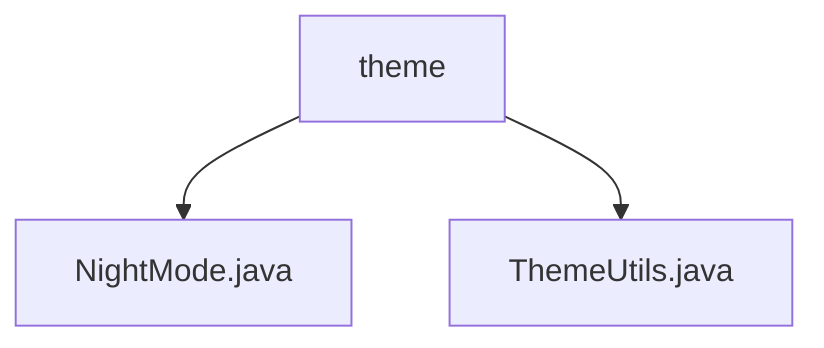

# 基础信息

|      |      |
|------|------|
| 名称 | theme |
| 编码语言 | .java |
| 代码路径 | termux-app/termux-shared/src/main/java/com/termux/shared/theme |
| 包名 | termux-app.termux-shared.src.main.java.com.termux.shared.theme |
| 概述说明 | ThemeUtils工具类提供主题功能，包括检测夜间模式、深色主题判断及文本颜色获取方法。 |

# 说明

```markdown
## 概述
该代码模块属于Termux应用的共享功能部分，主要提供主题相关的工具类实现。模块包含两个核心Java文件：
1. `NightMode.java` - 处理夜间模式状态检测与主题切换逻辑
2. `ThemeUtils.java` - 提供主题属性操作的工具方法集合

## 主要业务场景
1. **夜间模式检测与切换**：
   - 通过`isNightModeEnabled()`检测系统是否启用夜间模式
   - 使用`shouldEnableDarkTheme()`根据配置参数动态决定深色主题的启用

2. **主题属性管理**：
   - 提供4种标准文本颜色属性常量（如`ATTR_TEXT_COLOR_PRIMARY`）
   - 封装`getSystemAttrColor()`方法统一获取主题属性值，支持默认值回退
   - 强调必须使用`Activity`或`AppCompatActivity`上下文保证兼容性

3. **文本颜色获取**：
   - 实现`getTextColorPrimary()`、`getTextColorSecondary()`等方法
   - 提供标准化的主题文本颜色取值接口

4. **主题工具扩展**：
   - 通过静态工具类设计实现跨组件复用
   - 封装系统主题相关API的复杂操作细节
```


### 包内部结构视图



该流程图展示了Termux应用中主题模块的层级结构。根节点为"theme"目录，包含两个Java文件：NightMode.java处理夜间模式功能，ThemeUtils.java提供主题相关的工具方法。这种结构体现了模块化设计思想，将主题相关功能集中管理，便于维护和扩展。

# 文件列表 File List

| 名称   | 类型  | 说明 |
|-------|------|-------------|
| [ThemeUtils.java](ThemeUtils.md) | file | ThemeUtils类提供主题颜色获取和夜间模式判断功能。 |
| [NightMode.java](NightMode.md) | file | 输入内容为空，无法生成概要。请提供具体信息。 |


