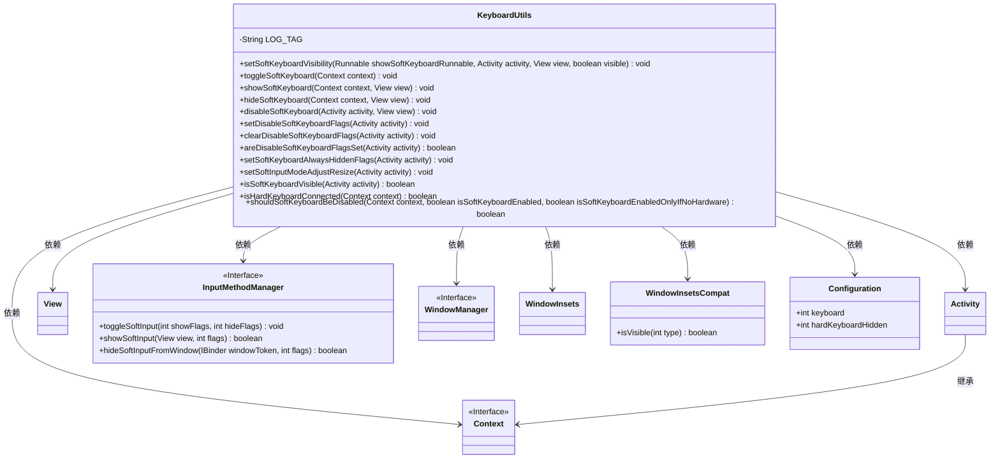

# 基础信息

|      |      |
|------|------|
| 名称 | KeyboardUtils |
| 编码语言 | .java |
| 代码路径 | termux-app/termux-shared/src/main/java/com/termux/shared/view/KeyboardUtils.java |
| 包名 | com.termux.shared.view |
| 依赖项 | ['android.app.Activity', 'android.content.Context', 'android.content.res.Configuration', 'android.inputmethodservice.InputMethodService', 'android.os.Build', 'android.view.View', 'android.view.WindowInsets', 'android.view.WindowManager', 'android.view.inputmethod.InputMethodManager', 'androidx.annotation.NonNull', 'androidx.annotation.RequiresApi', 'androidx.core.view.WindowInsetsCompat', 'com.termux.shared.logger.Logger'] |
| 概述说明 | KeyboardUtils类提供软键盘显示、隐藏、切换及硬件键盘检测功能。 |

# 说明

KeyboardUtils类提供了一系列静态方法用于管理Android软键盘的显示、隐藏和状态检测。主要功能包括：通过Runnable延迟控制软键盘显示/隐藏，强制切换/显示软键盘，隐藏软键盘，禁用软键盘标志设置与清除，检测软键盘和硬件键盘状态，以及根据用户配置判断是否应禁用软键盘。特别处理了硬件键盘连接时的兼容性问题，并包含窗口输入模式设置和API级别适配说明。所有方法均进行空指针检查，关键操作会通过InputMethodManager系统服务实现。

# 类列表 Class Summary

| 名称   | 类型  | 说明 |
|-------|------|-------------|
| KeyboardUtils | class | 键盘工具类，提供显示、隐藏、切换软键盘功能，支持硬件键盘检测及状态管理。 |

## 类 KeyboardUtils

|      |      |
|------|------|
| 访问范围 | public |
| 类型 | class |
| 名称 | KeyboardUtils |
| 说明 | 键盘工具类，提供显示、隐藏、切换软键盘功能，支持硬件键盘检测及状态管理。 |

### UML类图

这段代码定义了一个`KeyboardUtils`工具类，主要用于处理Android软键盘的显示/隐藏控制、状态检测和硬件键盘检测。类中包含15个静态方法，涵盖软键盘的显隐切换、强制显示/隐藏、窗口标志位设置、键盘可见性检测、硬件键盘连接状态判断等功能。通过`InputMethodManager`系统服务实现核心功能，并处理了硬件键盘连接时的特殊场景。类与Android框架的`Context`、`Activity`、`View`等核心组件存在依赖关系，同时涉及`WindowManager`的窗口标志位操作和`Configuration`的系统配置读取。

### 内部方法调用关系图

```mermaid
graph TD
    A["类KeyboardUtils"]
    B["常量: LOG_TAG = 'KeyboardUtils'"]
    C["方法: setSoftKeyboardVisibility(Runnable, Activity, View, boolean)"]
    D["方法: toggleSoftKeyboard(Context)"]
    E["方法: showSoftKeyboard(Context, View)"]
    F["方法: hideSoftKeyboard(Context, View)"]
    G["方法: disableSoftKeyboard(Activity, View)"]
    H["方法: setDisableSoftKeyboardFlags(Activity)"]
    I["方法: clearDisableSoftKeyboardFlags(Activity)"]
    J["方法: areDisableSoftKeyboardFlagsSet(Activity)"]
    K["方法: setSoftKeyboardAlwaysHiddenFlags(Activity)"]
    L["方法: setSoftInputModeAdjustResize(Activity)"]
    M["方法: isSoftKeyboardVisible(Activity)"]
    N["方法: isHardKeyboardConnected(Context)"]
    O["方法: shouldSoftKeyboardBeDisabled(Context, boolean, boolean)"]

    A --> B
    A --> C
    A --> D
    A --> E
    A --> F
    A --> G
    A --> H
    A --> I
    A --> J
    A --> K
    A --> L
    A --> M
    A --> N
    A --> O

    C -->|visible=true| C1["view.postDelayed(showSoftKeyboardRunnable, 500)"]
    C -->|visible=false| C2["view.removeCallbacks(showSoftKeyboardRunnable)"]
    C2 --> C3["hideSoftKeyboard(activity, view)"]
    D --> D1["inputMethodManager.toggleSoftInput(SHOW_FORCED, 0)"]
    E --> E1["inputMethodManager.showSoftInput(view, 0)"]
    F --> F1["inputMethodManager.hideSoftInputFromWindow(view.getWindowToken(), 0)"]
    G --> G1["hideSoftKeyboard(activity, view)"]
    G1 --> G2["setDisableSoftKeyboardFlags(activity)"]
    M --> M1["WindowInsetsCompat.isVisible(WindowInsetsCompat.Type.ime())"]
    N --> N1["config.keyboard != KEYBOARD_NOKEYS || config.hardKeyboardHidden == HARDKEYBOARDHIDDEN_NO"]
    O --> O1["!isSoftKeyboardEnabled → return true"]
    O --> O2["isSoftKeyboardEnabledOnlyIfNoHardware → return isHardKeyboardConnected"]
    O --> O3["else → return false"]
```

这段代码是Android平台下的键盘工具类KeyboardUtils，主要用于控制软键盘的显示/隐藏、状态检测及硬件键盘连接判断。核心功能包括：通过InputMethodManager实现软键盘的强制显示/隐藏切换；通过WindowManager标志位控制软键盘的禁用状态；检测软键盘当前可见性和硬件键盘连接状态；根据用户配置智能判断是否应禁用软键盘。特别处理了硬件键盘连接时的边缘情况，并包含针对不同Android版本的兼容性逻辑。

### 字段列表 Field List

| 名称  | 类型  | 说明 |
|-------|-------|------|
| LOG_TAG = "KeyboardUtils" | String | 日志标签设为KeyboardUtils |

### 方法列表 Method List

| 名称  | 类型  | 说明 |
|-------|-------|------|
| isSoftKeyboardVisible | boolean | 检查安卓软键盘是否可见的方法，适用于API 23及以上。 |
| isHardKeyboardConnected | boolean | 检查设备是否连接了硬件键盘。 |
| setSoftKeyboardAlwaysHiddenFlags | void | 隐藏活动窗口的软键盘。 |
| disableSoftKeyboard | void | 禁用Activity软键盘，需传入Activity和View参数。 |
| toggleSoftKeyboard | void | 切换Android软键盘的静态方法，需传入Context对象。 |
| shouldSoftKeyboardBeDisabled | boolean | 根据上下文和硬件键盘状态决定是否禁用软键盘。 |
| setSoftInputModeAdjustResize | void | 废弃API30的软输入模式调整，改用WindowInset API。检查窗口非空后设置调整模式。 |
| setDisableSoftKeyboardFlags | void | 静态方法禁用软键盘，需非空Activity和Window。 |
| hideSoftKeyboard | void | 隐藏Android软键盘的静态方法，需上下文和视图参数。 |
| areDisableSoftKeyboardFlagsSet | boolean | 检查活动窗口是否设置了禁用软键盘标志。 |
| showSoftKeyboard | void | 静态方法显示软键盘，需上下文和视图参数，非空检查后调用系统服务执行。 |
| clearDisableSoftKeyboardFlags | void | 清除Activity窗口的软键盘禁用标志。 |
| setSoftKeyboardVisibility | void | 静态方法控制软键盘显示隐藏，延时显示确保兼容性，隐藏时清除回调并关闭键盘。 |

