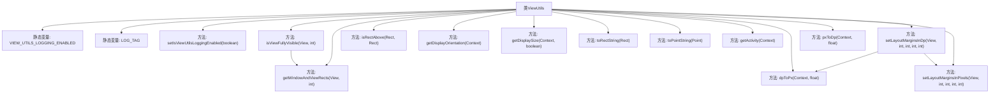
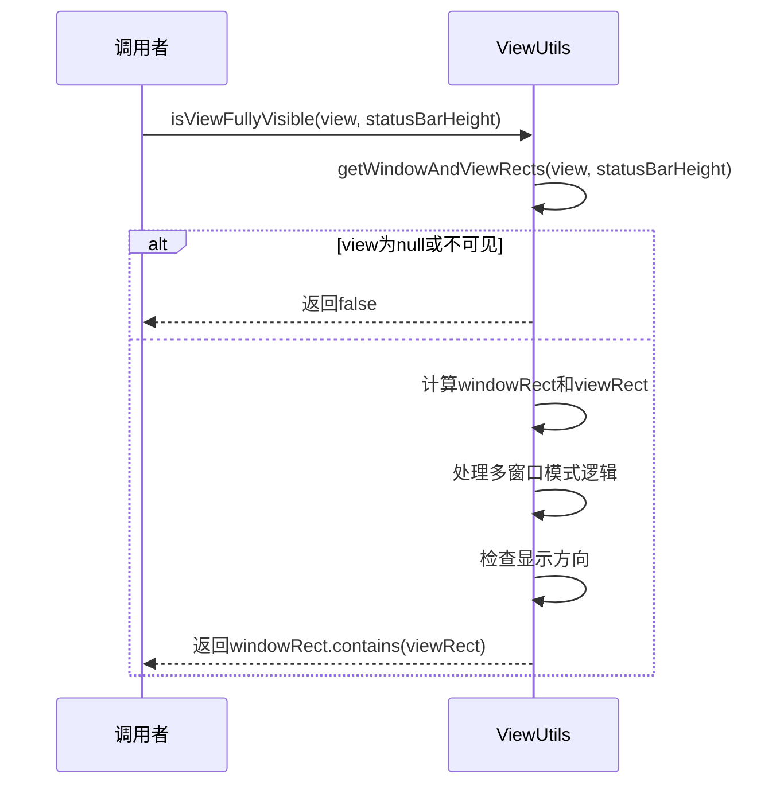

# 基础信息

|      |      |
|------|------|
| 名称 | ViewUtils |
| 编码语言 | .java |
| 代码路径 | termux-app/termux-shared/src/main/java/com/termux/shared/view/ViewUtils.java |
| 包名 | com.termux.shared.view |
| 依赖项 | ['android.app.Activity', 'android.content.Context', 'android.content.ContextWrapper', 'android.content.res.Configuration', 'android.graphics.Point', 'android.graphics.Rect', 'android.os.Build', 'android.util.TypedValue', 'android.view.View', 'android.view.ViewGroup', 'androidx.annotation.NonNull', 'androidx.annotation.Nullable', 'androidx.appcompat.app.ActionBar', 'androidx.appcompat.app.AppCompatActivity', 'com.termux.shared.logger.Logger'] |
| 概述说明 | ViewUtils类提供视图工具方法，包括可见性检查、尺寸转换和布局设置。 |

# 说明

ViewUtils是一个工具类，提供视图相关操作功能。包含日志开关VIEW_UTILS_LOGGING_ENABLED控制调试输出。主要功能有：检查视图是否完全可见（isViewFullyVisible），获取窗口和视图的矩形区域（getWindowAndViewRects），处理多窗口模式和不同屏幕方向。其他功能包括：判断矩形位置关系（isRectAbove）、获取屏幕方向（getDisplayOrientation）、获取显示尺寸（getDisplaySize）、dp与px单位转换（dpToPx/pxToDp）、设置视图边距（setLayoutMarginsInDp/Pixels）。类中使用了Rect处理区域计算，并兼容不同Android版本和上下文类型。

# 类列表 Class Summary

| 名称   | 类型  | 说明 |
|-------|------|-------------|
| ViewUtils | class | ViewUtils工具类，提供视图可见性检查、窗口矩形获取、dp/px转换等功能。 |


## 类 ViewUtils

|      |      |
|------|------|
| 访问范围 | public |
| 类型 | class |
| 名称 | ViewUtils |
| 说明 | ViewUtils工具类，提供视图可见性检查、窗口矩形获取、dp/px转换等功能。 |


### UML类图

```mermaid
classDiagram
    class ViewUtils {
        +boolean VIEW_UTILS_LOGGING_ENABLED
        -String LOG_TAG
        +setIsViewUtilsLoggingEnabled(boolean value) void
        +isViewFullyVisible(View view, int statusBarHeight) boolean
        +getWindowAndViewRects(View view, int statusBarHeight) Rect[]
        +isRectAbove(Rect r1, Rect r2) boolean
        +getDisplayOrientation(Context context) int
        +getDisplaySize(Context context, boolean activitySize) Point
        +toRectString(Rect rect) String
        +toPointString(Point point) String
        +getActivity(Context context) Activity
        +dpToPx(Context context, float dp) float
        +pxToDp(Context context, float px) float
        +setLayoutMarginsInDp(View view, int left, int top, int right, int bottom) void
        +setLayoutMarginsInPixels(View view, int left, int top, int right, int bottom) void
    }

    class View {
        <<Interface>>
        +isShown() boolean
        +getWindowVisibleDisplayFrame(Rect outRect) void
        +getLocationInWindow(int[] outLocation) void
        +getWidth() int
        +getHeight() int
        +getContext() Context
        +getLayoutParams() ViewGroup$LayoutParams
        +setLayoutParams(ViewGroup$LayoutParams params) void
    }

    class Rect {
        +int left
        +int top
        +int right
        +int bottom
        +contains(Rect r) boolean
    }

    class Context {
        <<Interface>>
    }

    class Activity {
        +getActionBar() android.app.ActionBar
        +isInMultiWindowMode() boolean
    }

    class AppCompatActivity {
        +getSupportActionBar() ActionBar
        +isInMultiWindowMode() boolean
    }

    class Point {
        +int x
        +int y
    }

    class TypedValue {
        +applyDimension(int unit, float value, DisplayMetrics metrics) float
    }

    class ViewGroup$MarginLayoutParams {
        +setMargins(int left, int top, int right, int bottom) void
    }

    ViewUtils --> View : 使用
    ViewUtils --> Rect : 使用
    ViewUtils --> Context : 使用
    ViewUtils --> Activity : 使用
    ViewUtils --> AppCompatActivity : 使用
    ViewUtils --> Point : 使用
    ViewUtils --> TypedValue : 使用
    ViewUtils --> ViewGroup$MarginLayoutParams : 使用
    Activity --|> Context
    AppCompatActivity --|> Activity
```

类图描述：ViewUtils是一个工具类，提供了一系列静态方法来处理Android视图相关的操作，包括视图可见性检查、窗口和视图矩形区域获取、屏幕方向判断、尺寸单位转换等。它依赖于Android核心类如View、Rect、Context及其子类Activity/AppCompatActivity，以及辅助类Point和TypedValue。该类封装了复杂的视图计算逻辑，特别关注多窗口模式和不同屏幕方向的适配处理。


### 内部方法调用关系图





该流程图展示了ViewUtils类的完整结构，包含15个核心方法及其调用关系。主要功能包括视图可见性检测（通过isViewFullyVisible和getWindowAndViewRects实现）、显示方向判断、单位转换（dp/px）和布局边距设置等。时序图重点描述了视图可见性检查的完整流程，包含多窗口模式处理和显示方向适配等关键步骤。这些方法共同构成了一个完整的Android视图工具集，特别适合处理复杂的UI布局和跨设备适配场景。

### 字段列表 Field List

| 名称  | 类型  | 说明 |
|-------|-------|------|
| LOG_TAG = "ViewUtils" | String | 私有常量LOG_TAG值为"ViewUtils"。 |
| VIEW_UTILS_LOGGING_ENABLED = false | boolean | 静态布尔变量，控制视图工具日志是否启用，默认关闭。 |

### 方法列表 Method List

| 名称  | 类型  | 说明 |
|-------|-------|------|
| pxToDp | float | 将像素值转换为设备无关像素值的方法。 |
| isRectAbove | boolean | 检查矩形r1是否在r2上方且非空。 |
| setLayoutMarginsInDp | void | 设置视图边距，单位dp转px。 |
| getDisplayOrientation | int | 获取屏幕方向：横屏或竖屏。 |
| toRectString | String | 将矩形对象转为字符串，格式为"(左,上),(右,下)"，空对象返回"null"。 |
| toPointString | String | 将点对象转为"(x,y)"字符串，空点返回"null"。 |
| getDisplaySize | Point | 获取屏幕尺寸，区分活动窗口和最大窗口，兼容API30+。 |
| setLayoutMarginsInPixels | void | 静态方法设置视图外边距，参数为像素值，需MarginLayoutParams支持。 |
| dpToPx | float | 将dp单位转换为像素的静态方法。 |
| isViewFullyVisible | boolean | 检查视图是否完全可见，通过比较视图与窗口的矩形区域。 |
| getActivity | Activity | 从Context递归获取Activity，非Activity则返回null。 |
| getWindowAndViewRects | Rect[] | 获取视图和窗口矩形，考虑状态栏、操作栏及多窗口模式。 |
| setIsViewUtilsLoggingEnabled | void | 设置视图工具日志启用状态。 |


