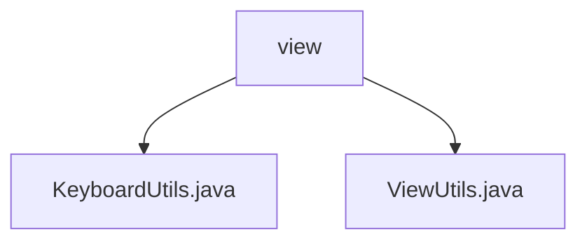

# 基础信息

|      |      |
|------|------|
| 名称 | view |
| 编码语言 | .java |
| 代码路径 | termux-app/termux-shared/src/main/java/com/termux/shared/view |
| 包名 | termux-app.termux-shared.src.main.java.com.termux.shared.view |
| 概述说明 | KeyboardUtils类提供Android软键盘管理功能，包括显示/隐藏、状态检测和兼容性处理。ViewUtils类提供视图操作功能，如可见性检查、区域计算和单位转换。 |

# 说明

## 概述

该代码模块主要包含两个工具类：`KeyboardUtils` 和 `ViewUtils`，均属于 `termux-app` 项目的共享模块（`termux-shared`）。这两个类提供了与 Android 视图和软键盘相关的实用功能，旨在简化开发过程中的常见操作，并确保兼容性和稳定性。

- **KeyboardUtils**：专注于软键盘的管理，包括显示、隐藏、状态检测以及硬件键盘的兼容性处理。  
- **ViewUtils**：提供视图相关的辅助功能，如可见性检查、区域计算、单位转换等，支持多窗口模式和不同屏幕方向。

## 主要业务场景

1. **软键盘管理（KeyboardUtils）**  
   - **动态控制软键盘**：通过 `Runnable` 实现延迟显示/隐藏，支持强制切换或隐藏软键盘。  
   - **状态检测**：判断软键盘和硬件键盘的当前状态，并根据用户配置决定是否禁用软键盘。  
   - **兼容性处理**：适配不同 Android API 级别，处理硬件键盘连接时的输入模式冲突。  
   - **安全操作**：所有方法均进行空指针检查，通过 `InputMethodManager` 系统服务实现关键操作。  

2. **视图操作与布局处理（ViewUtils）**  
   - **可见性检查**：判断视图是否完全可见（如滚动列表中的项），支持多窗口模式和屏幕方向变化。  
   - **区域计算**：获取窗口或视图的矩形区域（`Rect`），用于位置关系判断（如 `isRectAbove`）。  
   - **单位转换**：提供 `dp` 与 `px` 的相互转换，便于适配不同屏幕密度。  
   - **布局调整**：动态设置视图边距（支持 `dp` 或像素单位），优化界面布局。  
   - **设备信息获取**：获取屏幕方向、显示尺寸等，辅助响应式设计。  

**典型应用场景**：  
- 在终端模拟器（如 Termux）中，根据用户输入动态调整软键盘的显示/隐藏。  
- 在多窗口环境下，确保视图的正确布局和交互（如浮动键盘覆盖时的区域计算）。  
- 处理不同设备（如平板或外接键盘）的输入兼容性问题。

### 包内部结构视图

该流程图展示了Termux项目中view目录下的文件结构关系。view作为父节点，包含两个子文件：KeyboardUtils.java和ViewUtils.java。这两个文件都是与视图工具相关的Java类文件，分别处理键盘操作和视图操作的实用功能。整个结构简洁明了，体现了功能模块的划分。

# 文件列表 File List

| 名称   | 类型  | 说明 |
|-------|------|-------------|
| [KeyboardUtils.java](KeyboardUtils.md) | file | KeyboardUtils类提供软键盘显示、隐藏、切换及硬件键盘检测功能。 |
| [ViewUtils.java](ViewUtils.md) | file | ViewUtils类提供视图工具方法，包括可见性检查、尺寸转换和布局设置。 |

